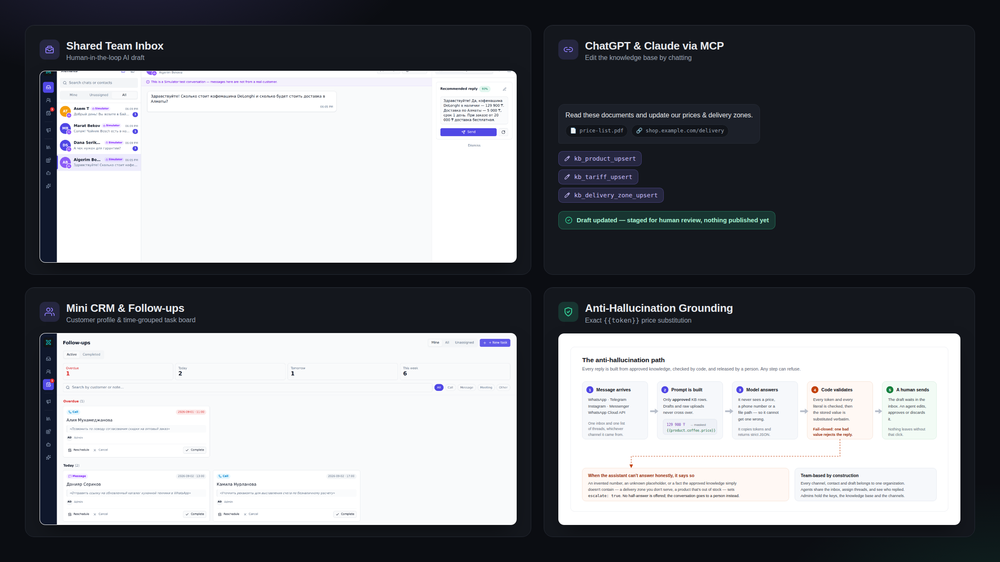
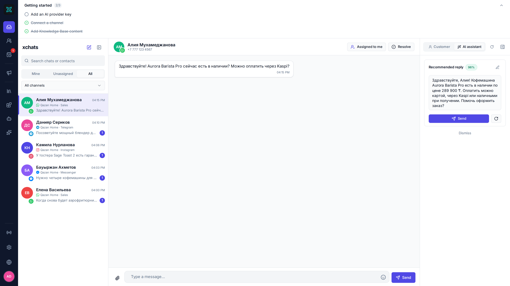
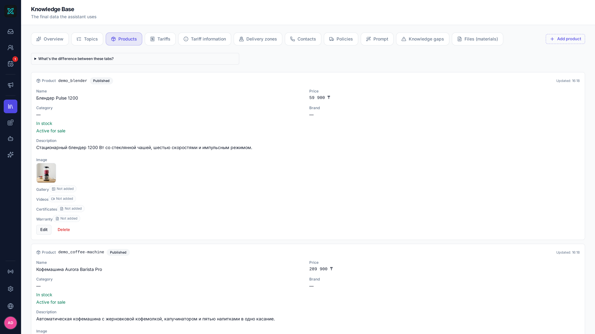
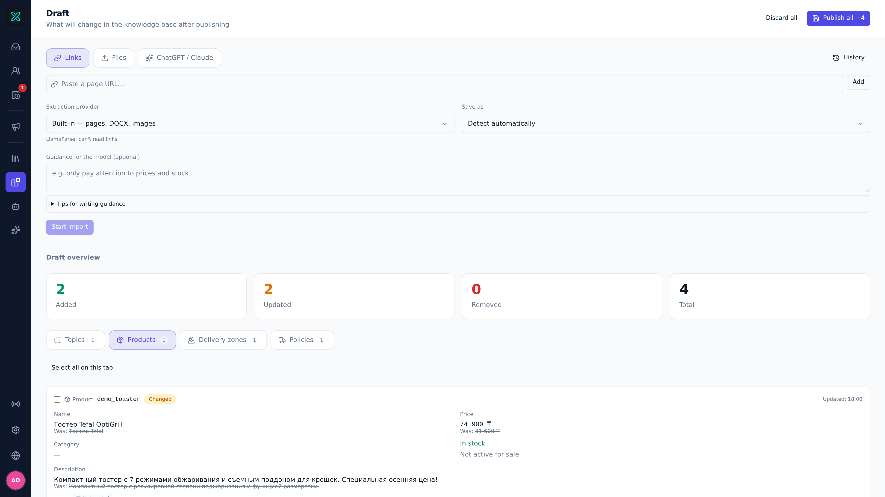
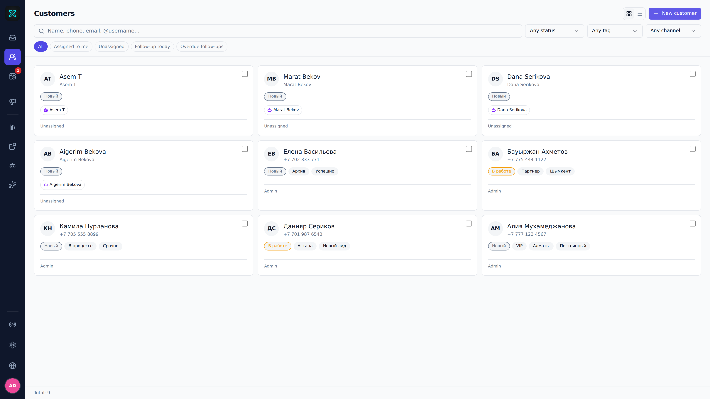
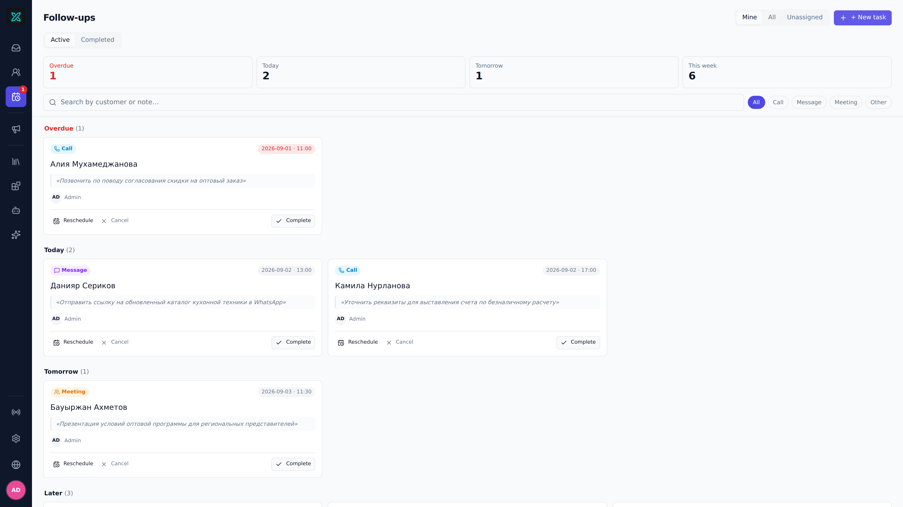
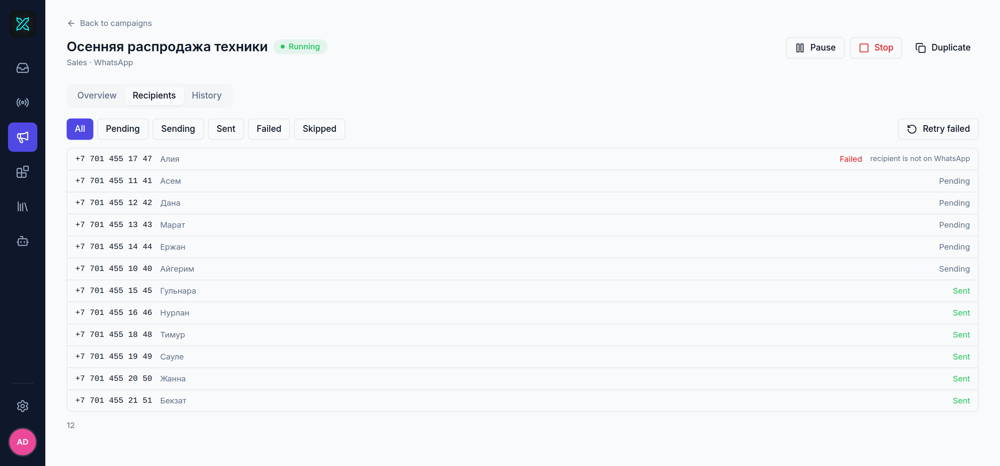
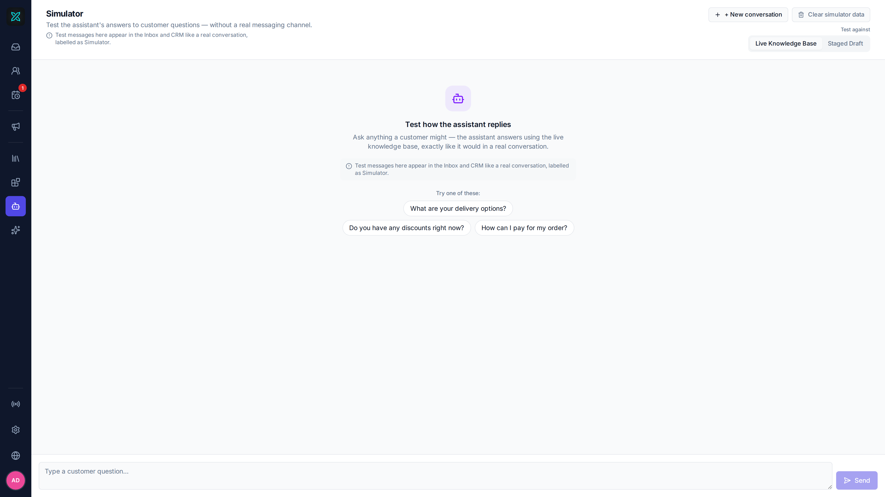

<div align="center">

# xchats

**Галлюцинациясыз AI-мен self-hosted омниарналы inbox.**
WhatsApp, Telegram, Instagram және Messenger — бір ортақ inbox-та. Көмекші
әр жауапты сіздің білім қорыңыз бойынша дайындайды, ал жібереді әрдайым адам.

[](LICENSE)
[](backend)
[](frontend)
[](docs/release/data-locations-and-privacy.md)
[](deploy)
[](https://github.com/yerassyldanay/xchats/actions/workflows/ci.yml)

[English](README.md) · [Русский](README.ru.md) · **Қазақша**

*Бұл файл — аударма. Алшақтық болған жағдайда негізгі құжат ағылшын тіліндегі [`README.md`](README.md) болып саналады.*

</div>



---

## 60 секундтық жылдам бастау

```bash
git clone https://github.com/yerassyldanay/xchats.git
cd xchats
make up
```

**http://localhost:8081** ашыңыз — `admin@xchat.kz` / `xchat-admin-change-me`
(жалпыға белгілі әдепкі құпиясөз) арқылы кіріңіз; бірінші кіргеннен кейін
бірден ауыстырыңыз.

## Басты мүмкіндіктер

- **Галлюцинациясыз жауаптар** — модель баға, күн немесе байланыс
  деректерін өзі ешқашан жазбайды. Ол `{{token}}` орынбасарын шығарады, ал
  бэкенд оны сақталған нақты мәнге ауыстырады — немесе жоба тексеруден
  өтпей, адамға беріледі.
- **Адам әрдайым бақылауда** — әр жоба тек ұсыныс. Агент «Жіберу»
  батырмасын баспайынша, клиентке ештеңе жетпейді.
- **Бір бинарник, бір файл** — Go + ендірілген SQLite. Postgres те,
  Redis те, бұлттық қызмет те қажет емес.
- **Кез келген модель** — OpenAI, Claude, Gemini, OpenRouter немесе
  Ollama арқылы жергілікті модель; провайдерді кодта емес, баптауларда
  ауыстырасыз.
- **ChatGPT / Claude арқылы баптау** — MCP-коннекторы LLM-клиентке
  құжаттарыңызды оқып, білім қорына өзгерістерді сіздің қарауыңызға
  дайындауға мүмкіндік береді.

## Визуалды тур

Төмендегі әрбір скриншот xchats жүйесінің нақты жұмыс істеп тұрған инстансынан алынған. Мұнда макеттер жоқ.

### 1. Ортақ inbox және омниарналы синхрондау



WhatsApp, Telegram, Instagram, Messenger және WhatsApp Cloud API-ден түсетін әрбір сұхбат **бір ортақ inbox-қа** жиналады, ал көмекші дайындаған жауап нұсқасы адамның мақұлдауын күтіп қатар тұрады. Клиентке ештеңе өздігінен жіберілмейді — соңғы шешімді әрқашан команда мүшесі қабылдайды.

### 2. Сенімді білім қоры және токендерді қатаң ауыстыру



Білім қоры көмекшіге жауап беруге рұқсат етілген нақты деректерді сақтайды — тауарлар, бағалар, жеткізу аймақтары, тарифтер және ережелер. Модель ешқашан сандарды өзі жазбайды: ол `{{token}}` орнын басушысын шығарады, ал бэкенд оны дерекқордағы нақты мәнмен алмастырады. Толығырақ — [сызбада](docs/images/grounding.svg).

### 3. Білімді кезең-кезеңімен енгізу және өзгерістерді көру (дифф)



Қолмен енгізілген, құжаттан немесе URL-ден импортталған, я болмаса MCP (§7) арқылы жазылған әрбір өзгеріс алдымен дайындық аймағына түседі және дейін/кейін диффін көрсетеді. Адам тексеріп, жарияламайынша, ештеңе негізгі білім қорына өтпейді.

### 4. Шағын CRM және күнделікті тапсырмалар тақтасы (Follow-ups)




Әрбір байланыс шағын CRM профилін алады — мәртебесі, тегтері, жазбалары және арналары бір жерде. Уәде етілген әрбір қадам **Мерзімі өткен, Бүгін, Ертең және Кейін** топтарына бөлінген тапсырмаға айналады.

### 5. Жаппай хабарлама тарату және жеткізуді бақылау



Алушылар тізімін жүктеңіз, хабарлама үлгісін жазыңыз — xchats оны жылдамдық шегін сақтай отырып жібереді. Жеткізу күйі нақты уақытта бақыланады, ал клиент жауаптары бірден ортақ inbox-қа түседі.

### 6. Арналар симуляторы және AI тестілеу



Симулятор нақты WhatsApp немесе Telegram тіркелгісіне тиіспей-ақ көмекшінің сұраққа қалай жауап беретінін тексеруге мүмкіндік береді — **бекітілген** білім қоры немесе **жоба** бойынша. Арнайы тестілеу құралымен ([`evals/`](evals/)) бірге жауап сапасын автоматты түрде бағалауға болады.

### 7. xchats-ты ChatGPT / Claude Desktop арқылы MCP хаттамасымен баптау

ChatGPT немесе Claude Desktop-ты xchats жүйесіне MCP коннекторы ретінде қосыңыз (**Жоба → ChatGPT / Claude**), OAuth 2.1 арқылы бір рет рұқсат беріңіз, және көмекші берілген құжаттарды оқып, 13 `kb_*` құралы арқылы деректерді дайындай алады. Барлық жазбалар **сол дайындық аймағына** түседі (§3).

## Бұл қалай жұмыс істейді

1. Клиент сізге WhatsApp, Telegram, Instagram немесе Messenger арқылы жазады.
2. Хабар бүкіл командаға ортақ **бір inbox-қа** түседі.
3. Көмекші тек бекітілген білім қоры бойынша жауап дайындайды.
4. Адам жобаны тексереді, өңдейді немесе алып тастайды — және өзі жібереді.

Толық архитектура сипаттамасы — [`docs/overview.md`](docs/overview.md)
файлында; фактілерді қою тетігі
[визуалды турда](#2-сенімді-білім-қоры-және-токендерді-қатаң-ауыстыру)
көрсетілген.

## Іске қосудың басқа жолдары

- **Бастапқы кодтан** (әзірлеу үшін): `make dev-backend` + `make dev-frontend`
  — қараңыз [`docs/release/installation.md`](docs/release/installation.md).
- **Десктоп қолданба** (Wails — Windows/macOS/Linux): `make desktop-build`
  — қараңыз [`docs/desktop.md`](docs/desktop.md).
- `make help` барлық қолжетімді командаларды көрсетеді.

> [!WARNING]
> WhatsApp арнасы WhatsApp Web сияқты қосылады (Business API комиссиясыз),
> бірақ бұл бейресми клиент — жоғалтуға дайын нөмірден бастаңыз. Толығырақ —
> [визуалды турда](#1-ортақ-inbox-және-омниарналы-синхрондау).

## Құжаттама

- [`docs/overview.md`](docs/overview.md) — өнім және архитектуралық шолу
- [`docs/release/installation.md`](docs/release/installation.md) — барлық орнату жолдары
- [`docs/desktop.md`](docs/desktop.md) — десктоп қолданба
- [`CONTRIBUTING.md`](CONTRIBUTING.md) — орта баптау, конвенциялар, PR
- [`SECURITY.md`](SECURITY.md) — осалдық туралы қалай хабарлау керек

## Лицензия

[AGPL-3.0-only](LICENSE) — WhatsApp интеграциясы арқылы транзитивті түрде
келетін GPL-3.0 тәуелділігі бэкендке статикалық сілтенгені анықталғаннан
кейін таңдалды; толығырақ — [`THIRD_PARTY_NOTICES.md`](THIRD_PARTY_NOTICES.md)
файлында.
