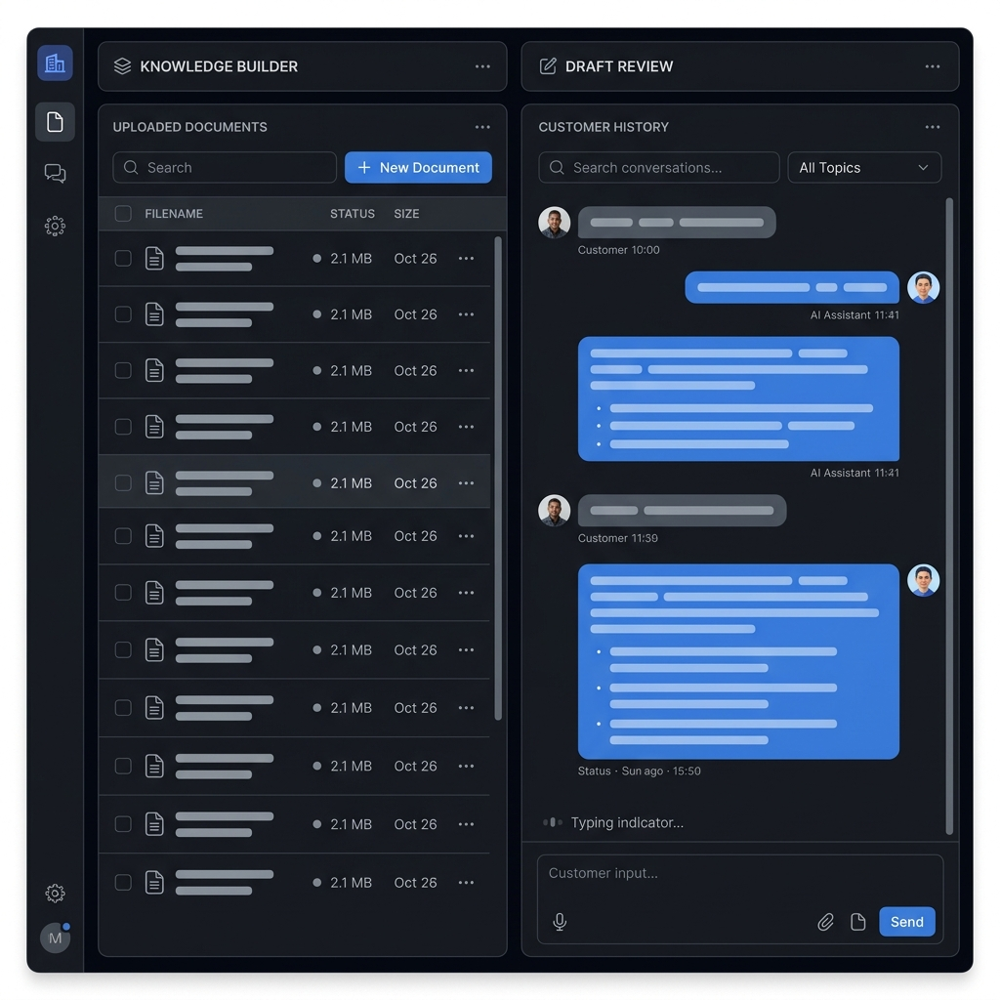
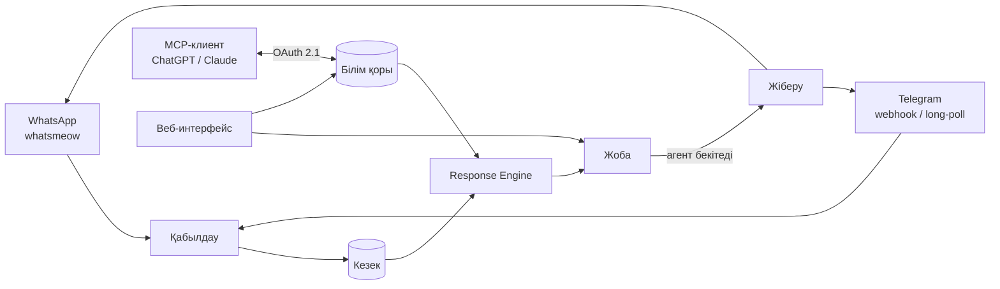

<div align="center">

# xchats

**WhatsApp пен Telegram үшін self-hosted командалық inbox — «жоба → бекіту» форматындағы AI көмекшісімен.**

[](LICENSE)
[](https://github.com/yerassyldanay/xchats/actions/workflows/ci.yml)
[](https://github.com/yerassyldanay/xchats/actions/workflows/codeql.yml)

[English](README.md) · [Русский](README.ru.md) · **Қазақша**

*Бұл файл — аударма. Алшақтық болған жағдайда негізгі құжат ағылшын тіліндегі [`README.md`](README.md) болып саналады.*

</div>

xchats WhatsApp пен Telegram-ды бір командалық inbox-қа біріктіреді және
әр агентке дайын білім қорына негізделген AI жобасын ұсынады — AI хабарды
өз бетінше ешқашан жібермейді, әрбір жобаны адам бекітеді. Білім қоры,
көмекшінің тәртібі және әрбір жасалған жоба сол қосымшада өзгертіледі —
веб-интерфейс арқылы немесе кірістірілген MCP-коннектор арқылы ChatGPT/Claude-тан тікелей.



## Жылдам бастау

```bash
git clone https://github.com/yerassyldanay/xchats.git
cd xchats
make up                         # backend (:8080) + frontend (:8081), бір команда
```

`make up` Docker Compose арқылы екі сервисті де құрастырып, іске қосады —
басқа ештеңе орнатудың қажеті жоқ. Алдын ала дайындайтын `.env` файлы жоқ:
xchats алғашқы қосылғанда өзінің ішкі құпияларын өзі жасап, сенімді сақтайды,
ал оператор баптайтынның бәрі (AI провайдері және оның API кілті, ngrok,
Langfuse, команда құрамы) қосымша іске қосылғаннан кейін Settings
интерфейсінде тұрады.

http://localhost:8081 ашыңыз, содан кейін бір реттік әкімші құпия сөзін алып,
жүйеге кіріңіз:

```bash
docker compose exec backend /xchats admin-credential show
```

Алғаш кіргенде жүйе басқа ештеңеге қол жеткізбес бұрын құпия сөзді ауыстыруды
талап етеді. Одан кейін алғашқы баптау шебері сізді LLM провайдерінің
API кілтін қосуға, содан соң QR код арқылы WhatsApp нөмірін қосу үшін
**Accounts → add** бөліміне, немесе Telegram ботын қосу үшін **Settings →
Integrations** бөліміне бастайды.

Docker жоқ па? `make dev-backend` (Go, `:8080`) және `make dev-frontend`
(Vite, `:5173`) сол қосымшаны екі жергілікті процесс ретінде іске қосады —
екі жолдың толық сипаттамасы (ағылшын тілінде) —
[`docs/release/installation.md`](docs/release/installation.md).

> **WhatsApp қосылымы бейресми.** xchats WhatsApp-қа
> [whatsmeow](https://github.com/tulir/whatsmeow) арқылы тікелей қосылады —
> бұл ресми WhatsApp Business API емес, кері инжиниринг жасалған клиент.
> WhatsApp қосылған нөмірді өз қалауы бойынша, дәлелдеусіз бұғаттай алады.
> Жоғалтуға дайын емес нөміріңізді қоспаңыз; алдымен бөлек тест нөмірін
> қарастырыңыз.

## Мүмкіндіктер

- **WhatsApp пен Telegram бір inbox-та** — WhatsApp тікелей қосылады (бөлек
  шлюзсіз); Telegram хабарларды webhook арқылы да, long-polling арқылы да
  жеткізе алады, таңдау ашық базалық URL бапталғанына қарай автоматты түрде
  жасалады.
- **Автоматты жіберусіз AI жобалары** — AI-дың әрбір жауабы — агент
  жіберер алдында тексеретін, өңдейтін немесе қабылдамайтын жоба. Жауаптар
  еркін генерациямен емес, құрылымдалған білім қорынан (тауарлар, тарифтер,
  жеткізу аймақтары, саясаттар) қалыптасады — сондықтан көмекші өзіне
  берілмеген фактілерді «ойлап таба» алмайды.
- **MCP-коннектор** — ChatGPT немесе Claude-ды білім қорына
  [MCP](https://modelcontextprotocol.io/) арқылы тікелей қосыңыз: тауарлар/
  тарифтер/саясаттарды оқып, өзгертіңіз, жеткізу аймақтарын басқарыңыз,
  өзгерістерді тексеруге жоба ретінде дайындаңыз — тікелей өзіңіз
  пайдаланатын LLM-клиенттен шықпай-ақ. OAuth 2.1 + PKCE, ортақ API кілтісіз.
- **Диалог симуляторы** — нақты WhatsApp/Telegram аккаунтын пайдаланбай-ақ,
  көмекшіні шынайы клиент хабарламаларында **Playground** бөлімінде
  тексеріңіз.
- **Сапаны бағалау құралы** (`evals/`) — көмекшіні дайын сценарийлер
  жиынтығында іске қосып, нәтижені бағалайтын жеке Go құралы — промпт/модель
  өзгерістерін болжамай, өлшеу үшін.
- **Self-hosted, бір бинарник + SQLite** — бір Go backend, бір SQLite
  дерекқоры, `make up` іске қосатын екі контейнерден басқа қосымша сервис
  жоқ. Деректеріңіз өз инфрақұрылымыңызда қалады.

## Архитектура



Бір Go backend (`backend/`) HTTP API-ды қызмет етеді, арналарды басқарады
және MCP серверін орналастырады; бір Vue 3 + TypeScript frontend
(`frontend/`) — команданың интерфейсі. Жалғыз дерекқор — SQLite. Толық
сипаттама (ағылшын тілінде) — [`plan/architecture.md`](plan/architecture.md),
шешімдердің негіздемесі — [`plan/DECISIONS.md`](plan/DECISIONS.md).

## Құжаттама

- [`docs/release/installation.md`](docs/release/installation.md) — Docker
  арқылы және бастапқы кодтан орнату, алғашқы іске қосу тәртібі (ағылшын
  тілінде).
- [`docs/release/`](docs/release/) — пайдалану: деплой, құпиялар, сақтық
  көшірмелер, жаңарту, ақаулықтарды жою (ағылшын тілінде).
- [`plan/`](plan/) — жоба құрылған негіздегі жобалау құжаттамасы; бастау
  үшін — [`plan/README.md`](plan/README.md) (ағылшын тілінде).
- [`CONTRIBUTING.md`](CONTRIBUTING.md) — даму ортасын баптау, келісімдер,
  PR қалай ашу керек (ағылшын тілінде, аудармасы —
  [`docs/i18n/kk/CONTRIBUTING.md`](docs/i18n/kk/CONTRIBUTING.md)).
- [`SECURITY.md`](SECURITY.md) — осалдық туралы қалай хабарлау керек
  (ағылшын тілінде, аудармасы —
  [`docs/i18n/kk/SECURITY.md`](docs/i18n/kk/SECURITY.md)).

Негізгі құжаттама `docs/release/` мен `plan/` ішінде ағылшын тілінде
жүргізіледі. Қауымдастықтың негізгі құжаттарының аудармалары —
[`docs/i18n/kk/`](docs/i18n/kk/) бөлімінде.

## Лицензия

[AGPL-3.0-only](LICENSE) — тәуелділіктерді тексеру нәтижесінде жоба саясаты
ретінде таңдалды: GPL-3.0 лицензиялы тәуелділік табылды
([`go.mau.fi/libsignal`](https://github.com/tulir/libsignal-go), whatsmeow
арқылы транзитивті түрде қосылады) және ол backend бинарнигіне статикалық
түрде байланысады — толығырақ
[`THIRD_PARTY_NOTICES.md`](THIRD_PARTY_NOTICES.md) құжатында. GPL-3.0 да
үйлесімді нұсқа болар еді; AGPL-3.0 таңдалуының себебі — өзгертілген
нұсқаны желілік қызмет ретінде іске қосу да, бинарникті таратумен бірдей,
кодпен бөлісу міндетін алып жүруі үшін.
