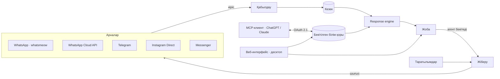

<div align="center">

# xchats

**Бес мессенджерге ортақ бір командалық inbox және әр жауапты сіздің білім
қорыңыз бойынша дайындайтын AI көмекшісі — оны адамсыз ешқашан жібермейді.**

[](LICENSE)
[](https://github.com/yerassyldanay/xchats/actions/workflows/ci.yml)
[](https://github.com/yerassyldanay/xchats/actions/workflows/codeql.yml)

[English](README.md) · [Русский](README.ru.md) · **Қазақша**

*Бұл файл — аударма. Алшақтық болған жағдайда негізгі құжат ағылшын тіліндегі [`README.md`](README.md) болып саналады.*

</div>

xchats — бүкіл командаға ортақ self-hosted inbox. WhatsApp, Telegram,
Instagram Direct, Messenger және WhatsApp Cloud API — бәрі бір диалогтар
тізіміне түседі. Әрбір кіріс хабарға көмекші сіз құрған білім қоры бойынша —
бағалар, жеткізу аймақтары, саясаттар — жауап дайындап, оны агенттің
алдына қояды: бекітеді, өңдейді немесе алып тастайды.


## Үш негізгі идея

**Көп арналылық.** Бес арна, бір inbox, бір диалогтар тізімі. Агент
қосымшалар арасында ауыспайды, ал көмекшіні әр арнаға бөлек баптаудың қажеті
жоқ — жүйе ішінде хабар — жай ғана хабар.

**Командалық жұмыс.** Барлығы жеке адамға емес, ұйымға тиесілі. Агенттер
ортақ inbox-та жұмыс істейді, диалогтарды бір-біріне тағайындайды және кім
не жауап бергенін көреді. Әкімшілерде — API кілттері, арналар және білім
қоры.

**Ойлап табу емес, деректен жауап.** Көмекшіге сіздің бағаларыңызды білуге
рұқсат жоқ. Ол жауапты толтырғыш белгілер арқылы жазады, ал нақты мәндерді
кейін код қояды — сондықтан қате сан модель болдырмайды деп үміттенетін
нәрсе емес, конструкциясы бойынша мүмкін емес нәрсеге айналады.

## Көмекші қалай ойдан шығармайды


Бір абзацпен айтқанда: промптқа тек **бекітілген** білім қоры жазбалары
кіреді — жобалар да, жүктелген бастапқы файлдар да ешқашан кірмейді. Нақты
бизнес-мәндер одан алынып тасталып, `{{product.coffee.price}} `тәрізді
белгілермен ауыстырылады — модель `129 900 ₸` дегенді сөзбе-сөз көрмейді,
сондықтан оны қате теруі, дөңгелектеуі немесе ойдан шығаруы мүмкін емес.
Модель қатаң JSON келісімімен жауап береді; содан кейін backend әр
толтырғышты және әр санды бекітілген фактілермен салыстырып, сақталған
мәндерді сөзбе-сөз қояды. Ойдан шығарылған мән немесе белгісіз белгі жартылай
дұрыс жауапты жіберудің орнына бүкіл жауапты қабылдамайды. Ал бекітілген
білім сұраққа мүлде жетпейтін болса, көмекші болжам жасаудың орнына
`escalate: true` қайтарады да, диалог адамға өтеді.

Соңғы шекара — ең қарапайымы: **жоба — әлі де жоба.** Ол агент «Жіберу»
батырмасын баспайынша inbox-та тұрады. Әр арна үшін әкімші режимді таңдай
алады: *off* (жоба мүлдем жасалмайды), *suggestions* (әдепкі — жоба жасалады,
бірақ ешқашан жіберілмейді) немесе *кесте бойынша жіберу* — жауап тек сіз
белгілеген қайталанатын уақыт терезесінің ішінде автоматты кетеді, ал одан
тыс уақытта қайтадан *suggestions* сияқты жұмыс істейді.

## Арналар


| Арна | Қалай қосылады | Ескертпе |
|---|---|---|
| **WhatsApp** | **Channels → Connect a channel** бөлімінде QR кодты сканерлеу | [whatsmeow](https://github.com/tulir/whatsmeow) арқылы тікелей — бөлек шлюзсіз және Meta мақұлдауынсыз. Бейресми, төмендегі ескертуді қараңыз. |
| **WhatsApp Cloud API** | Meta арқылы OAuth | Ресми API — қолдау көрсетілетін нөмір мен хабар үлгілері керек болғанда. |
| **Telegram** | Бот токені | Webhook немесе long-polling, ашық HTTPS мекенжайының қолжетімділігіне қарай автоматты таңдалады. |
| **Instagram Direct** | Meta арқылы OAuth | Кәсіби Instagram аккаунтына келген жеке хабарлар. |
| **Facebook Messenger** | Meta арқылы OAuth | Facebook парақшасына келген жеке хабарлар. |

Үш Meta арнасы «өз қосымшаң» қағидасымен жұмыс істейді: Meta Developer
қосымшасының App ID мен құпиясын бір рет **Channels → Channel setup**
бөлімінде енгізесіз, ал OAuth қайта бағыттауын, webhook жазылымын және
олардың әрқайсысы талап ететін 24 сағаттық клиенттік қолдау терезесін xchats
өзі реттейді. Ашық хост болмаса, кірістірілген ngrok туннелі оны береді де,
барлық webhook мекенжайлары одан автоматты түрде шығарылады.

Әр арнаның өз автоматтандыру режимі және өз debounce уақыты бар: клиент
жазып бітірсін деп xchats неше секунд күтетіні — үш жылдам хабар үш емес, бір
жауапқа айналуы үшін.

> **WhatsApp-қа whatsmeow арқылы қосылу бейресми.** Бұл — кері инжиниринг
> жасалған клиент, WhatsApp Business API емес. Meta қосылған нөмірді өз
> қалауы бойынша, дәлелдеусіз бұғаттай алады. Жоғалтуға дайын емес нөміріңізді
> қоспаңыз — алдымен тест нөмірін немесе жоғарыдағы кестедегі Cloud API-ды
> пайдаланыңыз.

## Білім қоры


Көмекші құжаттар үйіндісінен емес, құрылымдалған жазбалардан жауап береді.
Тауарлардың, тарифтердің, жеткізу аймақтарының, байланыстардың және
саясаттардың нақты өрістері бар — баға сөйлемде емес, баға бағанында тұрады —
жоғарыда сипатталған толтырғыштарды қоюды мүмкін ететін дәл осы нәрсе.

Оны үш жолмен толтыруға болады: интерфейсте қолмен, **импорт конвейері**
арқылы (сілтеме немесе құжат көрсетесіз — ол мазмұнды алып, тексеруге
типтелген жоба жазбаларын жинайды) немесе кірістірілген **MCP-коннектор**
арқылы ChatGPT/Claude-тан. Үшеуі де бір ғана жоба қабатына жазады, ал
**Draft** беті жариялау нақты нені қосатынын, өзгертетінін және
жоятынын көрсетеді. Біреу жарияламайынша, ештеңе тірі білім қорына — демек,
клиентке де — жетпейді.

## Таратылымдар


Керек болғанда — шығыс хабарлар: алушылар тізімін қойыңыз немесе жүктеңіз,
`{{name}}` тәрізді айнымалылары бар бір хабар жазыңыз, жіберуші аккаунтты
таңдаңыз — таратылым сіз белгілеген қарқынмен жүреді. Жіберулер әр аккаунт
үшін жиілігі бойынша шектеледі және тек жіберу терезесінің ішінде жүреді,
уақытша қателер өздігінен қайталанады, ал жіберуші аккаунт байланыстан
шықса, таратылым автоматты түрде кідіртіледі. Жауаптар кәдімгі inbox-қа
кәдімгі диалог болып түседі — сол көмекшімен және сол бекітілген жауаптармен.

## Жылдам бастау

```bash
git clone https://github.com/yerassyldanay/xchats.git
cd xchats
make up                         # backend (:8080) + frontend (:8081), бір команда
```

`make up` Docker Compose арқылы екі сервисті де құрастырып, іске қосады —
басқа ештеңе орнатудың қажеті жоқ, алдын ала дайындайтын `.env` файлы да жоқ.
http://localhost:8081 ашыңыз және кіріңіз:

- **Email:** `admin@xchat.kz`
- **Құпия сөз:** `xchat-admin-change-me`

> **Бұл құпия сөз жария.** Ол осы README-де жазылған және репозиторийдің
> миграция тарихында тіркелген, сондықтан оны кез келген адам таба алады.
> Инстансыңызды өз құрылғыңыздан тыс ашпас бұрын оны ауыстырыңыз — қалай
> ауыстыру керектігін
> [`docs/release/installation.md`](docs/release/installation.md#first-run)
> құжатынан қараңыз (ағылшын тілінде). Кіре алмай қалдыңыз ба?
> `xchats reset-admin-password` келесі іске қосылымда осы әдепкі құпия сөзді
> қайта қалпына келтіреді.

Одан кейін баптау шебері LLM провайдерінің API кілтін қосуға бағыттайды, ал
**Channels → Connect a channel** алғашқы аккаунтты жалғайды.

Docker жоқ па? `make dev-backend` (Go, `:8080`) және `make dev-frontend`
(Vite, `:5173`) сол қосымшаны екі жергілікті процесс ретінде іске қосады.
Нативті десктоп нұсқасы да бар — Windows, macOS және Linux үшін терезедегі
сол бинарник, [`docs/desktop.md`](docs/desktop.md) қараңыз (ағылшын тілінде).
Барлық жолдардың толық сипаттамасы —
[`docs/release/installation.md`](docs/release/installation.md).

## Конфигурация

Баптаулар әдейі екі жерде тұрады:

- **[`config.yaml`](config.yaml)** — репозиторийде жатыр және құпия
  сақтамайды. Тек қосымшаға іске қосылу үшін керегі: тыңдау мекенжайы,
  дерекқор мен файлдар жолы, лог деңгейі, воркерлер саны, әдепкі debounce
  және Telegram мен Meta үшін базалық webhook мекенжайлары. Кез келген мәнді
  дәл сол атаудағы орта айнымалысымен қайта анықтауға болады — Docker пен
  Kubernetes оларды осылай бекітеді.
- **Қосымшаның өзі** — оператор шынымен өзгертетіннің бәрі. Settings ішінде —
  LLM провайдері мен оның API кілті, ngrok, Langfuse, команда құрамы мен
  рөлдер, сақтық көшірмелер; Channels бетінде — Telegram бот токені және Meta
  Developer қосымшасының тіркелгі деректері.

Жүйелік құпиялар — сессия қолтаңбасы, тіркелгі деректерін шифрлау, MCP
қолтаңбасы, Telegram webhook құпиясы — алғашқы іске қосылғанда жасалып,
credential store ішінде сақталады. Оларды ешқайда жазып қоюдың қажеті жоқ.

## Тағы не бар

- **Білім қорына арналған чат-көмекші** — көмекшінің шын мәнінде нені
  білетінін **Ассистент** бетінде қарапайым тілмен сұраңыз: ағымдағы білім
  қоры ма, жобадағы ма, әлде екеуінің айырмашылығы ма. Жауап бірте-бірте
  ағып шығады, ал әр мән қай күйден алынғанын көрсетеді — модель оны өз
  сөзімен айтып бермейді.
- **MCP-коннектор** — ChatGPT немесе Claude-ды білім қорыңызға
  [MCP](https://modelcontextprotocol.io/) арқылы жалғап, тауарларды,
  тарифтерді, саясаттарды және жеткізу аймақтарын өзіңіз пайдаланатын
  клиенттен түзетіңіз. OAuth 2.1 + PKCE, ортақ API кілтісіз.
- **Диалог симуляторы** — тірі аккаунтқа тимей-ақ, көмекшіні шынайы клиент
  хабарламаларында сынаңыз. Әдепкіде өшірулі, `SIMULATOR_ENABLED=true`
  арқылы қосылады.
- **Сапаны бағалау құралы** ([`evals/`](evals/)) — көмекшіні дайын
  сценарийлер жиынтығында іске қосып, нәтижені бағалайтын жеке Go құралы:
  промпт немесе модель өзгерісі болжанбай, өлшенеді.
- **Self-hosted, бір бинарник + SQLite** — бір Go backend, бір SQLite файлы,
  `make up` іске қосатын екі контейнерден басқа сервис жоқ. Жазысулар өз
  инфрақұрылымыңызда қалады.

## Архитектура



Бір Go backend (`backend/`) HTTP API-ды қызмет етеді, арналарды басқарады
және MCP серверін орналастырады; бір Vue 3 + TypeScript frontend
(`frontend/`) — команданың интерфейсі: браузерде немесе десктоп нұсқасына
кірістірілген. Жалғыз дерекқор — SQLite. Толық сипаттама (ағылшын тілінде) —
[`plan/architecture.md`](plan/architecture.md), шешімдердің негіздемесі —
[`plan/DECISIONS.md`](plan/DECISIONS.md).

## Құжаттама

- [`docs/release/installation.md`](docs/release/installation.md) — Docker
  арқылы және бастапқы кодтан орнату, алғашқы іске қосу тәртібі (ағылшын
  тілінде).
- [`docs/desktop.md`](docs/desktop.md) — нативті десктоп қосымшасы: іске
  қосу, құрастыру, CI не шығаратыны (ағылшын тілінде).
- [`docs/release/`](docs/release/) — пайдалану: деплой, құпиялар, сақтық
  көшірмелер, жаңарту, ақаулықтарды жою (ағылшын тілінде).
- [`plan/`](plan/) — жоба құрылған негіздегі жобалау құжаттамасы; бастау
  үшін — [`plan/README.md`](plan/README.md) (ағылшын тілінде).
- [`CONTRIBUTING.md`](CONTRIBUTING.md) — даму ортасын баптау, келісімдер,
  PR қалай ашу керек (ағылшын тілінде, аудармасы —
  [`docs/i18n/kk/CONTRIBUTING.md`](docs/i18n/kk/CONTRIBUTING.md)).
- [`SECURITY.md`](SECURITY.md) — осалдық туралы қалай хабарлау керек
  (ағылшын тілінде, аудармасы —
  [`docs/i18n/kk/SECURITY.md`](docs/i18n/kk/SECURITY.md)).

Негізгі құжаттама `docs/release/` мен `plan/` ішінде ағылшын тілінде
жүргізіледі. Қауымдастықтың негізгі құжаттарының аудармалары —
[`docs/i18n/kk/`](docs/i18n/kk/) бөлімінде.

## Лицензия

[AGPL-3.0-only](LICENSE) — тәуелділіктерді тексеру нәтижесінде жоба саясаты
ретінде таңдалды: GPL-3.0 лицензиялы тәуелділік табылды
([`go.mau.fi/libsignal`](https://github.com/tulir/libsignal-protocol-go), whatsmeow
арқылы транзитивті түрде қосылады) және ол backend бинарнигіне статикалық
түрде байланысады — толығырақ
[`THIRD_PARTY_NOTICES.md`](THIRD_PARTY_NOTICES.md) құжатында. GPL-3.0 да
үйлесімді нұсқа болар еді; AGPL-3.0 таңдалуының себебі — өзгертілген
нұсқаны желілік қызмет ретінде іске қосу да, бинарникті таратумен бірдей,
кодпен бөлісу міндетін алып жүруі үшін.
