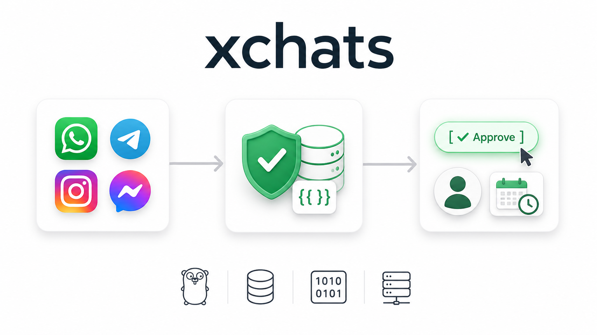

<div align="center">

# xchats

**The self-hosted omnichannel inbox with zero-hallucination AI.**
WhatsApp, Telegram, Instagram and Messenger in one shared inbox — an AI
assistant drafts every reply from your own knowledge base, and a human
always approves before it sends.

[](LICENSE)
[](backend)
[](frontend)
[](docs/release/data-locations-and-privacy.md)
[](deploy)
[](https://github.com/yerassyldanay/xchats/actions/workflows/ci.yml)

**English** · [Русский](README.ru.md) · [Қазақша](README.kk.md)

</div>



---

## 60-second quickstart

```bash
git clone https://github.com/yerassyldanay/xchats.git
cd xchats
make up
```

Open **http://localhost:8081** — sign in with `admin@xchat.kz` /
`xchat-admin-change-me` (public default; change it after your first login).

## Key superpowers

- **Zero-hallucination replies** — the model never writes a price, date
  or contact detail itself. It emits a `{{token}}`; the backend substitutes
  the exact stored value, or the draft fails closed and escalates to a human.
- **Human-in-the-loop, always** — every draft is a suggestion. Nothing
  reaches a customer until a teammate clicks Send.
- **One binary, one file** — Go + embedded SQLite. No Postgres, no Redis,
  no managed cloud service required to run this.
- **Model-agnostic** — OpenAI, Claude, Gemini, OpenRouter or a local
  Ollama model; swap providers from Settings, not code.
- **Configurable from ChatGPT / Claude** — an MCP connector lets an LLM
  client read your documents and stage knowledge-base edits for your review.

## Visual Tour

Every screenshot below comes straight from a live, self-hosted xchats instance. Nothing here is a mockup.

### 1. Team Inbox & Omnichannel Sync


Every conversation from WhatsApp, Telegram, Instagram, Messenger and the
WhatsApp Cloud API lands in **one shared inbox**, with the assistant's
suggested reply waiting beside it for a human to approve, edit, or discard.
Nothing sends itself — a teammate always makes the final call before a
customer sees a word of it.

### 2. Grounded Knowledge Base & Strict Token Replacement


The Knowledge Base holds the exact facts the assistant is allowed to answer
from — products, prices, delivery zones, tariffs and policies, each with real
photos and current values. The model never writes a number itself; it emits a
`{{token}}` placeholder that the backend substitutes with the stored value, so
a wrong price is structurally impossible, not just unlikely — see the
[grounding diagram](docs/images/grounding.svg) for the full five-stage pipeline.

### 3. Staged Knowledge Ingestion & Visual Diff Review


Every edit — typed by hand, imported from a URL or document, or written by an
LLM over MCP (§7) — lands in a staging area first, showing exactly what will
be **added, changed or removed** with a full before/after diff. Nothing
reaches the live knowledge base, and nothing the assistant can quote, until a
human reviews and publishes it.

### 4. Mini CRM & Time-Grouped Daily Follow-up Board


Every contact gets a lightweight CRM profile — status, tags, notes and every
channel identity in one place — and every promised next step becomes a
follow-up task, automatically grouped into **Overdue, Today, Tomorrow and
Later** (with a Completed tab for history). It's the minimum structure a
small sales or support team actually needs, without a separate CRM
subscription.

### 5. Campaigns: Bulk Outbound with Live Delivery Tracking


Paste or upload a recipient list, write one templated message, and xchats
sends it out rate-limited and confined to a send window — no accidental
floods, no banned numbers. Each campaign tracks **delivery status per
recipient live**, and any reply a customer sends back lands right in the
shared inbox like any other conversation.

### 6. Built-in Channel Simulator & AI Evals


The Simulator lets you test exactly how the assistant would answer a real
customer question — against the **live** knowledge base or a **staged
draft** — without touching a real WhatsApp or Telegram account. Pair it with
the open evaluation harness ([`evals/`](evals/)) to grade response quality
automatically whenever the prompt, model or knowledge base changes.

### 7. Configuring xchats via ChatGPT / Claude Desktop using MCP

Point ChatGPT or Claude Desktop at your own xchats instance as an MCP
connector (**Draft → ChatGPT / Claude**), authorize once over OAuth 2.1 with
PKCE, and the assistant can read documents you hand it and store structured
facts through 13 `kb_*` tools — products, tariffs, delivery zones, policies
and more. Every write lands in the **same staging area** shown in §3, so an
LLM configuring your knowledge base over chat is exactly as safe as typing it
in yourself.

## How it works

1. A customer messages you on WhatsApp, Telegram, Instagram or Messenger.
2. It lands in **one inbox**, shared by your whole team.
3. The assistant drafts a reply from your approved knowledge base only.
4. A person reviews, edits or discards it — then sends.

The full design lives in [`docs/overview.md`](docs/overview.md); the
grounding mechanism above is diagrammed in the
[visual tour](#2-grounded-knowledge-base--strict-token-replacement).

## Run it another way

- **From source** (dev): `make dev-backend` + `make dev-frontend` — see
  [`docs/release/installation.md`](docs/release/installation.md).
- **Desktop app** (Wails — Windows/macOS/Linux): `make desktop-build` — see
  [`docs/desktop.md`](docs/desktop.md).
- `make help` lists every target.

> [!WARNING]
> The WhatsApp channel connects like WhatsApp Web (no Business API fee), but
> it is an unofficial client — start with a number you can afford to lose.
> Details in the [visual tour](#1-team-inbox--omnichannel-sync).

## Documentation

- [`docs/overview.md`](docs/overview.md) — product and architectural overview
- [`docs/release/installation.md`](docs/release/installation.md) — every install path
- [`docs/desktop.md`](docs/desktop.md) — the desktop app
- [`CONTRIBUTING.md`](CONTRIBUTING.md) — dev setup, conventions, PRs
- [`SECURITY.md`](SECURITY.md) — reporting a vulnerability

## License

[AGPL-3.0-only](LICENSE) — chosen after a GPL-3.0 dependency (pulled in
transitively through the WhatsApp integration) was found statically linked
into the backend; see [`THIRD_PARTY_NOTICES.md`](THIRD_PARTY_NOTICES.md).
