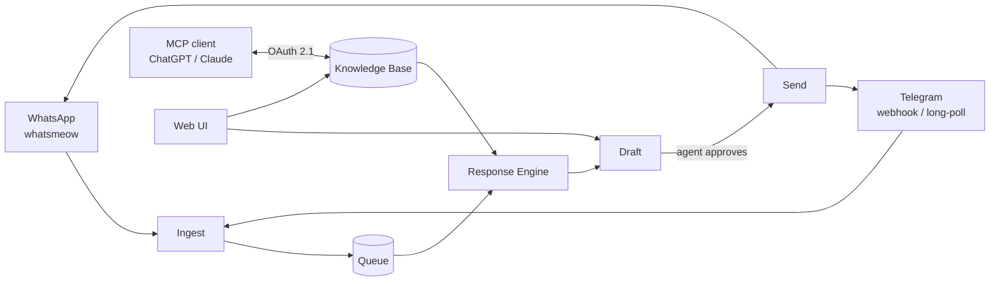

<div align="center">

# xchats

**A self-hosted team inbox for WhatsApp and Telegram, with a draft-and-approve AI assistant.**

[](LICENSE)
[](https://github.com/yerassyldanay/xchats/actions/workflows/ci.yml)
[](https://github.com/yerassyldanay/xchats/actions/workflows/codeql.yml)

**English** · [Русский](README.ru.md) · [Қазақша](README.kk.md)

</div>

xchats connects WhatsApp and Telegram to one team inbox, and gives every
agent an AI-drafted reply grounded in a curated knowledge base — the AI
never sends on its own; a human always approves first. The knowledge base,
the assistant's behavior, and every draft it produces are all editable from
the same app, either through the web UI or directly from ChatGPT/Claude via
the built-in MCP connector.


## Quickstart

```bash
git clone https://github.com/yerassyldanay/xchats.git
cd xchats
make up                         # backend (:8080) + frontend (:8081), one command
```

`make up` builds and starts both services with Docker Compose — nothing
else to install. There's no `.env` file to prepare first: xchats generates
and durably stores its own internal secrets on first boot, and everything
an operator configures (the AI provider and its API key, ngrok, Langfuse,
team members) lives in the Settings UI once the app is running.

Open http://localhost:8081, then retrieve the one-time bootstrap admin
password and log in:

```bash
docker compose exec backend /xchats admin-credential show
```

The first login forces a password change before anything else is
reachable. After that, the setup wizard walks you through adding an LLM
provider API key, then **Accounts → add** to pair a WhatsApp number by
scanning a QR code, or **Settings → Integrations** to connect a Telegram
bot.

No Docker? `make dev-backend` (Go, `:8080`) and `make dev-frontend` (Vite,
`:5173`) run the same app as two local processes — see
[`docs/release/installation.md`](docs/release/installation.md) for both
paths in full.

> **WhatsApp connectivity is unofficial.** xchats talks to WhatsApp directly
> via [whatsmeow](https://github.com/tulir/whatsmeow), a reverse-engineered
> client — not WhatsApp's official Business API. A connected number can be
> banned by WhatsApp at their discretion, with no recourse. Don't pair a
> number you can't afford to lose; consider a dedicated test number first.

## Features

- **WhatsApp and Telegram in one inbox** — WhatsApp connects directly (no
  gateway to run); Telegram supports both webhook and long-polling
  delivery, auto-selected based on whether a public base URL is configured.
- **Draft-and-approve AI, never auto-send** — every AI reply is a draft an
  agent reviews, edits, or discards before it goes out. Replies are
  generated from a structured knowledge base (products, tariffs, delivery
  zones, policies), not freeform generation, so the assistant can't
  improvise facts it wasn't given.
- **MCP connector** — connect ChatGPT or Claude directly to the knowledge
  base over [MCP](https://modelcontextprotocol.io/): read and edit
  products/tariffs/policies, manage delivery zones, and stage draft
  changes for review, from inside the LLM client you already use. OAuth
  2.1 + PKCE, no shared API key.
- **A conversation simulator** — exercise the assistant against realistic
  customer messages without touching a real WhatsApp/Telegram account,
  from **Playground**.
- **An evaluation harness** (`evals/`) — a standalone Go tool that runs the
  assistant against a curated scenario set and grades the output, for
  measuring prompt/model changes instead of guessing.
- **Self-hosted, single binary + SQLite** — one Go backend, one SQLite
  database, no separate services beyond the two containers `make up`
  starts. Your data stays on your infrastructure.

## Architecture



One Go backend (`backend/`) serves the HTTP API, runs the channel
adapters, and hosts the MCP server; one Vue 3 + TypeScript frontend
(`frontend/`) is the team's UI. SQLite is the only datastore. See
[`plan/architecture.md`](plan/architecture.md) for the full design and
[`plan/DECISIONS.md`](plan/DECISIONS.md) for the record of why it's shaped
this way.

## Documentation

- [`docs/release/installation.md`](docs/release/installation.md) — Docker
  and from-source setup, first-run walkthrough.
- [`docs/release/`](docs/release/) — deploying, credentials, backups,
  upgrades, troubleshooting a real deployment.
- [`plan/`](plan/) — the design record this project was built from; start
  at [`plan/README.md`](plan/README.md).
- [`CONTRIBUTING.md`](CONTRIBUTING.md) — development setup, conventions,
  how to open a PR.
- [`SECURITY.md`](SECURITY.md) — how to report a vulnerability.

## License

[AGPL-3.0-only](LICENSE), selected as project policy after a dependency
review found a GPL-3.0 dependency ([`go.mau.fi/libsignal`](https://github.com/tulir/libsignal-protocol-go),
pulled in transitively through whatsmeow) statically linked into the
backend binary — see [`THIRD_PARTY_NOTICES.md`](THIRD_PARTY_NOTICES.md).
GPL-3.0 would also have been a compatible choice; AGPL-3.0 was chosen so
that running a modified version as a network service carries the same
share-back obligation as distributing it does.
