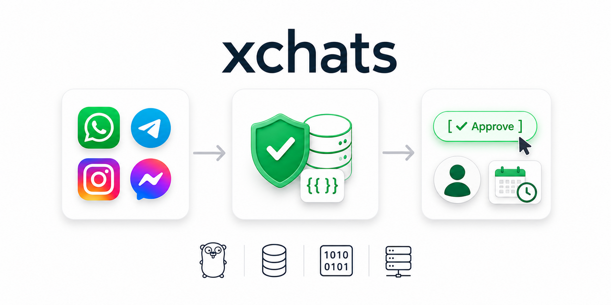
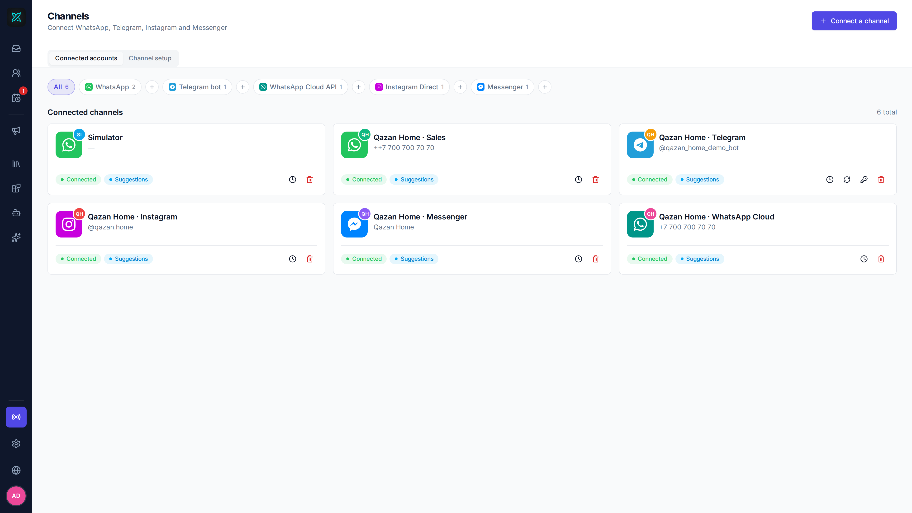
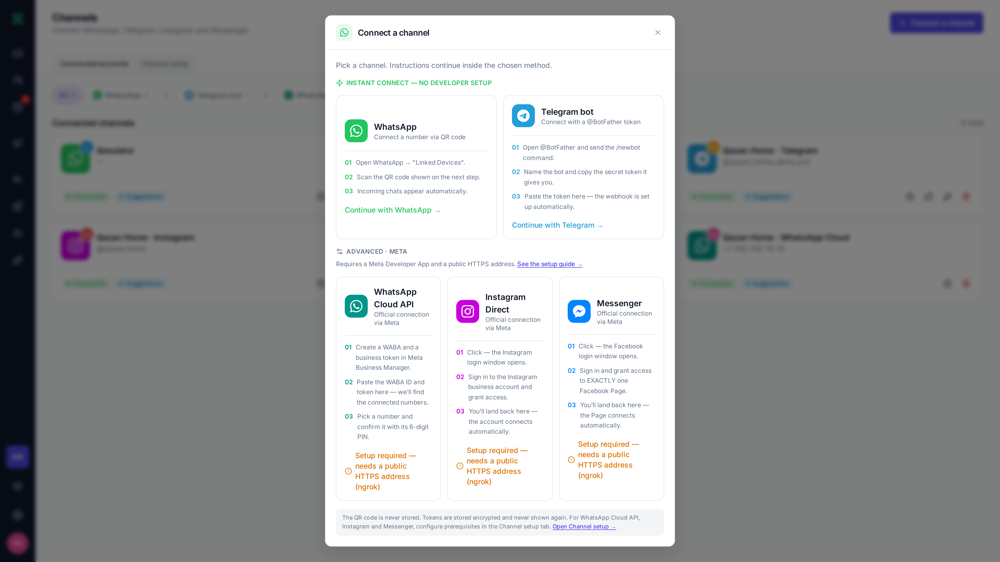
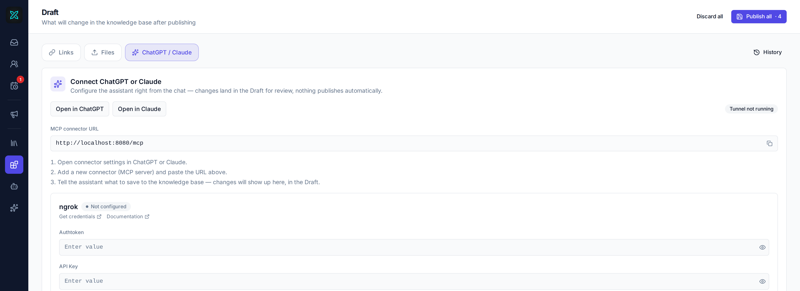
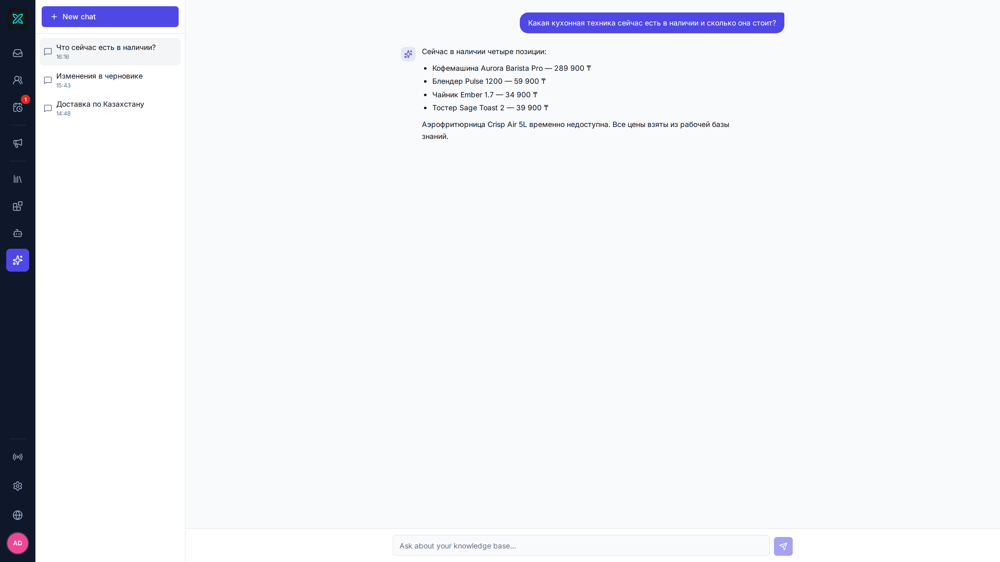
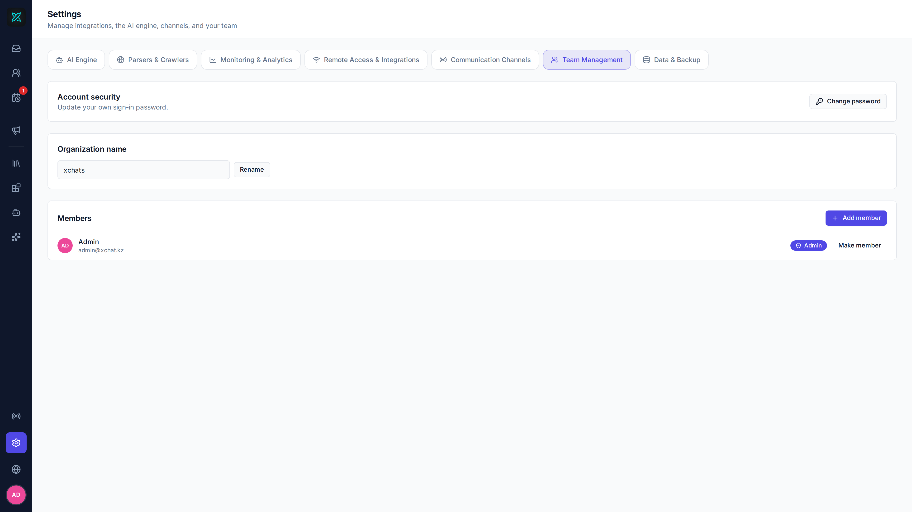

<div align="center">

# xchats

**The self-hosted omnichannel inbox with zero-hallucination AI.**
WhatsApp, Telegram, Instagram and Messenger in one shared inbox — an AI
assistant drafts every reply from your own knowledge base, and a human
always approves before it sends.

[](LICENSE)
[](backend)
[](frontend)
[](docs/release/data-locations-and-privacy.md)
[](deploy)
[](https://github.com/yerassyldanay/xchats/actions/workflows/ci.yml)

**English** · [Русский](README.ru.md) · [Қазақша](README.kk.md)

</div>



---

## 60-second quickstart

```bash
git clone https://github.com/yerassyldanay/xchats.git
cd xchats
make up
make seed
```

Open **http://localhost:8081** — sign in with `admin@xchat.kz` /
`xchat-admin-change-me` (public default; change it after your first login).
`make seed` fills the local instance with the Qazan Home kitchen-appliance
demo and is safe to run again.

## Key superpowers

- **Zero-hallucination replies** — the model never writes a price, date
  or contact detail itself. It emits a `{{token}}`; the backend substitutes
  the exact stored value, or the draft fails closed and escalates to a human.
- **Human-in-the-loop, always** — every draft is a suggestion. Nothing
  reaches a customer until a teammate clicks Send.
- **One binary, one file** — Go + embedded SQLite. No Postgres, no Redis,
  no managed cloud service required to run this.
- **Model-agnostic** — OpenAI, Claude, Gemini, OpenRouter or a local
  Ollama model; swap providers from Settings, not code.
- **Configurable from ChatGPT / Claude** — an MCP connector lets an LLM
  client read your documents and stage knowledge-base edits for your review.

## Visual tour

These are real screens from a seeded Qazan Home instance, not mockups.

### 1. Shared inbox


WhatsApp, Telegram, Instagram, Messenger and WhatsApp Cloud conversations
share one queue. AI replies remain suggestions until a teammate edits,
approves or discards them.

### 2. Channels and automation




Connect QR-based WhatsApp, Telegram, WhatsApp Cloud, Instagram or Messenger.
Each account has health checks and independent automation controls.

### 3. Grounded knowledge base


Products, tariffs, delivery zones, contacts and policies are the only facts
the assistant may use. Numbers become `{{token}}` placeholders and are filled
from stored values; see the [grounding pipeline](docs/images/grounding.svg).

### 4. Imports, review and ChatGPT / Claude




Links, files and the MCP connector all write to the same Draft. ChatGPT or
Claude can use 13 `kb_*` tools after OAuth 2.1 authorization, but every change
still needs human review before publishing.

### 5. Knowledge Base assistant



Ask about live facts, pending changes, or compare both versions. This private
operator workspace never sends messages to customers.

### 6. Customers and follow-ups


The mini CRM keeps identities, notes, tags and ownership together; its daily
board tracks overdue, upcoming and completed follow-ups.

### 7. Campaigns


Import recipients, preview templates, set rate limits and send windows, then
track every delivery and reply in the shared inbox.

### 8. Simulator and evaluations


Rehearse customer questions against the live Knowledge Base or Draft, then
compare prompts and models with the open [`evals/`](evals/) harness.

### 9. Settings



Configure model providers, extraction, Langfuse monitoring, ngrok, channels,
team access and backups from the UI—no secrets belong in `config.yaml`.

## How it works

1. A customer messages you on WhatsApp, Telegram, Instagram or Messenger.
2. It lands in **one inbox**, shared by your whole team.
3. The assistant drafts a reply from your approved knowledge base only.
4. A person reviews, edits or discards it — then sends.

The full design lives in [`docs/overview.md`](docs/overview.md); the grounding
mechanism is summarized in the [visual tour](#3-grounded-knowledge-base).

## Run it another way

- **From source** (dev): `make dev-backend` + `make dev-frontend` — see
  [`docs/release/installation.md`](docs/release/installation.md).
- **Desktop app** (Wails — Windows/macOS/Linux): `make desktop-build` — see
  [`docs/desktop.md`](docs/desktop.md).
- `make help` lists every target.

> [!WARNING]
> The WhatsApp channel connects like WhatsApp Web (no Business API fee), but
> it is an unofficial client — start with a number you can afford to lose.
> Details in the [visual tour](#2-channels-and-automation).

## Documentation

- [`docs/overview.md`](docs/overview.md) — product and architectural overview
- [`docs/release/installation.md`](docs/release/installation.md) — every install path
- [`docs/desktop.md`](docs/desktop.md) — the desktop app
- [`CONTRIBUTING.md`](CONTRIBUTING.md) — dev setup, conventions, PRs
- [`SECURITY.md`](SECURITY.md) — reporting a vulnerability

## License

[AGPL-3.0-only](LICENSE) — chosen after a GPL-3.0 dependency (pulled in
transitively through the WhatsApp integration) was found statically linked
into the backend; see [`THIRD_PARTY_NOTICES.md`](THIRD_PARTY_NOTICES.md).
