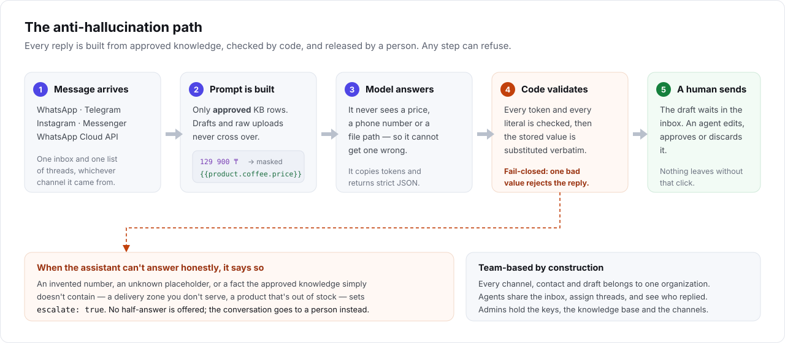
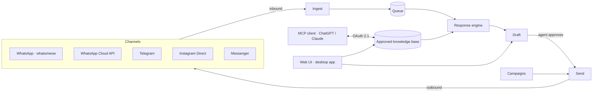

<div align="center">

# xchats

**One team inbox for five messaging channels, with an AI assistant that
drafts every reply from your own knowledge base — and never sends one
without a human.**

[](LICENSE)
[](https://github.com/yerassyldanay/xchats/actions/workflows/ci.yml)
[](https://github.com/yerassyldanay/xchats/actions/workflows/codeql.yml)

**English** · [Русский](README.ru.md) · [Қазақша](README.kk.md)

</div>

xchats is a self-hosted inbox your whole team shares. WhatsApp, Telegram,
Instagram Direct, Messenger and the WhatsApp Cloud API all land in the same
list of conversations. For each incoming message the assistant prepares a
reply drafted strictly from a knowledge base you curate — prices, delivery
zones, policies — and puts it in front of an agent to approve, edit or throw
away.


## The three ideas

**Multi-channel.** Five channels, one inbox, one list of threads. An agent
doesn't switch apps, and the assistant doesn't need to be reconfigured per
channel — a message is a message once it's inside.

**Team-based.** Everything belongs to an organization, not to a person.
Agents share the inbox, assign threads to each other, and see who replied to
what. Admins hold the API keys, the channels and the knowledge base.

**Grounded, not generative.** The assistant is not allowed to know your
prices. It writes replies out of placeholders, and code fills in the real
values afterwards — so a wrong number is a class of bug that cannot happen,
rather than one you hope the model avoids.

## How the assistant is kept honest



The pattern in one paragraph: the prompt contains only **approved** knowledge
rows, never drafts or raw uploaded files. Exact business values are stripped
out of it and replaced by tokens like `{{product.coffee.price}}` — the model
literally never sees `129 900 ₸`, so it cannot mistype it, round it, or make
one up. The model answers in a strict JSON contract; the backend then checks
every placeholder and every number against the approved facts and pastes the
stored values in verbatim. An invented value or an unknown token rejects the
whole reply rather than sending a partly-correct one. And when the approved
knowledge simply doesn't cover the question, the assistant returns
`escalate: true` instead of guessing, and the thread goes to a person.

The last gate is the simplest one: **a draft is a draft.** It sits in the
inbox until an agent presses send. Per channel, an admin can set this to
*off* (no drafts at all), *suggestions* (the default — draft, never send), or
*scheduled auto-send*, which sends automatically only inside a recurring time
window you define and falls back to suggestions outside it.

## Channels


| Channel | How it connects | Notes |
|---|---|---|
| **WhatsApp** | Scan a QR code from **Channels → Connect a channel** | Direct via [whatsmeow](https://github.com/tulir/whatsmeow) — no gateway to run, and no Meta approval. Unofficial; see the warning below. |
| **WhatsApp Cloud API** | Meta OAuth | The official API, for when you want a supported number and templates. |
| **Telegram** | Paste a bot token | Webhook or long-polling, auto-selected by whether a public HTTPS origin is reachable. |
| **Instagram Direct** | Meta OAuth | DMs to a professional Instagram account. |
| **Facebook Messenger** | Meta OAuth | DMs to a Facebook Page. |

The three Meta channels are bring-your-own-app: you enter your own Meta
Developer App ID and secret once under **Channels → Channel setup**, and
xchats handles the OAuth redirect, the webhook subscription and the 24-hour
customer-service window each of them enforces. If you have no public
hostname, the built-in ngrok tunnel supplies one and every webhook URL is
derived from it automatically.

Each channel carries its own automation mode and its own debounce — the
number of seconds xchats waits for a customer to finish typing before it
drafts, so three quick messages become one reply instead of three.

> **WhatsApp connectivity via whatsmeow is unofficial.** It is a
> reverse-engineered client, not WhatsApp's Business API. A connected number
> can be banned at Meta's discretion, with no recourse. Don't pair a number
> you can't afford to lose — use a test number first, or the Cloud API row
> above.

## The knowledge base


The assistant answers out of structured records, not a pile of documents.
Products, tariffs, delivery zones, contacts and policies each have real
fields — a price is a price column, not a sentence — which is exactly what
makes the placeholder substitution above possible.

You can fill it in three ways: by hand in the UI, by pointing the **import
pipeline** at a URL or a document (it extracts the content, then synthesizes
typed draft records for you to review), or from ChatGPT/Claude over the
built-in **MCP connector**. All three write to the same draft layer, and the
**Draft** page shows exactly what publishing would add, update and remove.
Nothing reaches the live knowledge base — and therefore nothing reaches a
customer — until a person publishes it.

## Campaigns


Outbound, when you need it: paste or upload a recipient list, write one
message with `{{name}}`-style variables, pick a sending account, and let it
drain at a pace you set. Sends are rate-limited per account and confined to a
send window, transient failures retry on their own, and the campaign
auto-pauses if the sending account drops offline. Replies land in the normal
inbox as ordinary conversations — with the same assistant drafting the same
approved answers.

## Quickstart

```bash
git clone https://github.com/yerassyldanay/xchats.git
cd xchats
make up                         # backend (:8080) + frontend (:8081), one command
```

`make up` builds and starts both services with Docker Compose — nothing else
to install, and no `.env` to prepare. Open http://localhost:8081 and sign in:

- **Email:** `admin@xchat.kz`
- **Password:** `xchat-admin-change-me`

> **This password is public.** It's printed in this README and committed in
> this repo's migration history, so anyone can look it up. Change it before
> exposing your instance beyond your own machine — see
> [`docs/release/installation.md`](docs/release/installation.md#first-run).
> Locked out instead? `xchats reset-admin-password` restores this same
> default on the next boot.

A setup wizard then walks you through adding an LLM provider key, after which
**Channels → Connect a channel** pairs your first account.

No Docker? `make dev-backend` (Go, `:8080`) and `make dev-frontend` (Vite,
`:5173`) run the same app as two local processes. There is also a native
desktop build — the same binary in a window, for Windows, macOS and Linux —
see [`docs/desktop.md`](docs/desktop.md). Full instructions for every path
are in [`docs/release/installation.md`](docs/release/installation.md).

## Configuration

Configuration lives in two places, deliberately:

- **[`config.yaml`](config.yaml)** — committed to the repo and free of
  secrets. Only what the app needs to boot: listen address, database and blob
  paths, log level, worker count, the default debounce, and the Telegram/Meta
  webhook base URLs. Any value can be overridden by an environment variable of
  the matching name, which is how Docker and Kubernetes pin them.
- **The app itself** — everything an operator actually changes. Settings holds
  the LLM provider and its API key, ngrok, Langfuse, your team and their
  roles, and backups; the Channels page holds the Telegram bot token and the
  Meta Developer App credentials.

System secrets — session signing, credential encryption, MCP signing, the
Telegram webhook secret — are generated on first boot and kept in the
credential store. You never write one down.

## Also in the box

- **MCP connector** — point ChatGPT or Claude at your knowledge base over
  [MCP](https://modelcontextprotocol.io/) and edit products, tariffs, policies
  and delivery zones from the client you already use. OAuth 2.1 + PKCE, no
  shared API key.
- **Conversation simulator** — exercise the assistant against realistic
  customer messages without touching a live account. Off by default; enable it
  with `SIMULATOR_ENABLED=true`.
- **Evaluation harness** ([`evals/`](evals/)) — a standalone Go tool that runs
  the assistant over a curated scenario set and grades the output, so a prompt
  or model change is measured rather than guessed at.
- **Self-hosted, one binary + SQLite** — one Go backend, one SQLite file, no
  services beyond the two containers `make up` starts. Your conversations stay
  on your infrastructure.

## Architecture



One Go backend (`backend/`) serves the HTTP API, runs the channel adapters,
and hosts the MCP server; one Vue 3 + TypeScript frontend (`frontend/`) is the
team's UI, served in a browser or embedded in the desktop build. SQLite is the
only datastore. See [`plan/architecture.md`](plan/architecture.md) for the
full design and [`plan/DECISIONS.md`](plan/DECISIONS.md) for the record of why
it's shaped this way.

## Documentation

- [`docs/release/installation.md`](docs/release/installation.md) — Docker and
  from-source setup, first-run walkthrough.
- [`docs/desktop.md`](docs/desktop.md) — the native desktop app: running it,
  building it, what CI produces.
- [`docs/release/`](docs/release/) — deploying, credentials, backups,
  upgrades, troubleshooting a real deployment.
- [`plan/`](plan/) — the design record this project was built from; start at
  [`plan/README.md`](plan/README.md).
- [`CONTRIBUTING.md`](CONTRIBUTING.md) — development setup, conventions, how
  to open a PR.
- [`SECURITY.md`](SECURITY.md) — how to report a vulnerability.

## License

[AGPL-3.0-only](LICENSE), selected as project policy after a dependency
review found a GPL-3.0 dependency ([`go.mau.fi/libsignal`](https://github.com/tulir/libsignal-protocol-go),
pulled in transitively through whatsmeow) statically linked into the
backend binary — see [`THIRD_PARTY_NOTICES.md`](THIRD_PARTY_NOTICES.md).
GPL-3.0 would also have been a compatible choice; AGPL-3.0 was chosen so
that running a modified version as a network service carries the same
share-back obligation as distributing it does.
