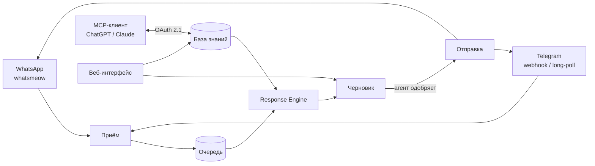

<div align="center">

# xchats

**Self-hosted командный инбокс для WhatsApp и Telegram с AI-ассистентом в режиме «черновик → одобрение».**

[](LICENSE)
[](https://github.com/yerassyldanay/xchats/actions/workflows/ci.yml)
[](https://github.com/yerassyldanay/xchats/actions/workflows/codeql.yml)

[English](README.md) · **Русский** · [Қазақша](README.kk.md)

*Этот файл — перевод. При расхождениях [`README.md`](README.md) на английском считается основным.*

</div>

xchats объединяет WhatsApp и Telegram в один командный инбокс и предлагает
каждому агенту черновик ответа от AI, основанный на курируемой базе знаний —
AI никогда не отправляет сообщения самостоятельно, каждое одобряет человек.
База знаний, поведение ассистента и каждый сгенерированный черновик
редактируются в том же приложении — через веб-интерфейс или напрямую из
ChatGPT/Claude через встроенный MCP-коннектор.


## Быстрый старт

```bash
git clone https://github.com/yerassyldanay/xchats.git
cd xchats
make up                         # backend (:8080) + frontend (:8081), одна команда
```

`make up` собирает и запускает оба сервиса через Docker Compose — больше
ничего устанавливать не нужно. Файл `.env` заранее готовить не требуется:
xchats сам генерирует и надёжно хранит внутренние секреты при первом
запуске, а всё, что настраивает оператор (AI-провайдер и его API-ключ,
ngrok, Langfuse, состав команды), находится в интерфейсе Settings уже после
запуска приложения.

Откройте http://localhost:8081, затем получите одноразовый пароль
администратора и войдите:

```bash
docker compose exec backend /xchats admin-credential show
```

При первом входе система заставит сменить пароль, прежде чем откроется
доступ к остальному интерфейсу. После этого мастер первоначальной настройки
проведёт вас через добавление API-ключа LLM-провайдера, затем **Accounts →
add**, чтобы подключить номер WhatsApp по QR-коду, или **Settings →
Integrations**, чтобы подключить Telegram-бота.

Без Docker: `make dev-backend` (Go, `:8080`) и `make dev-frontend` (Vite,
`:5173`) запускают то же приложение как два локальных процесса — оба
варианта подробно описаны в
[`docs/release/installation.md`](docs/release/installation.md) (на
английском).

> **Подключение к WhatsApp неофициальное.** xchats обращается к WhatsApp
> напрямую через [whatsmeow](https://github.com/tulir/whatsmeow) —
> реверс-инжиниринговый клиент, а не официальный WhatsApp Business API.
> WhatsApp может заблокировать подключённый номер по своему усмотрению, без
> возможности оспорить. Не подключайте номер, потерю которого не готовы
> принять; для начала рассмотрите отдельный тестовый номер.

## Возможности

- **WhatsApp и Telegram в одном инбоксе** — WhatsApp подключается напрямую
  (без отдельного шлюза); Telegram поддерживает доставку и через webhook, и
  через long-polling, выбор происходит автоматически в зависимости от того,
  настроен ли публичный базовый URL.
- **AI-черновики без автоотправки** — каждый ответ от AI — это черновик,
  который агент проверяет, редактирует или отклоняет перед отправкой.
  Ответы формируются из структурированной базы знаний (товары, тарифы, зоны
  доставки, политики), а не свободной генерацией — поэтому ассистент не
  может «придумать» факты, которых ему не давали.
- **MCP-коннектор** — подключите ChatGPT или Claude напрямую к базе знаний
  через [MCP](https://modelcontextprotocol.io/): читайте и редактируйте
  товары/тарифы/политики, управляйте зонами доставки, оформляйте изменения
  как черновики на проверку — прямо из привычного LLM-клиента. OAuth 2.1 +
  PKCE, без общего API-ключа.
- **Симулятор диалогов** — проверяйте работу ассистента на реалистичных
  сообщениях клиентов, не трогая настоящий аккаунт WhatsApp/Telegram, в
  разделе **Playground**.
- **Инструмент для оценки качества** (`evals/`) — отдельная утилита на Go,
  которая прогоняет ассистента через набор курируемых сценариев и оценивает
  результат — чтобы измерять изменения промпта/модели, а не гадать.
- **Self-hosted, один бинарник + SQLite** — один backend на Go, одна база
  SQLite, никаких дополнительных сервисов кроме двух контейнеров, которые
  запускает `make up`. Данные остаются на вашей инфраструктуре.

## Архитектура



Один backend на Go (`backend/`) обслуживает HTTP API, работает с каналами и
хостит MCP-сервер; один frontend на Vue 3 + TypeScript (`frontend/`) —
интерфейс команды. Единственное хранилище — SQLite. Полное описание — в
[`plan/architecture.md`](plan/architecture.md) (на английском), обоснование
решений — в [`plan/DECISIONS.md`](plan/DECISIONS.md).

## Документация

- [`docs/release/installation.md`](docs/release/installation.md) — установка
  через Docker и из исходников, порядок первого запуска.
- [`docs/release/`](docs/release/) — эксплуатация: деплой, секреты,
  резервные копии, обновления, диагностика.
- [`plan/`](plan/) — проектная документация, по которой создавался проект;
  начните с [`plan/README.md`](plan/README.md).
- [`CONTRIBUTING.md`](CONTRIBUTING.md) — настройка окружения разработки,
  соглашения, как оформить PR.
- [`SECURITY.md`](SECURITY.md) — как сообщить об уязвимости.

Основная документация в `docs/release/` и `plan/` ведётся на английском.
Переводы ключевых документов сообщества — в [`docs/i18n/ru/`](docs/i18n/ru/).

## Лицензия

[AGPL-3.0-only](LICENSE) — выбрана как политика проекта после проверки
зависимостей: обнаружена зависимость с лицензией GPL-3.0
([`go.mau.fi/libsignal`](https://github.com/tulir/libsignal-protocol-go),
подключается транзитивно через whatsmeow) и статически линкуется в
backend-бинарник — подробности в
[`THIRD_PARTY_NOTICES.md`](THIRD_PARTY_NOTICES.md). GPL-3.0 также была бы
совместимым вариантом; выбор в пользу AGPL-3.0 сделан, чтобы запуск
изменённой версии как сетевого сервиса нёс то же обязательство делиться
кодом, что и распространение бинарника.
