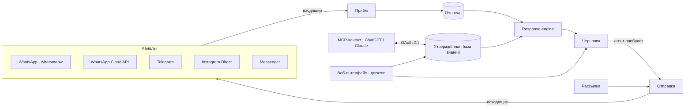

<div align="center">

# xchats

**Один командный инбокс для пяти мессенджеров и AI-ассистент, который
составляет каждый ответ по вашей базе знаний — и никогда не отправляет его
без человека.**

[](LICENSE)
[](https://github.com/yerassyldanay/xchats/actions/workflows/ci.yml)
[](https://github.com/yerassyldanay/xchats/actions/workflows/codeql.yml)

[English](README.md) · **Русский** · [Қазақша](README.kk.md)

*Этот файл — перевод. При расхождениях [`README.md`](README.md) на английском считается основным.*

</div>

xchats — self-hosted инбокс, общий для всей команды. WhatsApp, Telegram,
Instagram Direct, Messenger и WhatsApp Cloud API попадают в один и тот же
список диалогов. На каждое входящее сообщение ассистент готовит ответ строго
по вашей базе знаний — цены, зоны доставки, политики — и показывает его
агенту: одобрить, отредактировать или отклонить.


## Три главные идеи

**Мультиканальность.** Пять каналов, один инбокс, один список диалогов.
Агент не переключается между приложениями, а ассистента не нужно настраивать
под каждый канал — внутри системы сообщение есть сообщение.

**Командная работа.** Всё принадлежит организации, а не отдельному человеку.
Агенты работают в общем инбоксе, назначают диалоги друг на друга и видят, кто
что ответил. У администраторов — API-ключи, каналы и база знаний.

**Ответ из данных, а не из головы модели.** Ассистенту не разрешено знать
ваши цены. Он пишет ответ через плейсхолдеры, а код подставляет настоящие
значения после — так неверная цифра становится невозможной по конструкции, а
не тем, чего вы надеетесь избежать.

## Как ассистента удерживают от выдумок


Схема в одном абзаце: в промпт попадают только **утверждённые** записи базы
знаний — никогда черновики и никогда исходные загруженные файлы. Точные
бизнес-значения из него вырезаны и заменены токенами вида
`{{product.coffee.price}}` — модель буквально не видит `129 900 ₸`, поэтому
не может опечататься, округлить или придумать. Модель отвечает строгим
JSON-контрактом; затем backend сверяет каждый плейсхолдер и каждое число с
утверждёнными фактами и подставляет сохранённые значения дословно.
Придуманное значение или неизвестный токен отклоняют весь ответ целиком —
вместо того чтобы отправить наполовину верный. А когда утверждённых знаний
для вопроса просто нет, ассистент возвращает `escalate: true` вместо
догадки, и диалог уходит человеку.

Последний рубеж — самый простой: **черновик остаётся черновиком.** Он ждёт в
инбоксе, пока агент не нажмёт «Отправить». Для каждого канала администратор
может выбрать режим: *off* (черновики не создаются вовсе), *suggestions*
(по умолчанию — черновик, но никогда не отправка) или *отправка по
расписанию*, когда ответ уходит автоматически только внутри заданного
повторяющегося окна времени, а вне его снова работает как *suggestions*.

## Каналы


| Канал | Как подключается | Примечания |
|---|---|---|
| **WhatsApp** | Сканирование QR-кода в **Channels → Connect a channel** | Напрямую через [whatsmeow](https://github.com/tulir/whatsmeow) — без отдельного шлюза и без одобрения Meta. Неофициально, см. предупреждение ниже. |
| **WhatsApp Cloud API** | OAuth через Meta | Официальный API — когда нужен поддерживаемый номер и шаблоны сообщений. |
| **Telegram** | Токен бота | Webhook или long-polling, выбирается автоматически по тому, доступен ли публичный HTTPS-адрес. |
| **Instagram Direct** | OAuth через Meta | Личные сообщения профессиональному аккаунту Instagram. |
| **Facebook Messenger** | OAuth через Meta | Личные сообщения странице Facebook. |

Три канала Meta работают по принципу «своё приложение»: вы один раз вводите
собственные App ID и секрет из Meta Developer в разделе
**Channels → Channel setup**, а xchats берёт на себя OAuth-редирект, подписку
на webhook и 24-часовое окно клиентской поддержки, которое требует каждый из
них. Если публичного хоста нет, встроенный ngrok-туннель даёт его, и все
webhook-адреса выводятся из него автоматически.

У каждого канала — свой режим автоматизации и свой debounce: сколько секунд
xchats ждёт, пока клиент допишет, прежде чем составить черновик, чтобы три
быстрых сообщения превратились в один ответ, а не в три.

> **Подключение к WhatsApp через whatsmeow неофициальное.** Это
> реверс-инжиниринговый клиент, а не WhatsApp Business API. Meta может
> заблокировать подключённый номер по своему усмотрению, без возможности
> оспорить. Не подключайте номер, потерю которого не готовы принять —
> начните с тестового или используйте Cloud API из таблицы выше.

## База знаний


Ассистент отвечает по структурированным записям, а не по куче документов. У
товаров, тарифов, зон доставки, контактов и политик есть настоящие поля —
цена лежит в колонке цены, а не в предложении, — и именно это делает
возможной подстановку плейсхолдеров, описанную выше.

Заполнить её можно тремя способами: вручную в интерфейсе, через **конвейер
импорта** (укажите ссылку или документ — он извлечёт содержимое и соберёт
типизированные записи-черновики вам на проверку) или из ChatGPT/Claude через
встроенный **MCP-коннектор**. Все три пути пишут в один и тот же слой
черновиков, а страница **Draft** показывает, что именно публикация добавит,
изменит и удалит. Ничто не попадает в живую базу знаний — а значит, и к
клиенту, — пока это не опубликует человек.

## Рассылки


Исходящие, когда они нужны: вставьте или загрузите список получателей,
напишите одно сообщение с переменными вида `{{name}}`, выберите отправляющий
аккаунт — и рассылка пойдёт в заданном вами темпе. Отправки ограничены по
частоте для каждого аккаунта и идут только внутри окна отправки, временные
ошибки повторяются сами, а если отправляющий аккаунт отвалится, рассылка
встанет на паузу автоматически. Ответы приходят в обычный инбокс обычными
диалогами — с тем же ассистентом и теми же утверждёнными ответами.

## Быстрый старт

```bash
git clone https://github.com/yerassyldanay/xchats.git
cd xchats
make up                         # backend (:8080) + frontend (:8081), одна команда
```

`make up` собирает и запускает оба сервиса через Docker Compose — больше
ничего устанавливать не нужно, и `.env` заранее готовить не требуется.
Откройте http://localhost:8081 и войдите:

- **Email:** `admin@xchat.kz`
- **Пароль:** `xchat-admin-change-me`

> **Этот пароль публичный.** Он указан в этом README и зафиксирован в
> истории миграций репозитория, так что его может найти кто угодно. Смените
> его до того, как открывать доступ к своему инстансу за пределами своей
> машины — как это сделать, см.
> [`docs/release/installation.md`](docs/release/installation.md#first-run)
> (на английском). Остались без доступа? `xchats reset-admin-password`
> восстановит этот же пароль по умолчанию при следующем запуске.

Дальше мастер настройки проведёт вас через добавление API-ключа
LLM-провайдера, после чего **Channels → Connect a channel** подключит первый
аккаунт.

Без Docker: `make dev-backend` (Go, `:8080`) и `make dev-frontend` (Vite,
`:5173`) запускают то же приложение как два локальных процесса. Есть и
нативная десктоп-сборка — тот же бинарник в окне, для Windows, macOS и Linux,
см. [`docs/desktop.md`](docs/desktop.md) (на английском). Подробности по всем
вариантам — в [`docs/release/installation.md`](docs/release/installation.md).

## Конфигурация

Настройки намеренно живут в двух местах:

- **[`config.yaml`](config.yaml)** — лежит в репозитории и не содержит
  секретов. Только то, что нужно приложению для запуска: адрес прослушивания,
  пути к базе и файлам, уровень логирования, число воркеров, debounce по
  умолчанию и базовые webhook-адреса для Telegram и Meta. Любое значение
  можно переопределить переменной окружения с тем же именем — так их
  фиксируют в Docker и Kubernetes.
- **Само приложение** — всё, что оператор действительно меняет. В Settings —
  LLM-провайдер и его API-ключ, ngrok, Langfuse, состав команды и роли,
  резервные копии; на странице Channels — токен Telegram-бота и учётные
  данные приложения Meta Developer.

Системные секреты — подпись сессий, шифрование учётных данных, подпись MCP,
секрет webhook Telegram — генерируются при первом запуске и хранятся в
credential store. Записывать их куда-то не нужно.

## Что ещё внутри

- **MCP-коннектор** — подключите ChatGPT или Claude к своей базе знаний через
  [MCP](https://modelcontextprotocol.io/) и правьте товары, тарифы, политики
  и зоны доставки прямо из привычного клиента. OAuth 2.1 + PKCE, без общего
  API-ключа.
- **Симулятор диалогов** — прогоняйте ассистента на реалистичных сообщениях
  клиентов, не трогая живой аккаунт. По умолчанию выключен, включается через
  `SIMULATOR_ENABLED=true`.
- **Инструмент оценки качества** ([`evals/`](evals/)) — отдельная утилита на
  Go, которая прогоняет ассистента через набор курируемых сценариев и
  оценивает результат: изменение промпта или модели измеряется, а не
  угадывается.
- **Self-hosted, один бинарник + SQLite** — один backend на Go, один файл
  SQLite, никаких сервисов кроме двух контейнеров, которые запускает
  `make up`. Переписка остаётся на вашей инфраструктуре.

## Архитектура



Один backend на Go (`backend/`) обслуживает HTTP API, работает с каналами и
хостит MCP-сервер; один frontend на Vue 3 + TypeScript (`frontend/`) —
интерфейс команды: в браузере или встроенный в десктоп-сборку. Единственное
хранилище — SQLite. Полное описание — в
[`plan/architecture.md`](plan/architecture.md) (на английском), обоснование
решений — в [`plan/DECISIONS.md`](plan/DECISIONS.md).

## Документация

- [`docs/release/installation.md`](docs/release/installation.md) — установка
  через Docker и из исходников, порядок первого запуска.
- [`docs/desktop.md`](docs/desktop.md) — нативное десктоп-приложение: запуск,
  сборка, что выпускает CI.
- [`docs/release/`](docs/release/) — эксплуатация: деплой, секреты,
  резервные копии, обновления, диагностика.
- [`plan/`](plan/) — проектная документация, по которой создавался проект;
  начните с [`plan/README.md`](plan/README.md).
- [`CONTRIBUTING.md`](CONTRIBUTING.md) — настройка окружения разработки,
  соглашения, как оформить PR.
- [`SECURITY.md`](SECURITY.md) — как сообщить об уязвимости.

Основная документация в `docs/release/` и `plan/` ведётся на английском.
Переводы ключевых документов сообщества — в [`docs/i18n/ru/`](docs/i18n/ru/).

## Лицензия

[AGPL-3.0-only](LICENSE) — выбрана как политика проекта после проверки
зависимостей: обнаружена зависимость с лицензией GPL-3.0
([`go.mau.fi/libsignal`](https://github.com/tulir/libsignal-protocol-go),
подключается транзитивно через whatsmeow) и статически линкуется в
backend-бинарник — подробности в
[`THIRD_PARTY_NOTICES.md`](THIRD_PARTY_NOTICES.md). GPL-3.0 также была бы
совместимым вариантом; выбор в пользу AGPL-3.0 сделан, чтобы запуск
изменённой версии как сетевого сервиса нёс то же обязательство делиться
кодом, что и распространение бинарника.
