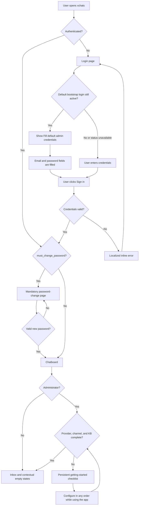

# First-Time Onboarding — Current Flow & Roadmap

> **Verified:** 2026-08-30 against the Vue router, auth store, login and password-change views, persistent checklist, and backend auth/bootstrap handlers.
>
> **Status:** The original blocking setup wizard has been removed. The intended baseline is implemented: a predictable first login, mandatory password rotation, immediate product access, and configuration along the way.

## Product Decisions — Do Not Regress

1. A fresh installation uses the known bootstrap credentials `admin@xchat.kz` / `xchat-admin-change-me`.
2. The login page may offer **Fill default admin credentials** only while that exact bootstrap account is still reachable with the default password.
3. The helper fills the fields but never submits the form automatically.
4. `must_change_password` is mandatory for the bootstrap account. The router and backend both enforce it.
5. After changing the password, the user enters the app immediately. Configuration is not a blocking wizard.
6. Administrators receive a persistent, minimizable checklist for AI provider, channel, and Knowledge Base setup.
7. Users can change their password later from Account Security.

The goal is a simple first run, not a generated password that operators must find in logs or deployment output.

## Entry Points

- Fresh installation at `/login`.
- Returning unauthenticated user redirected to `/login` by the router.
- Authenticated user with `must_change_password = true` redirected to `/change-password` before protected routes.
- Returning authenticated user with no forced change goes directly to the requested protected route.

## Current User Flow

## Implemented Legacy Findings

These entries preserve the original friction-point numbers referenced by existing code comments.

| Legacy | Status | Implemented behavior |
|---|---|---|
| #1 Public default credentials | ✅ Implemented | Migration `0014` sets `must_change_password = 1` only for the unchanged sentinel admin. The known password remains intentionally easy to use for the first login. |
| #2 No password-change UI | ✅ Implemented | Mandatory `/change-password` flow plus Account Security for later password changes. |
| #3 Admin-only setup wizard | 🟡 Reframed | The wizard was deleted. Administrators get an actionable checklist; the remaining operator empty-state problem is tracked as `ONB-03`. |
| #4 Knowledge Base omitted | ✅ Implemented | Published Knowledge Base content is one of the 3 persistent checklist milestones. |
| #5 Setup steps permanently skippable | ✅ Implemented | There is no blocking wizard or permanent skip. The checklist can be minimized and returns until complete. |
| #6 No persistent checklist | ✅ Implemented | `GettingStartedChecklist.vue` is rendered above the chatboard. |
| #7 Channel step loses context | ✅ Implemented | Channel setup is opened as normal application navigation; the checklist remains available afterward. |
| #8 Premature teammate invitation | ✅ Implemented | Team creation is not part of first-run gating. |
| #9 Wizard skipped after load failure | ✅ Implemented | The old `setup_completed` wizard gate no longer exists. Checklist-load recovery remains separately tracked in `ONB-12`. |
| #10 Wizard accessibility | ✅ Removed with wizard | The inaccessible custom wizard was deleted. Current login accessibility is tracked in `ONB-13`. |

## Remaining Work

### ONB-03 — [P2] Operators Lack Context in an Empty Workspace

**Status:** Open — reframed from legacy friction #3.

**Current behavior:** Non-admin users correctly do not receive admin-only provider/channel/KB actions. On an empty workspace they still land on 3 mostly blank panes with generic “No chats yet” and “Pick a conversation” copy.

**Target behavior:** Explain the operator’s role and what must happen before conversations arrive. If setup is incomplete, say that an administrator must connect a channel. If setup is complete but no messages exist, explain that incoming conversations will appear automatically.

**Acceptance criteria:**

- Empty-state copy distinguishes “workspace is not configured” from “configured but no messages yet.”
- A member sees administrator contact information or a clear instruction to contact an administrator when setup is blocked.
- No admin-only controls are exposed to members.
- Empty-state changes are covered by component tests.

**Primary ownership:** `ChatList.vue`, `ChatThread.vue`, `AssistantPanel.vue`, `accounts`/channel-setup state.

### ONB-11 — [P2] A Broken Channel Counts as Checklist Completion

**Status:** Open — newly identified.

**Current behavior:** `hasChannel` is true when `accounts.accounts.length > 0`, even if every account is disconnected or in an error state.

**Target behavior:** Complete the milestone only when at least 1 account can actually receive or send messages. Show a recovery state when accounts exist but require attention.

**Acceptance criteria:**

- `connected` or another explicitly usable state completes the task.
- Broken-only account lists keep the task open and link to the affected account.
- The state is derived in the account store or a focused composable rather than duplicated in templates.

**Primary ownership:** `stores/accounts.ts`, `GettingStartedChecklist.vue`, `Accounts.vue`.

### ONB-12 — [P2] Checklist Status Failures Are Silent

**Status:** Open — newly identified.

**Current behavior:** Provider and Knowledge Base status requests are best-effort. Failure leaves tasks looking incomplete without explaining whether configuration is missing or status could not be loaded.

**Target behavior:** Represent loading, loaded, and failed states explicitly. A failed status check must show a compact retry action without blocking the inbox.

**Acceptance criteria:**

- Checklist tasks do not display a definitive incomplete state until their source has loaded.
- Failed checks show localized error text and Retry.
- Retry updates only the failed source.
- Rejected promises are handled and tested.

**Primary ownership:** `GettingStartedChecklist.vue`, `stores/settings.ts`, `stores/playground.ts`.

### ONB-13 — [P2] Login Form Semantics and Async Feedback Need Accessibility Work

**Status:** Open — newly identified.

**Current behavior:** Visible login labels are not programmatically associated with their inputs. Inline errors and bootstrap-helper changes are not announced as live status updates.

**Target behavior:** Use associated labels, stable `name` attributes, correct autocomplete values, and polite live regions for asynchronous status and errors.

**Acceptance criteria:**

- Email and password labels activate/focus their controls.
- Controls have stable `id`, `name`, and autocomplete attributes.
- Login errors use `aria-live="polite"` or an equivalent accessible alert pattern.
- Keyboard and screen-reader behavior is covered by DOM tests.

**Primary ownership:** `Login.vue`, `MaskedSecretInput.vue`, shared input primitives.

## Source Map

| Responsibility | Source |
|---|---|
| Login and default-credential helper | [`Login.vue`](../../../frontend/src/views/Login.vue) |
| Auth/bootstrap state | [`auth.ts`](../../../frontend/src/stores/auth.ts) |
| Router enforcement | [`router.ts`](../../../frontend/src/router.ts) |
| Mandatory password change | [`ChangePassword.vue`](../../../frontend/src/views/ChangePassword.vue) |
| Backend bootstrap status and password gate | [`auth.go`](../../../backend/internal/httpapi/auth.go) |
| Sentinel password migration | [`0014_force_default_admin_password_change.up.sql`](../../../backend/migrations/sqlite/0014_force_default_admin_password_change.up.sql) |
| App shell and provider-health lifecycle | [`App.vue`](../../../frontend/src/App.vue) |
| Persistent checklist | [`GettingStartedChecklist.vue`](../../../frontend/src/components/GettingStartedChecklist.vue) |
| Chatboard composition | [`Chatboard.vue`](../../../frontend/src/views/Chatboard.vue) |
| Account Security | [`AccountSecurityDialog.vue`](../../../frontend/src/components/settings/AccountSecurityDialog.vue) |

## Implementation Order

1. `ONB-11` — prevent false completion.
2. `ONB-12` — make checklist state trustworthy.
3. `ONB-03` — improve member/operator orientation.
4. `ONB-13` — complete form and async accessibility.
