# First-Time Onboarding — User Flow

> **Purpose:** Trace the end-to-end first-time user experience from launching a fresh installation of xchats through sign-in with the default bootstrap credentials, initial workspace loading, and the Setup Wizard modal to the final empty inbox state. The forced-password route is included as a conditional branch, but the current seed migration does **not** set that flag for the default admin. Friction points are marked with 🔴.

---

## How the User Gets Here

A user enters this flow immediately upon deploying and launching a fresh instance of xchats:

1. **New deployment launch:** The operator starts the application (via Docker, source build, or desktop binary) and opens the web application at the host URL (e.g., `http://localhost:8081` or `http://localhost:5173`) or opens the desktop application window.
2. **Initial navigation:** Navigating to the root URL `/` displays the public landing page with a top-navigation "Log in" button. Navigating to any protected route (e.g., `/chatboard`, `/accounts`, `/settings`) triggers an authentication check that automatically redirects the unauthenticated user to `/login`.

---

## User Flow Diagram

```mermaid
flowchart TD
    AppLaunch["User opens xchats in browser or desktop app"]
    AppLaunch --> LoginPage

    subgraph LoginPage["Screen: /login — Sign In"]
        direction TB
        LoginSees["User sees:
        • Left brand panel:
          - Logo: X xchats
          - Headline: Team inbox and AI assistant
          - Feature list: One WhatsApp inbox | AI replies | Security and control
        • Right form panel:
          - Header: Sign in
          - Subtitle: Sign in to open your inbox
          - Email input field with Mail icon
          - Password input field with Lock icon
          - Button: Sign in
          - Note: No account? Contact your administrator
          - Language switcher: Русский · English · Қазақша"]
    end

    LoginSubmit{"User enters credentials\nand clicks Sign in"}
    LoginPage --> LoginSubmit

    LoginSubmit -->|"Invalid email or password"| LoginErrorState
    LoginSubmit -->|"Valid current seeded admin credentials\nmust_change_password is false"| AdminDirectInbox
    LoginSubmit -->|"Account is explicitly flagged\nmust_change_password is true"| ChangePasswordPage
    LoginSubmit -->|"Valid non-admin credentials"| OperatorDirectInbox

    subgraph LoginErrorState["Screen: /login — Error"]
        direction TB
        LoginErrSees["User sees:
        • Red alert icon + 'Wrong email or password'
        • Form fields preserved for re-entry
        • Sign in button re-enabled"]
    end
    LoginErrorState --> LoginPage

    subgraph ChangePasswordPage["Conditional screen: /change-password — Forced Password Reset"]
        direction TB
        ChangePwSees["User sees:
        • Centered card with KeyRound icon
        • Title: Change your password
        • Subtitle: Set a new password for this account before continuing
        • Input: Current password with eye toggle
        • Input: New password with eye toggle
        • Input: Confirm new password with eye toggle
        • Primary Button: Change password
        • Secondary Button: Log out"]
    end

    ChangePwAction{"User action on\nPassword Reset"}
    ChangePasswordPage --> ChangePwAction

    ChangePwAction -->|"Clicks Log out"| LoginPage
    ChangePwAction -->|"Validation error or mismatch"| ChangePwErrorState
    ChangePwAction -->|"Valid new password entered"| PasswordSuccessTransition

    subgraph ChangePwErrorState["Screen: /change-password — Validation Error"]
        direction TB
        PwErrSees["User sees inline error banner:
        • Passwords do not match OR
        • The new password must differ from current one OR
        • Current password is incorrect OR
        • Too many attempts. Wait a moment"]
    end
    ChangePwErrorState --> ChangePasswordPage

    subgraph PasswordSuccessTransition["Transition: Admin Session Initialized"]
        direction TB
        TransitionSees["System updates password flag
        Router redirects to /chatboard
        Nav rail renders on left
        App onboarding gate triggers Setup Wizard"]
    end

    PasswordSuccessTransition --> WizardStep1

    subgraph AdminDirectInbox["Transition: Seeded Admin Session Initialized"]
        direction TB
        AdminTransitionSees["Router redirects directly to /chatboard 🔴
        Nav rail renders on left
        App onboarding gate triggers Setup Wizard
        Public default password remains unchanged"]
    end
    AdminDirectInbox --> WizardStep1

    subgraph OperatorDirectInbox["Screen: /chatboard — Non-Admin Operator Landing"]
        direction TB
        OpSees["User sees:
        • Persistent left Nav Rail
        • Empty Chat List: 'No chats yet'
        • Empty Thread Pane: 'Pick a chat to open the conversation'
        • Right panel defaults to Customer: 'Pick a conversation'
        • Zero onboarding guide or wizard shown 🔴"]
    end

    subgraph WizardStep1["Modal: Welcome to xchats — Step 1 of 3 (AI Provider)"]
        direction TB
        W1Sees["User sees modal over dimmed chatboard:
        • Header: Welcome to xchats | Step 1 / 3
        • Header Action: Skip setup button 🔴
        • Body Text: Add an API key so assistant can draft replies
        • OpenRouter Credential Card:
          - Provider title: OpenRouter
          - Status badge: Not configured
          - Link: Get API key with external icon
          - Link: Documentation with external icon
          - Masked Secret Input: API key
          - Button: Save
        • Footer: Empty left | Button: Next"]
    end

    W1Action{"User action on\nWizard Step 1"}
    WizardStep1 --> W1Action

    W1Action -->|"Enters key and clicks Save"| W1SaveKey
    W1Action -->|"Clicks Next without saving"| WizardStep2
    W1Action -->|"Clicks Skip setup"| SkipSetupAction

    subgraph W1SaveKey["Modal: Step 1 — Key Verification"]
        direction TB
        W1KeyStatus["User sees:
        • Spinner: Saving...
        • If valid: Status flips to Verified with green badge
        • If invalid: Inline error 'Invalid API key'
        • Additional settings appear: Base URL, Default Model"]
    end
    W1SaveKey --> WizardStep1

    subgraph WizardStep2["Modal: Welcome to xchats — Step 2 of 3 (Channels)"]
        direction TB
        W2Sees["User sees:
        • Header: Welcome to xchats | Step 2 / 3
        • Header Action: Skip setup button
        • Body Text: Connect a WhatsApp number or Telegram bot
        • Central Button: Go to Channels 🔴
        • Footer: Button: Back | Button: Next"]
    end

    W2Action{"User action on\nWizard Step 2"}
    WizardStep2 --> W2Action

    W2Action -->|"Clicks Back"| WizardStep1
    W2Action -->|"Clicks Next"| WizardStep3
    W2Action -->|"Clicks Go to Channels"| GoToChannelsAction
    W2Action -->|"Clicks Skip setup"| SkipSetupAction

    subgraph WizardStep3["Modal: Welcome to xchats — Step 3 of 3 (Invite Team)"]
        direction TB
        W3Sees["User sees:
        • Header: Welcome to xchats | Step 3 / 3
        • Header Action: Skip setup button
        • Body Text: Invite a teammate now or later from Settings
        • Form:
          - Input: Name
          - Input: Email
          - Input: Password
          - Button: Invite
        • Footer: Button: Back | Button: Finish"]
    end

    W3Action{"User action on\nWizard Step 3"}
    WizardStep3 --> W3Action

    W3Action -->|"Fills form and clicks Invite"| W3InviteSubmit
    W3Action -->|"Clicks Back"| WizardStep2
    W3Action -->|"Clicks Finish"| FinishWizardAction
    W3Action -->|"Clicks Skip setup"| SkipSetupAction

    subgraph W3InviteSubmit["Modal: Step 3 — Invite Feedback"]
        direction TB
        W3Feedback["User sees:
        • If error: Red text error message
        • If success: Green checkmark + 'Invitation sent.'
        • Invite form is replaced by the success message
        • Wizard remains on Step 3 until Back, Finish, or Skip setup"]
    end
    W3InviteSubmit --> WizardStep3

    subgraph GoToChannelsAction["Action: Go to Channels"]
        direction TB
        ChannelsNav["Wizard automatically finishes and dismisses 🔴
        Router navigates to /accounts"]
    end
    GoToChannelsAction --> AccountsPageEmpty

    subgraph FinishWizardAction["Action: Complete Wizard"]
        direction TB
        WizardClose["Setup is marked complete in settings
        Modal dismisses
        User remains on /chatboard"]
    end
    FinishWizardAction --> EmptyChatboardFinal

    subgraph SkipSetupAction["Action: Skip Setup"]
        direction TB
        SkipClose["Setup is marked complete without saving 🔴
        Modal dismisses immediately
        User remains on /chatboard"]
    end
    SkipSetupAction --> EmptyChatboardFinal

    subgraph EmptyChatboardFinal["Screen: /chatboard — Completed Onboarding"]
        direction TB
        FinalBoardSees["User sees unguided empty workspace:
        • Left Nav Rail: Inbox, Customers, Tasks, Channels, Campaigns, KB, Simulator, Settings
        • Left Pane: Chat list empty state — 'No chats yet. New messages will show up here.'
        • Middle Pane: Chat thread empty state — 'Pick a chat to open the conversation'
        • Right Pane: Customer tab empty state — 'Pick a conversation.'
        • No getting-started checklist or onboarding banner 🔴"]
    end

    subgraph AccountsPageEmpty["Screen: /accounts — Channels Management"]
        direction TB
        AccountsSees["User sees:
        • Header: Channels
        • Stat cards: Connected 0 | Waiting on action 0 | Not connected 0
        • Empty state banner
        • Button: + Connect a channel
        • No contextual return link to finish wizard 🔴"]
    end
```

---

## Friction Points and Suggested Changes

### 🔴 1. Default Admin Credentials are Public in the README and Migrations

**What happens today:** The initial admin credentials (`admin@xchat.kz` / `xchat-admin-change-me`) are publicly documented in the repository `README.md` and restored by the current database migration. That migration also sets `must_change_password = 0`, so the seeded admin is **not** sent through `/change-password`; the public password remains valid until an operator changes it through the API. On a publicly reachable, unconfigured deployment, this is an immediate account-takeover risk.

**Suggested change:** Automatically generate a strong random one-time administrator password upon first startup and print it directly to the terminal stdout / container logs (or prompt the operator to initialize credentials in an interactive initial setup CLI command).

---

### 🔴 2. No Way to Change Password in the UI

**What happens today:** The `/change-password` view exists only for accounts whose server-side `must_change_password` flag is true. The current seeded admin is not flagged, and there is no password management or security interface in the profile menu or Settings. The `README.md` directs users to send a manual `curl` request to change the default password.

**Suggested change:** Add an "Account Security" / "Change Password" modal or sub-tab inside the user profile avatar dropdown in the navigation rail and within the Settings page so operators and administrators can update their password directly from the interface at any time.

---

### 🔴 3. Setup Wizard is Exclusively Shown to Administrators

**What happens today:** The setup wizard check in `App.vue` only evaluates `onboardingReady` for users where `isAdmin` is true. When a teammate or operator account logs in for the first time, they bypass all introductory guidance and are dropped directly onto an empty `/chatboard` with three blank columns and zero context.

**Suggested change:** Implement an Operator Onboarding Tour for non-admin team members that introduces the shared inbox, explains the three-pane layout (Chat List, Active Conversation Thread, CRM / AI Suggested Reply panel), and explains how to review, edit, and approve AI draft suggestions.

---

### 🔴 4. Knowledge Base Setup is Completely Omitted from the Setup Wizard

**What happens today:** The 3-step setup wizard covers an AI provider key (Step 1), a channel connection redirect (Step 2), and teammate creation (Step 3). The Knowledge Base is never mentioned even though its published records provide the business facts used to ground assistant replies.

**Suggested change:** Add a dedicated Knowledge Base step into the onboarding wizard (e.g., between AI Provider and Channels) offering a one-click button to "Load Demo Knowledge Base" (`seed-kb-demo`) or import existing business facts, explaining that the AI relies entirely on this knowledge to answer inquiries.

---

### 🔴 5. Every Step is Permanently Dismissable with "Skip setup"

**What happens today:** The top-right header of every wizard step has a "Skip setup" button. Clicking it immediately triggers `store.setupComplete()`, which permanently marks the deployment as setup-complete on the server and closes the modal. Users who accidentally click this are left with an unconfigured system and no obvious way to relaunch the guided flow.

**Suggested change:** Replace the destructive "Skip setup" action with "Save for later" or "Minimize checklist". If a user attempts to dismiss setup before adding an AI key or connecting a channel, display a gentle confirmation explaining what capabilities remain inactive.

---

### 🔴 6. No Persistent Getting-Started Checklist After Wizard Closes

**What happens today:** As soon as the Setup Wizard is completed or skipped, the modal vanishes completely. The user is left looking at an empty 3-pane chatboard with placeholder messages ("No chats yet", "Pick a chat to open the conversation", "Pick a conversation"). There is no persistent onboarding checklist, banner, or progress indicator remaining on screen to guide next actions.

**Suggested change:** Render a collapsible "Getting Started Checklist" card on the empty inbox state (or in the top header) showing remaining setup milestones:
1. [ ] Replace Default Admin Credentials
2. [ ] Add AI Provider API Key (OpenRouter / OpenAI / Gemini)
3. [ ] Connect WhatsApp or Telegram Channel
4. [ ] Populate Knowledge Base Facts
5. [ ] Test Assistant in Simulator
6. [ ] Invite Teammates

---

### 🔴 7. Channel Step Immediately Closes the Wizard and Drops Context

**What happens today:** On Step 2 of the wizard ("Connect Channels"), the central action button is "Go to Channels". Clicking this button immediately invokes `finish()`, which marks setup complete, destroys the wizard modal, and redirects the user to `/accounts`. The user never sees Step 3 (Invite Teammate), and no guided overlay or contextual tutorial appears on the `/accounts` page.

**Suggested change:** Embed the channel connection dialog directly inside the wizard modal (or launch the channel connector as a child modal that returns the user back to Step 3 of the wizard upon completion).

---

### 🔴 8. Step 3 Prompts for Teammate Invites Before the Product is Functional

**What happens today:** Step 3 asks the administrator to create a teammate account and choose its password before a channel or Knowledge Base content is required. The action provisions the account directly; despite the success copy saying "Invitation sent", there is no email invitation or acceptance flow. A teammate can therefore receive credentials for an empty or non-functional workspace.

**Suggested change:** Reorder onboarding milestones so that teammate invitations are recommended as the final step *after* at least one communication channel is connected and verified in the Simulator.

---

### 🔴 9. Setup Wizard Can Be Silently Skipped After a Load Failure

**What happens today:** `App.vue` checks setup status only once per admin session. If `settingsStore.load()` fails during that check, the catch block intentionally does nothing and `checkedSetup` remains true. The wizard will not retry during the session, and the user receives no explanation that onboarding was skipped.

**Suggested change:** Surface a retryable onboarding-status error and retry on reconnect or the next navigation. Do not mark the one-time check as complete until setup state has loaded successfully.

---

### 🔴 10. Setup Wizard Lacks Dialog and Form Accessibility

**What happens today:** The wizard is a fixed overlay made from plain `div` elements. It has no dialog semantics, accessible name, focus trap, initial focus, Escape handling, or focus restoration. Its teammate inputs rely on placeholders instead of associated labels, and asynchronous errors/success are not announced through a live region. Keyboard and screen-reader users can move into the obscured application behind the modal or miss state changes.

**Suggested change:** Use the shared accessible Dialog primitives, add explicit labels and field names, focus the first relevant control, trap and restore focus, support Escape with an intentional confirmation policy, and announce validation/success with `aria-live="polite"`.

---

## Source Components

| UI Element / Screen | Source File | Description |
|---|---|---|
| Sign In Screen | [`Login.vue`](../../../frontend/src/views/Login.vue) | Brand panel, credentials form, error feedback, and language selector |
| Conditional Password Reset Screen | [`ChangePassword.vue`](../../../frontend/src/views/ChangePassword.vue) | Password form shown only when the authenticated account carries `must_change_password = true` |
| Masked Password Input Component | [`MaskedSecretInput.vue`](../../../frontend/src/components/settings/MaskedSecretInput.vue) | Shared secret input with eye icon toggle for showing/masking passwords |
| Onboarding Gate & Realtime Mount | [`App.vue` L20–46](../../../frontend/src/App.vue#L20-L46) | Evaluates `onboardingReady` for admins and displays the `SetupWizard` modal |
| Setup Wizard Modal | [`SetupWizard.vue`](../../../frontend/src/components/settings/SetupWizard.vue) | 3-step first-run onboarding modal (AI provider, channels redirect, team invite) |
| Provider Credential Card | [`ProviderCredentialCard.vue`](../../../frontend/src/components/settings/ProviderCredentialCard.vue) | OpenRouter API key entry, validation testing, and settings configuration |
| Persistent Navigation Rail | [`NavRail.vue`](../../../frontend/src/components/NavRail.vue) | Left navigation bar, app logo, route links, status indicators, and avatar dropdown |
| Chatboard View | [`Chatboard.vue`](../../../frontend/src/views/Chatboard.vue) | Main 3-pane layout containing chat list, conversation thread, and assistant panel |
| Chat List (Empty State) | [`ChatList.vue` L125–132](../../../frontend/src/components/ChatList.vue#L125-L132) | Left pane chat list with search input, filters, new message button, and empty state |
| Chat Thread (Empty State) | [`ChatThread.vue` L199–206](../../../frontend/src/components/ChatThread.vue#L199-L206) | Middle conversation pane with "Pick a chat to open the conversation" empty state |
| Right Customer/Assistant Panel | [`AssistantPanel.vue` L58–185](../../../frontend/src/components/AssistantPanel.vue#L58-L185) | Tab container that defaults to Customer and conditionally shows AI draft states |
| Channels Management View | [`Accounts.vue`](../../../frontend/src/views/Accounts.vue) | Channels list, connection status counters, and channel connection dialog |
| Authentication Store | [`stores/auth.ts`](../../../frontend/src/stores/auth.ts) | Pinia store managing user session, roles, permissions, and `mustChangePassword` state |
| Settings Store | [`stores/settings.ts`](../../../frontend/src/stores/settings.ts) | Pinia store managing integration credentials, setup completion flag, and health checks |
| Router & Navigation Guards | [`router.ts` L50–71](../../../frontend/src/router.ts#L50-L71) | Global route guards enforcing auth redirect, forced password reset, and role checks |
| Current Default Admin Migration | [`0011_restore_default_admin_password.up.sql`](../../../backend/migrations/sqlite/0011_restore_default_admin_password.up.sql) | Restores the public seed password and sets `must_change_password = 0` |
