# Connect WhatsApp (QR Scan) — User Flow

> **Purpose:** Trace exactly what a user sees and does when connecting a WhatsApp
> number via QR code (whatsmeow). Friction points are marked with 🔴.

---

## How the User Gets Here

The user must first navigate to `/accounts` (the "Channels" icon in the nav rail).
There are two entry points:

1. **From the nav rail:** User clicks the Radio icon labeled "Channels"
2. **From the Setup Wizard:** User clicks "Go to Channels" button on wizard step 2/3

---

## User Flow Diagram

```mermaid
flowchart TD
    Start["User clicks 'Channels' in nav rail"]
    Start --> AccountsPage

    subgraph AccountsPage["Screen: /accounts"]
        direction TB
        PageSees["User sees:
        • Header: 'Channels and Accounts'
        • 3 stat cards: Connected 0 | Waiting 0 | Broken 0
        • Empty state: WhatsApp + Telegram icons
        • Text: 'No channels connected yet'
        • Button: '+ Connect a channel'"]
    end

    AccountsPage -->|"Clicks '+ Connect a channel'"| PickerModal

    subgraph PickerModal["Modal: Connect a channel"]
        direction TB
        PickerSees["User sees 5 channel cards in a grid:

        WhatsApp — QR code pairing
        01 Open WhatsApp on your phone
        02 Go to Linked Devices
        03 Scan the QR code

        Telegram — Paste BotFather token
        WhatsApp Cloud — Official Cloud API
        Instagram — Connect via Meta
        Messenger — Connect via Meta

        Footer: unofficial connection warning"]
    end

    PickerModal -->|"Clicks WhatsApp card"| QRLoading

    subgraph QRLoading["Modal: Connecting..."]
        direction TB
        LoadingSees["User sees:
        • Title: WhatsApp icon + 'Connect WhatsApp'
        • Centered spinner animation
        • Backend creates pairing session"]
    end

    QRLoading --> QRReady

    subgraph QRReady["Modal: QR Code Displayed"]
        direction TB
        QRSees["User sees:
        • Instructions: Open WhatsApp on your phone,
          go to Settings, Linked devices, tap Link a device
        • QR code image 208x208 in bordered card
        • Animated spinner: Waiting for scan...
        • Polls backend every 2.5 seconds"]
    end

    QRReady --> ScanDecision{"User scans QR\nwith phone?"}

    ScanDecision -->|"Scan succeeds"| SuccessModal
    ScanDecision -->|"No scan within ~60s"| TimeoutState
    ScanDecision -->|"Backend restarts mid-scan"| SessionExpired

    subgraph TimeoutState["Modal: Timeout Error"]
        direction TB
        TimeoutSees["User sees:
        • Red icon + 'Pairing timed out'
        • QR image disappears entirely
        • Button: Retry"]
    end
    TimeoutState -->|"Clicks Retry"| QRLoading

    subgraph SessionExpired["Modal: Session Lost"]
        direction TB
        ExpiredSees["User sees:
        • Red icon + 'Session expired'
        • No explanation of why
        • Button: Retry"]
    end
    SessionExpired -->|"Clicks Retry"| QRLoading

    subgraph SuccessModal["Modal: Success — auto-closes in 900ms"]
        direction TB
        SuccessSees["User sees:
        • Large green checkmark
        • Text: 'Number connected!'
        • Dialog closes automatically"]
    end

    SuccessModal --> FinalState

    subgraph FinalState["Screen: /accounts — Updated"]
        direction TB
        FinalSees["User sees:
        • Stat cards: Connected 1
        • New account card with:
          - WhatsApp icon tile
          - Phone number
          - Green 'Connected' badge
          - Automation status badge
          - Sending budget meter
          - Buttons: Automation | Delete"]
    end
```

---

## Friction Points and Suggested Changes

### 🔴 1. No Warning About Phone Requirements Before Starting

**What happens today:** User clicks the WhatsApp card and QR appears immediately.
If their phone has no internet, WhatsApp is outdated, or they already linked the
maximum number of devices — the scan silently fails and eventually times out.

**Suggested change:** Before showing QR, display a pre-flight checklist:
- Make sure your phone has internet connection
- WhatsApp must be updated to latest version
- You can link up to 4 devices per number

---

### 🔴 2. QR Timeout Gives No Context

**What happens today:** After ~60 seconds of no scan, the QR disappears and a bare
"Pairing timed out" message appears. User does not know if they did something
wrong or if there is a system issue.

**Suggested change:** Show a more helpful message:
"The QR code expired. This usually happens if the scan was not completed in
time. Click Retry to generate a fresh code."

---

### 🔴 3. Session Expired Error is Cryptic

**What happens today:** If the backend restarts during pairing, the poll returns 404
and the user sees "Session expired" with no further explanation.

**Suggested change:** Explain: "The pairing session was lost (the server may
have restarted). Click Retry to start a new session — no data was lost."

---

### 🔴 4. Success Auto-Closes Too Fast (900ms)

**What happens today:** The success modal shows for only 900ms. On a slow render or
if the user blinks, they miss the confirmation entirely and wonder if it worked.

**Suggested change:** Either extend to 2–3 seconds, or do not auto-close — let the
user click a "Done" button to acknowledge.

---

### 🔴 5. No "What's Next?" After Connecting

**What happens today:** After the modal closes, the user is back on `/accounts` with
a new card. There is no guidance on what to do next.

**Suggested change:** Show a one-time banner after first channel connection:
"WhatsApp connected! Next step: add content to your Knowledge Base so the
assistant can start drafting replies. [Go to Knowledge Base →]"

---

### 🔴 6. Reconnect Flow is Hidden When Connection Drops

**What happens today:** If the WhatsApp session drops later (phone lost, WhatsApp
logged out), the card shows a broken status. The only way to reconnect is a
small unlabeled icon button (RotateCw) that is easy to miss.

**Suggested change:** Show a prominent yellow banner on the card:
"Connection lost — your WhatsApp session expired. [Reconnect via QR →]"

---

## Source Components

| Element | File |
|---|---|
| Channels page | [`Accounts.vue`](file:///home/yerassyl/codespace/github.com/yerassyldanay/xchats/frontend/src/views/Accounts.vue) |
| Channel picker + QR dialog | [`AddAccountDialog.vue`](file:///home/yerassyl/codespace/github.com/yerassyldanay/xchats/frontend/src/components/AddAccountDialog.vue) |
| Account cards and empty state | [`Accounts.vue` L284–418](file:///home/yerassyl/codespace/github.com/yerassyldanay/xchats/frontend/src/views/Accounts.vue#L284-L418) |
| Sending budget meter | [`AccountSendingBudget.vue`](file:///home/yerassyl/codespace/github.com/yerassyldanay/xchats/frontend/src/components/AccountSendingBudget.vue) |
| Automation dialog | [`AutomationSettingsDialog.vue`](file:///home/yerassyl/codespace/github.com/yerassyldanay/xchats/frontend/src/components/AutomationSettingsDialog.vue) |
| Accounts store | [`stores/accounts.ts`](file:///home/yerassyl/codespace/github.com/yerassyldanay/xchats/frontend/src/stores/accounts.ts) |
