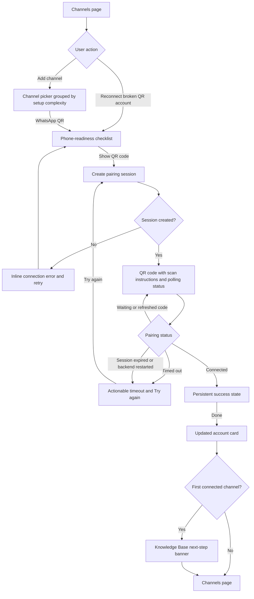

# Connect WhatsApp with QR — Current Flow & Roadmap

> **Verified:** 2026-08-30 against `Accounts.vue`, `AddAccountDialog.vue`, the accounts store, and WhatsApp pairing handlers.
>
> **Status:** The main QR-pairing refactor is implemented. Remaining work is expectation-setting and shared account-card accessibility.

## Entry Points

- Administrator opens **Channels** from the nav rail and clicks **Add channel**.
- Administrator opens Channels from the getting-started checklist.
- A disconnected QR WhatsApp account exposes a prominent **Reconnect** action.

The deleted Setup Wizard is not an entry point.

## Current User Flow

## Implemented Legacy Findings

| Legacy | Status | Implemented behavior |
|---|---|---|
| #1 No phone-requirement warning | ✅ Implemented | A preflight checklist appears before a pairing session starts. |
| #2 No time expectation or recovery context | 🟡 Partial | Timeout and expired-session messages are actionable; proactive duration/countdown remains `WA-02`. |
| #3 Cryptic session-expired error | ✅ Implemented | A lost/expired session stops polling and offers a clear retry path. |
| #4 Success auto-closes after 900 ms | ✅ Implemented | Success remains visible until the user clicks **Done**. |
| #5 No next step | ✅ Implemented | The first successful channel connection shows a Knowledge Base CTA. |
| #6 Hidden reconnect flow | ✅ Implemented | Broken QR accounts show a full-width reconnect banner. |
| #7 Redundant status metrics | ✅ Implemented | Platform count/filter pills replaced generic Connected/Waiting/Broken cards. |

## Remaining Work

### WA-02 — [P3] Pairing Has No Proactive Time Expectation

**Status:** Open remainder of legacy friction #2.

**Current behavior:** The QR view says that the code refreshes automatically, but does not explain how long the pairing session normally remains available or how much time is left.

**Target behavior:** Set a simple expectation without pretending the backend can provide an exact completion ETA. Prefer a session-expiry countdown if the backend exposes a reliable expiry timestamp; otherwise state the approximate validity window.

**Acceptance criteria:**

- The QR screen explains the expected validity window before timeout.
- If a countdown is shown, it comes from backend session expiry rather than a disconnected frontend timer.
- Expiry transitions once into the existing recoverable error state.
- Reduced-motion preferences are respected for continuously rotating status icons.

**Primary ownership:** `AddAccountDialog.vue`, `stores/accounts.ts`, WhatsApp pairing response contract.

### WA-08 — [P2] Account-Card Actions Are Icon-Only

**Status:** Open — shared Channels-page issue.

**Current behavior:** Automation, reconnect/check, token replacement, and deletion controls use icon-only buttons with `title` attributes. Tooltips are not dependable on touch devices, and the buttons do not consistently expose accessible names.

**Target behavior:** Give every icon-only action an `aria-label`; expose visible text for the primary recovery action. Keep destructive actions visually distinct and confirmed.

**Acceptance criteria:**

- Every icon-only account action has a localized accessible name.
- Keyboard focus is visible.
- The primary action for a broken account is visible text, not only an icon.
- Delete remains behind confirmation.

**Primary ownership:** `Accounts.vue`, shared `Button`/tooltip conventions.

### WA-09 — [P3] Pairing QR Uses a Generic Image Description

**Status:** Open — newly identified.

**Current behavior:** The functional pairing image uses `alt="QR"`.

**Target behavior:** Give the image a localized description such as “WhatsApp pairing QR code,” while keeping full scan instructions in visible text.

**Acceptance criteria:**

- The image has a meaningful localized `alt` value and explicit dimensions.
- Instructions do not depend on the image description alone.

**Primary ownership:** `AddAccountDialog.vue`, account i18n messages.

## Source Map

| Responsibility | Source |
|---|---|
| Channels page, filters, banners, account cards | [`Accounts.vue`](../../../frontend/src/views/Accounts.vue) |
| Picker, preflight, QR polling, success state | [`AddAccountDialog.vue`](../../../frontend/src/components/AddAccountDialog.vue) |
| Pairing API state | [`accounts.ts`](../../../frontend/src/stores/accounts.ts) |
| Backend pairing session | [`pairing.go`](../../../backend/internal/whatsmeow/pairing.go) |
| Automation dialog | [`AutomationSettingsDialog.vue`](../../../frontend/src/components/AutomationSettingsDialog.vue) |

## Implementation Order

1. `WA-08` — shared discoverability and accessibility.
2. `WA-02` — pairing expectation.
3. `WA-09` — QR semantics.
