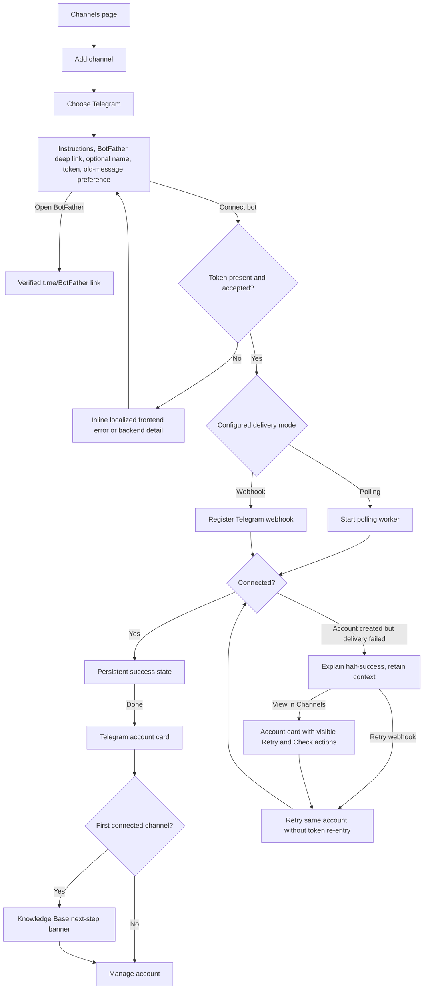

# Connect Telegram Bot — Current Flow & Roadmap

> **Verified:** 2026-08-30 against the channel picker, Telegram connection/retry UI, account cards, accounts store, and Telegram HTTP handlers.
>
> **Status:** The primary connection flow is implemented. Remaining work concerns delivery-mode semantics, localized backend errors, and shared account-card accessibility.

## Entry Points

- Administrator opens **Channels** and clicks **Add channel**.
- Administrator follows the getting-started checklist to Channels.
- An existing Telegram card exposes Retry webhook, Check connection, Replace token, Automation, and Delete actions as applicable.

The deleted Setup Wizard is not an entry point.

## Current User Flow

## Implemented Legacy Findings

| Legacy | Status | Implemented behavior |
|---|---|---|
| #1 No BotFather deep link | ✅ Implemented | The form links directly to `https://t.me/BotFather`. |
| #2 Half-success leaves user stuck | ✅ Implemented | The token/context remains, and the user can Retry webhook or view the created account. |
| #3 Ambiguous “Drop backlog” | 🟡 Partial | Copy is clearer; polling-mode mismatch remains `TG-03`. |
| #4 Success auto-closes | ✅ Implemented | Success remains until **Done**. |
| #5 Undiscoverable icon-only buttons | 🟡 Partial | Broken Telegram cards expose visible Retry/Check actions; healthy-card actions remain covered by `TG-05`. |
| #6 No next step | ✅ Implemented | First direct connection shows Knowledge Base guidance. |
| #7 Errors can appear in Russian | 🔴 Open | Tracked as `TG-07`. |
| #8 Redundant status metrics | ✅ Implemented | Platform count/filter pills are used. |

## Remaining Work

### TG-03 — [P2] “Ignore Old Messages” Is Shown When Polling Ignores It

**Status:** Open remainder of legacy friction #3.

**Current behavior:** The checkbox is always rendered. `drop_pending_backlog` is only applied when registering the first webhook; polling mode does not consume it.

**Target behavior:** Derive the field from the effective delivery mode. Hide it in polling mode, or implement equivalent polling behavior and describe it accurately.

**Acceptance criteria:**

- The frontend receives or derives the effective Telegram delivery mode from one source of truth.
- Polling mode never presents a control that has no effect.
- Webhook mode explains that the choice only applies during first connection.
- Both branches are covered by tests.

**Primary ownership:** `AddAccountDialog.vue`, configuration/status API, `telegram_accounts.go`.

### TG-05 — [P2] Healthy Telegram Account Actions Remain Icon-Only

**Status:** Open remainder of legacy friction #5; shared with `WA-08`.

**Current behavior:** Check connection, Replace token, Automation, and Delete are represented by unlabeled icon buttons with `title` text.

**Target behavior:** Provide localized accessible names and visible text for the most important action. Preserve the current inline text actions when the account is broken.

**Acceptance criteria:**

- Icon-only actions have `aria-label` and visible focus.
- The card exposes a discoverable overflow/action menu or visible labels without overcrowding the card.
- Destructive and credential-replacement actions cannot be triggered accidentally.

**Primary ownership:** `Accounts.vue`, `ReplaceTokenDialog.vue`, shared account-card action UI.

### TG-07 — [P1] Telegram Backend Errors Ignore the Selected Locale

**Status:** Open legacy friction #7.

**Current behavior:** Validation, token, ownership, public-URL, webhook, and stored-token failures include hardcoded Russian strings. The frontend displays the backend message directly, so English and Kazakh sessions can receive Russian errors.

**Target behavior:** Return stable error codes and structured parameters from the backend. Translate user-facing copy in the frontend; preserve raw upstream detail only in logs or an expandable technical-detail area.

**Acceptance criteria:**

- Expected Telegram failures have stable error codes.
- English, Russian, and Kazakh translations include a concrete recovery step.
- Arbitrary upstream descriptions do not replace the localized headline.
- Backend tests assert error codes rather than prose.

**Primary ownership:** `telegram_accounts.go`, API error contract, account i18n messages.

## Source Map

| Responsibility | Source |
|---|---|
| Telegram connect and half-success UI | [`AddAccountDialog.vue`](../../../frontend/src/components/AddAccountDialog.vue) |
| Account cards and recovery actions | [`Accounts.vue`](../../../frontend/src/views/Accounts.vue) |
| Telegram account state and API calls | [`accounts.ts`](../../../frontend/src/stores/accounts.ts) |
| Token replacement | [`ReplaceTokenDialog.vue`](../../../frontend/src/components/ReplaceTokenDialog.vue) |
| Telegram handlers and delivery-mode behavior | [`telegram_accounts.go`](../../../backend/internal/httpapi/telegram_accounts.go) |
| Runtime mode configuration | [`config.go`](../../../backend/internal/config/config.go) |

## Implementation Order

1. `TG-07` — locale-correct recovery information.
2. `TG-03` — remove a control that can be meaningless.
3. `TG-05` — finish shared account-card accessibility.
