# Connect Telegram Bot — User Flow

> **Purpose:** Trace exactly what a user sees and does when connecting a Telegram
> bot via @BotFather token, handling webhook or long-polling delivery, and managing the bot card.
> Friction points are marked with 🔴.

---

## How the User Gets Here

The user navigates to `/accounts` (the "Channels" icon in the navigation rail).
There are three entry points:

1. **From the nav rail:** User clicks the Radio icon labeled "Channels"
2. **From the Setup Wizard:** User clicks "Go to Channels" on step 2/3
3. **From Settings:** User navigates to Settings → Communication channels and clicks "Manage"

---

## User Flow Diagram

```mermaid
flowchart TD
    NavRail["User clicks Channels icon in nav rail"] --> AccountsPage
    SetupWizard["User clicks Go to Channels in Setup Wizard"] --> AccountsPage
    SettingsLink["User clicks Manage in Settings Communication channels"] --> AccountsPage

    subgraph AccountsPage["Screen: /accounts"]
        direction TB
        PageSees["User sees:
        • Header: Channels - Connect WhatsApp, Telegram, Instagram and Messenger
        • Tab bar: Connected accounts | Channel setup
        • 3 stat cards: Connected 0 | Waiting on action 0 | Not connected 0
        • Empty state: WhatsApp and Telegram icons with No channels connected yet
        • Button: + Connect a channel"]
    end

    AccountsPage -->|"Clicks + Connect a channel"| PickerModal

    subgraph PickerModal["Modal: Connect a channel"]
        direction TB
        PickerSees["User sees 5 channel cards in a grid:

        WhatsApp - Connect a number via QR code
        Telegram bot - Connect with a BotFather token
        01 Open BotFather and send the /newbot command
        02 Name the bot and copy the secret token it gives you
        03 Paste the token here - delivery is configured automatically
        CTA: Continue with Telegram

        WhatsApp Cloud API - Official connection via Meta
        Instagram Direct - Official connection via Meta
        Messenger - Official connection via Meta

        Footer: Token encryption and storage security note"]
    end

    PickerModal -->|"Clicks Telegram bot card"| TelegramForm

    subgraph TelegramForm["Modal: Add a Telegram bot"]
        direction TB
        FormSees["User sees:
        • Header: Telegram icon + Add a Telegram bot
        • Step instructions:
          1. Open BotFather in Telegram
          2. Send /newbot and pick a name
          3. Copy the token it gives you and paste it below
        • Input: Name for you - placeholder E.g. Shop bot
        • Password input: Bot token - placeholder 1234567890:AA...
        • Helper text: The token is stored encrypted and never shown again
        • Checkbox: Drop the messages Telegram has queued up
          Hint: Only check this if the bot has existed for a while...
        • Primary button: Connect bot with link icon"]
    end

    TelegramForm -->|"Submits without entering token"| EmptyTokenError
    TelegramForm -->|"Enters token and clicks Connect bot"| ConnectingState

    subgraph EmptyTokenError["Modal: Validation Error"]
        direction TB
        EmptySees["User sees:
        • Red alert icon: Paste the token BotFather gave you
        • Button remains: Connect bot"]
    end
    EmptyTokenError -->|"Enters token and clicks Connect bot"| ConnectingState

    subgraph ConnectingState["Modal: Connecting..."]
        direction TB
        ConnectingSees["User sees:
        • Button disabled with spinner: Connecting..."]
    end

    ConnectingState --> SubmitOutcome{"Connection outcome"}

    SubmitOutcome -->|"Token valid and long polling starts\n(local/default without public HTTPS)"| SuccessModal
    SubmitOutcome -->|"Token valid and webhook accepted\n(webhook mode)"| SuccessModal
    SubmitOutcome -->|"Invalid token or server network error"| ApiErrorState
    SubmitOutcome -->|"Bot created but webhook rejected by Telegram"| WebhookFailedModal

    subgraph ApiErrorState["Modal: Connection Error"]
        direction TB
        ApiErrorSees["User sees:
        • Red alert icon with error message: Could not connect the bot
        • Button resets to: Connect bot"]
    end
    ApiErrorSees -->|"Edits token and clicks Connect bot"| ConnectingState

    subgraph WebhookFailedModal["Modal: Webhook Setup Failed"]
        direction TB
        WebhookFailedSees["User sees:
        • Red alert: The bot was added but Telegram did not accept the webhook
        • Token input is cleared
        • Button text changes to: Try again
        • Account row is already listed in background on Accounts page"]
    end
    WebhookFailedModal -->|"Clicks Try again with empty token"| EmptyTokenError
    WebhookFailedModal -->|"Closes modal dialog"| CardWebhookErrorState

    subgraph SuccessModal["Modal: Success - auto-closes in 900ms"]
        direction TB
        SuccessSees["User sees:
        • Large blue circle with checkmark
        • Text: Bot connected!
        • Dialog closes automatically after 900ms"]
    end

    SuccessModal --> CardConnectedState

    subgraph CardConnectedState["Screen: /accounts - Connected Bot Card"]
        direction TB
        ConnectedCardSees["User sees:
        • Stat cards: Connected 1
        • New Telegram account card with:
          - Blue Telegram tile + initials avatar badge
          - Display name e.g. Shop bot
          - Handle e.g. @my_shop_bot
          - Green badge: Connected
          - Automation badge: e.g. Off
          - Action buttons:
            - Clock icon: Automation settings
            - Refresh icon: Check connection
            - Key icon: Replace token
            - Trash icon: Delete"]
    end

    subgraph CardWebhookErrorState["Screen: /accounts - Error Bot Card"]
        direction TB
        ErrorCardSees["User sees:
        • Stat cards: Not connected 1
        • Telegram account card with:
          - Red banner with webhook error details
          - Red badge: Webhook error
          - Action buttons:
            - Clock icon: Automation settings
            - Rotate icon: Retry webhook
            - Refresh icon: Check connection
            - Key icon: Replace token
            - Trash icon: Delete"]
    end

    CardConnectedState -->|"Clicks Replace token key icon"| ReplaceTokenModal
    CardWebhookErrorState -->|"Clicks Replace token key icon"| ReplaceTokenModal
    CardWebhookErrorState -->|"Clicks Retry webhook rotate icon"| RetryAction["Card shows spinner on rotate button and retries webhook"]
    CardConnectedState -->|"Clicks Check connection refresh icon"| CheckAction["Card checks bot health with Telegram API"]
    CardConnectedState -->|"Clicks Delete trash icon"| DeletePrompt{"Browser confirm dialog: Disconnect bot?"}
    CardWebhookErrorState -->|"Clicks Delete trash icon"| DeletePrompt

    DeletePrompt -->|"Confirms delete"| AccountsPage
    DeletePrompt -->|"Cancels"| CardConnectedState

    subgraph ReplaceTokenModal["Modal: Replace token"]
        direction TB
        ReplaceSees["User sees:
        • Header: Telegram icon + Replace token
        • Explanatory text: The new token must belong to the same bot @handle
        • Password input: New token
        • Error message if token belongs to a different bot
        • Button: Replace token with key icon"]
    end
    ReplaceTokenModal -->|"Submits valid token for same bot"| CardConnectedState
    ReplaceTokenModal -->|"Closes dialog"| CardConnectedState
```

---

## Friction Points and Suggested Changes

### 🔴 1. No Clickable Link or Deep Link to @BotFather

**What happens today:** The dialog presents text instructions: "1. Open @BotFather in Telegram. 2. Send /newbot and pick a name. 3. Copy the token it gives you and paste it below." There is no hyperlink or button to open Telegram directly. Users unfamiliar with Telegram must manually search for @BotFather in their client, risking interacting with impersonator or phishing bots.

**Suggested change:** Make `@BotFather` a clickable deep link (`https://t.me/BotFather`) or provide an explicit "Open @BotFather in Telegram" external link button that launches the verified BotFather chat with the `/newbot` command pre-filled.

---

### 🔴 2. Half-Success State on Webhook Rejection Leaves User Stuck

**What happens today:** When a bot token is valid but Telegram rejects the webhook (for instance, if the public webhook URL is not reachable), the backend creates the account row and returns a `webhook_error`. The dialog wipes the token field (`botToken.value = ''`), displays the rejection error message, and changes the button text to "Try again". If the user clicks "Try again", client-side validation fires immediately and shows "Paste the token @BotFather gave you." Meanwhile, the broken account card has already been created in the background.

**Suggested change:** Provide clear options when webhook registration fails:
- Do not clear the token input if the user might need to re-submit.
- Clarify that the bot was created in xchats but webhook delivery is pending.
- Offer two explicit buttons: "[Retry Webhook]" (which calls the retry endpoint directly without requiring re-entering the token) and "[View in Channels]" to close the modal and manage the card.

---

### 🔴 3. Ambiguous "Drop Backlog" Checkbox Terminology

**What happens today:** The form includes a checkbox: "Drop the messages Telegram has queued up" with subtext: "Only check this if the bot has existed for a while and the old messages are not needed — they will be lost." First-time users often do not understand what "backlog" or "queued messages" means. The setting is honored only in webhook mode; local/default polling mode ignores it, but the UI does not reveal the active delivery mode or that distinction.

**Suggested change:** Rephrase the label and hint into user-centric language:
- Label: "Ignore old messages sent before connecting"
- Helper text: "Recommended if this bot already received messages in the past that you don't want to import. Leave unchecked for brand new bots."

---

### 🔴 4. Success Modal Auto-Closes Too Fast (900ms)

**What happens today:** On successful connection, the modal displays a "Bot connected!" screen for only 900ms before auto-closing. Users who glance away momentarily miss the confirmation completely and wonder if the connection completed.

**Suggested change:** Keep the success state visible for 2.5–3 seconds, or display a "Done" button allowing the user to acknowledge the success and close the dialog at their own pace.

---

### 🔴 5. Undiscoverable Icon-Only Buttons on the Account Card

**What happens today:** On the bot account card, actions for "Retry webhook" (RotateCw icon), "Check connection" (RefreshCw icon), and "Replace token" (KeyRound icon) are small 32x32px ghost buttons with browser tooltip attributes (`title`). When a webhook error occurs, the user sees a red error message but must hover over tiny, subtle icons in the card footer to figure out how to retry or diagnose the issue.

**Suggested change:** When an account has a `webhook_error` or broken state, display an explicit inline button with text directly inside the error banner: `[ Retry Webhook ]` alongside `[ Check Connection ]`, rather than hiding actions in small footer icons.

---

### 🔴 6. No Guided "What's Next?" After Bot Connection

**What happens today:** After connecting a bot, the user lands back on `/accounts` with the new card. There is no guidance on how to test the bot (e.g. sending a message in Telegram) or how to configure the Knowledge Base and auto-reply rules.

**Suggested change:** Show a brief post-connection callout banner on the card or page:
"Your Telegram bot @handle is live! Next steps:
1. Open [@handle in Telegram] and send a test message.
2. [Add Knowledge Base articles →] so your assistant can answer questions."

---

### 🔴 7. Telegram API Errors Can Appear in Russian in Any Locale

**What happens today:** The replace-token dialog already explains that a new token must belong to the same bot and that a different bot should be connected as its own channel. However, several backend validation and Telegram API errors are hardcoded in Russian, including invalid-token, cross-organization ownership, encryption-key, and different-bot errors. Those raw messages are displayed even when the frontend locale is English or Kazakh.

**Suggested change:** Return stable error codes and structured details from the backend, then translate the user-facing copy in the frontend locale dictionaries.

---

## Source Components

| UI Element | Source File |
|---|---|
| Channels page layout & header | [`Accounts.vue` L225–248](../../../frontend/src/views/Accounts.vue#L225-L248) |
| Channel stat cards | [`Accounts.vue` L263–282](../../../frontend/src/views/Accounts.vue#L263-L282) |
| Empty state & connect button | [`Accounts.vue` L294–306](../../../frontend/src/views/Accounts.vue#L294-L306) |
| Account cards grid & Telegram card | [`Accounts.vue` L307–418](../../../frontend/src/views/Accounts.vue#L307-L418) |
| Telegram card action buttons (retry, check, replace, delete) | [`Accounts.vue` L360–415](../../../frontend/src/views/Accounts.vue#L360-L415) |
| Channel picker modal & Telegram card option | [`AddAccountDialog.vue` L336–450](../../../frontend/src/components/AddAccountDialog.vue#L336-L450) |
| Telegram bot token input form | [`AddAccountDialog.vue` L452–495](../../../frontend/src/components/AddAccountDialog.vue#L452-L495) |
| Success confirmation state | [`AddAccountDialog.vue` L613–628](../../../frontend/src/components/AddAccountDialog.vue#L613-L628) |
| Telegram connect logic & webhook error handling | [`AddAccountDialog.vue` L167–190](../../../frontend/src/components/AddAccountDialog.vue#L167-L190) |
| Replace token dialog | [`ReplaceTokenDialog.vue`](../../../frontend/src/components/ReplaceTokenDialog.vue) |
| Automation settings dialog | [`AutomationSettingsDialog.vue`](../../../frontend/src/components/AutomationSettingsDialog.vue) |
| Accounts store (Telegram lifecycle actions) | [`stores/accounts.ts` L62–88](../../../frontend/src/stores/accounts.ts#L62-L88) |
| Connection status badge formatting | [`lib/format.ts` L48–87](../../../frontend/src/lib/format.ts#L48-L87) |
| Persistent navigation rail | [`NavRail.vue` L66–76](../../../frontend/src/components/NavRail.vue#L66-L76) |
| Settings communication channels summary tab | [`CommunicationChannelsTab.vue`](../../../frontend/src/components/settings/tabs/CommunicationChannelsTab.vue) |
| Telegram create/replace handlers and raw errors | [`telegram_accounts.go`](../../../backend/internal/httpapi/telegram_accounts.go) |
| Webhook vs polling mode resolution | [`config.go` L490–507](../../../backend/internal/config/config.go#L490-L507) |
