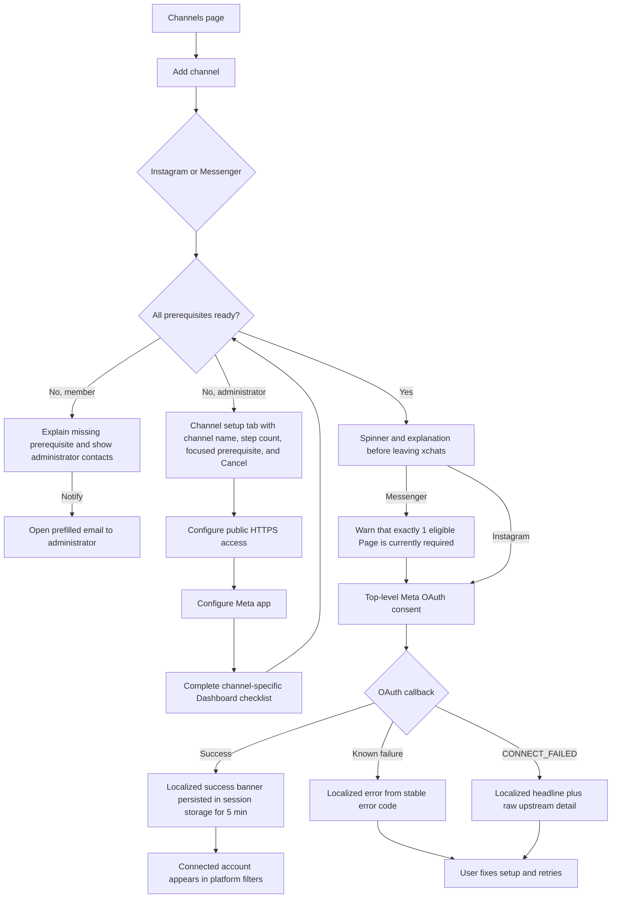

# Connect Instagram & Messenger — Current Flow & Roadmap

> **Verified:** 2026-08-30 against the channel picker, guided channel setup, Meta OAuth handlers, callback banners, account filters, and channel-setup store.
>
> **Status:** Guided prerequisites and OAuth recovery are largely implemented. Remaining work is Page selection, durable prerequisite confirmation, localized technical failures, and post-connection guidance.

## Entry Points

- Administrator opens **Channels** and clicks **Add channel**.
- Administrator follows the getting-started checklist to Channels.
- Settings → Communication Channels links to the dedicated Channel setup tab.
- A member may open the picker but cannot complete missing installation-wide prerequisites.

The deleted Setup Wizard is not an entry point.

## Current User Flow

## Implemented Legacy Findings

| Legacy | Status | Implemented behavior |
|---|---|---|
| #1 Outdated footer navigation | ✅ Implemented | Footer links directly to Channel setup. |
| #2 Member dead end | ✅ Implemented | Missing prerequisite, administrator contacts, and a notification action are shown. |
| #3 Disorienting automatic tab switch | ✅ Implemented | Guided setup shows channel context, current step, total steps, focus, and Cancel. |
| #4 Sudden full-page navigation | ✅ Implemented | A redirecting state visually bridges the top-level OAuth navigation. |
| #5 Exactly-1-Page failure | 🟡 Partial | The restriction remains, but warning and callback errors are explicit. Tracked as `META-05`. |
| #6 OAuth result disappears on refresh | ✅ Implemented | The banner is restored from session storage for 5 minutes. |
| #7 Raw backend redirect errors | 🟡 Partial | Known error codes are localized; `CONNECT_FAILED` detail remains `META-07`. |
| #8 No post-connection guidance | 🔴 Open | Direct channel connections show guidance, but Meta OAuth callbacks bypass it. Tracked as `META-08`. |
| #9 Redundant status metrics | ✅ Implemented | Platform count/filter pills are used. |
| #10 Flat picker hides setup complexity | ✅ Implemented | Instant and advanced tiers, live readiness, guided prerequisites, and setup cards are present. |

## Remaining Work

### META-05 — [P2] Messenger Cannot Select Among Multiple Pages

**Status:** Open remainder of legacy friction #5.

**Current behavior:** OAuth succeeds only when the returned Meta identity has exactly 1 eligible Page. Zero and multiple Page cases return explicit errors, but users with normal multi-Page accounts cannot continue.

**Target behavior:** When multiple eligible Pages exist, return a short-lived selection session to xchats, show Page names/identifiers, and connect the selected Page explicitly.

**Acceptance criteria:**

- Zero Pages produces a localized explanation and Meta-side recovery guidance.
- Exactly 1 Page keeps the fast path.
- Multiple Pages open an accessible selection step instead of failing.
- The selection token is short-lived, organization-bound, and cannot connect a Page not returned by the OAuth session.

**Primary ownership:** `meta_oauth_messenger.go`, callback/session contract, `Accounts.vue` or a focused Page-selection dialog.

### META-07 — [P2] CONNECT_FAILED Still Leaks Raw Backend Copy

**Status:** Open remainder of legacy friction #7.

**Current behavior:** The banner localizes the headline but displays arbitrary backend/upstream text underneath it. That detail can be Russian or overly technical.

**Target behavior:** Map expected failures to stable codes. Put unknown upstream text behind an optional **Technical details** disclosure and never make it the only recovery information.

**Acceptance criteria:**

- User-facing headline and next step are localized.
- Unknown technical detail is collapsed by default and safely wraps long content.
- Sensitive tokens and callback parameters are never rendered.

**Primary ownership:** Meta OAuth handlers, API error contract, `Accounts.vue`, i18n messages.

### META-08 — [P2] Meta OAuth Success Skips First-Channel Guidance

**Status:** Open legacy friction #8.

**Current behavior:** `firstChannelBanner` is set only by the dialog’s in-page `connected` event. Instagram and Messenger navigate away and return through a full-page callback, so their success banner does not include the Knowledge Base/testing next step.

**Target behavior:** On OAuth return, determine whether this is the organization’s first usable channel and show the same channel-aware next-step guidance as direct connections.

**Acceptance criteria:**

- First Meta connection shows the Knowledge Base/testing CTA.
- Later connections do not repeatedly show first-run guidance.
- The decision is based on server/account state, not a stale pre-redirect in-memory count.

**Primary ownership:** `Accounts.vue`, accounts store, OAuth callback response/query contract.

### META-11 — [P2] Channel Checklist Confirmation Resets Every Session

**Status:** Open — newly identified.

**Current behavior:** Messenger and WhatsApp Cloud checklist confirmation exists only in the Pinia store. Reloading the page makes a backend-ready channel appear incomplete until the administrator confirms the checklist again.

**Target behavior:** Persist a real installation-level completion signal, or make backend readiness sufficient and present the checklist as guidance rather than a repeated gate.

**Acceptance criteria:**

- Reloading does not force a completed administrator through the same checklist again.
- Completion is organization-scoped and survives sessions.
- Resetting or invalidating a prerequisite reopens the correct step.

**Primary ownership:** `stores/channelSetup.ts`, channel-setup API/store, `ChannelSetupTab.vue`.

## Source Map

| Responsibility | Source |
|---|---|
| Picker readiness, blocked-member and redirect states | [`AddAccountDialog.vue`](../../../frontend/src/components/AddAccountDialog.vue) |
| OAuth return banners and account filters | [`Accounts.vue`](../../../frontend/src/views/Accounts.vue) |
| Guided prerequisite state | [`channelSetup.ts`](../../../frontend/src/stores/channelSetup.ts) |
| Guided setup UI | [`ChannelSetupTab.vue`](../../../frontend/src/components/channels/ChannelSetupTab.vue) |
| Instagram OAuth | [`meta_oauth.go`](../../../backend/internal/httpapi/meta_oauth.go) |
| Messenger OAuth and Page discovery | [`meta_oauth_messenger.go`](../../../backend/internal/httpapi/meta_oauth_messenger.go) |
| Member-safe setup information | [`channel_setup.go`](../../../backend/internal/httpapi/channel_setup.go) |

## Implementation Order

1. `META-08` — finish the successful first-channel journey.
2. `META-11` — stop repeating completed setup.
3. `META-05` — support normal multi-Page accounts.
4. `META-07` — isolate and localize technical failures.
