# Connect Instagram and Messenger (Meta OAuth) — User Flow

> **Purpose:** Trace exactly what a user sees and does when connecting an Instagram Direct business account or a Facebook Messenger page via Meta OAuth. Covers prerequisite verification, guided setup routing, the external Meta consent flow, and redirect landing states. Friction points are marked with 🔴.

---

## How the User Gets Here

The user must navigate to the Channels section. There are three entry points:

1. **From the nav rail:** User clicks the Radio icon labeled "Channels" in the persistent left navigation bar (`/accounts`).
2. **From Settings:** User navigates to Settings (`/settings`), clicks the "Communication channels" tab, and clicks either the "Manage channels" or "Channel setup" button.
3. **From the Setup Wizard:** User clicks the "Go to Channels" button on wizard step 2/3.

---

## User Flow Diagram

```mermaid
flowchart TD
    Start["User navigates to Channels"]
    Start --> AccountsPage

    subgraph AccountsPage["Screen: /accounts - Connected accounts tab"]
        direction TB
        PageSees["User sees:
        • Header: Channels and subtitle
        • Tab bar: Connected accounts | Channel setup
        • 3 stat cards: Connected 0 | Waiting on action 0 | Not connected 0
        • Empty state or existing account cards grid
        • Button: + Connect a channel"]
    end

    AccountsPage -->|"Clicks + Connect a channel"| PickerModal

    subgraph PickerModal["Modal: Connect a channel"]
        direction TB
        PickerSees["User sees 5 channel cards in a grid:
        • WhatsApp: Connect a number via QR code
        • Telegram bot: Connect with BotFather token
        • WhatsApp Cloud API: Official connection via Meta
        • Instagram Direct: Official connection via Meta
          - 01 Click Instagram login window opens
          - 02 Sign in to Instagram business account and grant access
          - 03 Land back here account connects automatically
          - CTA: Continue with Instagram
        • Messenger: Official connection via Meta
          - 01 Click Facebook login window opens
          - 02 Sign in and grant access to EXACTLY one Facebook Page
          - 03 Land back here Page connects automatically
          - CTA: Continue with Messenger
        • 🔴 Footer note: Mentions outdated Settings Channels path"]
    end

    PickerModal -->|"Clicks Instagram Direct or Messenger card"| PrereqCheck{"Prerequisites ready?\n1. Public access\n2. Meta Developer App\n3. Channel App/Checklist"}

    PrereqCheck -->|"Missing and user is Member"| NonAdminBlocked
    PrereqCheck -->|"Missing and user is Admin"| GuidedSetupStart
    PrereqCheck -->|"All prerequisites ready"| OAuthStart

    subgraph NonAdminBlocked["Modal: Non-Admin Member Blocked"]
        direction TB
        NonAdminSees["User sees:
        • Red alert icon and error text:
          Only an administrator can configure this channel.
        • 🔴 Dead end: No explanation of missing items or contact info
        • User cannot proceed"]
    end

    subgraph GuidedSetupScreen["Screen: /accounts - Channel setup tab (Guided Run)"]
        direction TB
        GuidedSetupSees["🔴 Dialog closes and tab automatically switches to Channel setup:
        • Public access card: Public HTTPS address or Start tunnel button
        • Meta Developer App card: App ID, App Secret, Save button, Open Meta Dashboard link
        • Instagram API card: App ID, App Secret, Dashboard field values to copy, Save button
        • Messenger API card: Dashboard field values to copy, Button: I have completed these steps continue
        • Missing prerequisite card is highlighted with primary ring and centered"]
    end

    GuidedSetupStart -->|"Switches to Channel setup tab"| GuidedSetupScreen
    GuidedSetupScreen -->|"Admin completes missing cards"| GuidedComplete["Guided setup complete"]
    GuidedComplete -->|"Auto-switches back to Accounts tab and reopens dialog"| OAuthStart

    subgraph OAuthStart["Modal: Initiating OAuth Redirect"]
        direction TB
        StartingSees["User sees:
        • Card button shows loading spinner: Connecting...
        • If start fails: Inline error Could not start connection
        • If start succeeds: 🔴 Browser immediately navigates away to Meta"]
    end

    OAuthStart -->|"Browser navigates to Meta URL"| MetaConsentPage

    subgraph MetaConsentPage["External Screen: Meta OAuth Consent Screen"]
        direction TB
        MetaSees["User sees Meta authorization interface:
        • Instagram Login or Facebook Login prompt
        • Permission consent request for direct messages and business data
        • 🔴 Messenger only: Page picker list - must pick EXACTLY ONE page
        • Buttons: Continue / Grant Permissions or Cancel"]
    end

    MetaConsentPage -->|"User cancels or denies"| RedirectError
    MetaConsentPage -->|"Multiple pages or 0 pages selected for Messenger"| RedirectError
    MetaConsentPage -->|"User approves and grants permissions"| RedirectSuccess

    subgraph RedirectSuccess["Screen: /accounts - Success Landing"]
        direction TB
        SuccessSees["User sees:
        • Green banner at top: Instagram/Messenger connected successfully.
        • Dismiss link
        • 🔴 Banner disappears on page reload
        • Connected counter increments by 1
        • New account card added to grid"]
    end

    subgraph RedirectError["Screen: /accounts - Error Landing"]
        direction TB
        ErrorSees["User sees:
        • Red banner at top with error text
        • 🔴 Error message may be in Russian or unlocalized
        • Dismiss link
        • 🔴 Banner disappears on page reload
        • No new account card added"]
    end

    RedirectSuccess --> UpdatedAccountsGrid

    subgraph UpdatedAccountsGrid["Screen: /accounts - Connected Card Ready"]
        direction TB
        CardSees["User sees new channel card:
        • Fuchsia tile with Instagram icon or Blue tile with Messenger icon
        • Top-right avatar initials badge
        • Display name: Page name or Instagram handle
        • Handle: @handle or Page name
        • Badge: Connected with green dot
        • Badge: Automation status
        • Action buttons: Automation settings clock icon | Delete trash icon
        • 🔴 No post-connection guidance or testing next steps"]
    end
```

---

## Friction Points and Suggested Changes

### 🔴 1. Outdated Navigation Pointer in Dialog Footer Note

**What happens today:** The footer note at the bottom of the "Connect a channel" modal states:  
*"For WhatsApp Cloud API, Instagram and Messenger, first set your Meta App ID and App Secret in Settings → Channels."*  
However, channel prerequisite setup was moved out of Settings and now lives under the **Channel setup** tab directly on `/accounts`. Following this text sends users to `/settings`, where they only find a read-only pointer card directing them back to `/accounts?tab=setup`.

**Suggested change:** Update the copy to reflect current navigation:  
*"For WhatsApp Cloud API, Instagram and Messenger, configure prerequisites in the Channel setup tab above."*  
Add an inline button or link directly in the footer note to switch to the Channel setup tab.

---

### 🔴 2. Non-Admin Members Hit an Unhelpful Dead-End Error

**What happens today:** When a non-admin team member clicks Instagram or Messenger before prerequisites are configured, an inline red error appears inside the modal:  
*"Only an administrator can configure this channel."*  
The user cannot proceed, is given no details about what prerequisites are missing, and cannot contact or notify an administrator from within the UI.

**Suggested change:** Replace the generic error with a structured status panel:
- Explain what is missing (e.g., *"Meta Developer App credentials have not been configured for this workspace."*).
- Display the names of workspace administrators.
- Provide a *"Notify Admin to Configure"* button.

---

### 🔴 3. Disorienting Automatic Tab Switch During Guided Setup

**What happens today:** When an administrator clicks Instagram Direct or Messenger with missing prerequisites, the dialog immediately closes and the active tab switches to "Channel setup" without any introductory explanation. The user suddenly lands on a different tab with highlighted cards, which can feel jarring and confusing.

**Suggested change:** Show a brief interstitial dialog or transition notice before switching tabs:  
*"Instagram requires prerequisite setup first (Public HTTPS access and Meta Developer App credentials). Redirecting to Channel Setup to complete configuration..."*  
Display a progress step indicator (e.g., *"Step 1 of 3: Meta App Credentials"*) on the Channel setup tab to maintain context.

---

### 🔴 4. Sudden Full-Page Browser Navigation to External Meta Domain

**What happens today:** Once prerequisites are met and the user clicks the Instagram or Messenger card, the frontend immediately executes `window.location.href = started.authorize_url`. The entire browser tab navigates away from xchats to Meta's external login domain without warning or confirmation.

**Suggested change:** Provide a visual bridge before navigation:
- Show a brief redirecting state: *"Redirecting to Meta to authorize your account... Please make sure you are logged into the correct Instagram or Facebook account."*
- Alternatively, launch Meta OAuth in a dedicated popup window that communicates the result back to xchats via `postMessage`, keeping the user on the xchats page.

---

### 🔴 5. Strict Single-Page Requirement for Messenger Causes Silent Failure

**What happens today:** On Meta's Facebook OAuth consent screen, Meta provides checkboxes for all Facebook Pages the user manages. The backend strictly requires granting access to **exactly one** Facebook Page. If the user selects multiple pages or zero pages, the OAuth authorization fails upon redirect with a cryptic error banner. Although the modal card text mentions *"grant access to EXACTLY one Facebook Page"*, this restriction is easily overlooked inside Meta's interface.

**Suggested change:**  
- Display a prominent pre-flight warning before redirecting to Meta: *"Important: When prompted by Facebook, check the box for EXACTLY ONE Page. Selecting multiple pages will cause the connection to fail."*
- Enhance the backend flow to accept multiple authorized pages and allow the user to select the target Page in an xchats dialog after returning from Meta.

---

### 🔴 6. Ephemeral One-Shot OAuth Banner Disappears on Refresh

**What happens today:** When the browser returns from Meta to `/accounts`, a green success banner (*"Instagram connected successfully."*) or red error banner is displayed based on query parameters. On mount, `router.replace` immediately strips these query parameters from the browser address bar. If the user reloads the page, navigates away, or accidentally dismisses the banner, the confirmation or error message is permanently lost.

**Suggested change:**  
- Persist recent connection events in the channel list or activity feed.
- For error states, provide a persistent *"Connection Failed"* card with a direct *"Try Again"* action button rather than relying solely on a dismissable banner.

---

### 🔴 7. Hardcoded Non-Localized Error Messages from Backend Redirect

**What happens today:** If Meta OAuth fails (e.g. cancelled consent, expired state session, or invalid page selection), the backend redirects back to the frontend with hardcoded Russian error messages in the URL query string (such as *"Meta не передала code/state — попробуйте подключить заново."* or *"Сессия подключения истекла или уже использована. Попробуйте снова."*). When rendered in the frontend error banner, an English or Kazakh user sees an untranslated Russian error string.

**Suggested change:** Pass structured error codes (such as `?messenger_error_code=PAGE_SELECTION_INVALID` or `?instagram_error_code=SESSION_EXPIRED`) in the redirect URL and translate them on the frontend using standard i18n locale dictionaries.

---

### 🔴 8. Missing Post-Connection Guidance and Testing Checklist

**What happens today:** After returning with a successful connection, the user sees a green banner and a new card in the channel grid. There is no guidance on what to do next to verify that messages are flowing or how to configure automated responses.

**Suggested change:** Display a *"What's Next?"* onboarding banner or card action:
- *"Instagram connected! Send a test direct message to your Instagram handle to verify incoming chats."*
- *"Configure AI auto-replies in Automation Settings [Configure →]"*
- *"Add business knowledge to your Knowledge Base [Go to Knowledge Base →]"*

---

## Source Components

| Element | File |
|---|---|
| Channels page layout & OAuth banner handling | [`Accounts.vue` L51–57, L137–159, L251–260](file:///home/yerassyl/codespace/github.com/yerassyldanay/xchats/frontend/src/views/Accounts.vue#L51-L57) |
| Channel cards grid & status badges | [`Accounts.vue` L307–418](file:///home/yerassyl/codespace/github.com/yerassyldanay/xchats/frontend/src/views/Accounts.vue#L307-L418) |
| Channel picker dialog & OAuth launcher | [`AddAccountDialog.vue` L86–148, L402–442](file:///home/yerassyl/codespace/github.com/yerassyldanay/xchats/frontend/src/components/AddAccountDialog.vue#L86-L148) |
| Guided setup routing store | [`channelSetup.ts` L80–127](file:///home/yerassyl/codespace/github.com/yerassyldanay/xchats/frontend/src/stores/channelSetup.ts#L80-L127) |
| Channel setup tab (Public access, Meta App, APIs) | [`ChannelSetupTab.vue` L132–272](file:///home/yerassyl/codespace/github.com/yerassyldanay/xchats/frontend/src/components/channels/ChannelSetupTab.vue#L132-L272) |
| Setup card shell with focus indicator | [`ChannelSetupCard.vue` L48–88](file:///home/yerassyl/codespace/github.com/yerassyldanay/xchats/frontend/src/components/channels/ChannelSetupCard.vue#L48-L88) |
| Meta Dashboard copyable fields | [`DashboardFieldList.vue` L14–25](file:///home/yerassyl/codespace/github.com/yerassyldanay/xchats/frontend/src/components/channels/DashboardFieldList.vue#L14-L25) |
| Left navigation rail (Channels entry point) | [`NavRail.vue`](file:///home/yerassyl/codespace/github.com/yerassyldanay/xchats/frontend/src/components/NavRail.vue) |
| Settings Communication channels tab | [`CommunicationChannelsTab.vue`](file:///home/yerassyl/codespace/github.com/yerassyldanay/xchats/frontend/src/components/settings/tabs/CommunicationChannelsTab.vue) |
| Accounts store (OAuth start endpoints) | [`accounts.ts` L120–137](file:///home/yerassyl/codespace/github.com/yerassyldanay/xchats/frontend/src/stores/accounts.ts#L120-L137) |
