# Knowledge Base Lifecycle — User Flow

> **Purpose:** Trace what a user sees and experiences throughout the 3-stage Knowledge Base lifecycle: **Ingestion** (uploading files, scraping URLs, or connecting external MCP models), **Review** (inspecting diffs, editing staged records, bulk actions, and publishing), and **Testing** (simulating customer interactions and verifying AI responses through the production ingestion path). Friction points are marked with 🔴.

---

## How the User Gets Here

The user navigates through the Knowledge Base lifecycle via three primary navigation entries on the persistent left navigation rail, cross-page banners, or direct URLs:

1. **Draft / Ingestion & Staging (`/playground`):** Click the **Blocks** icon labeled **Draft** (or **Черновик**) in the nav rail.
2. **Live Knowledge Base (`/knowledge-base`):** Click the **Library** icon labeled **Knowledge Base** (or **База знаний**) in the nav rail.
3. **AI Simulator (`/simulator`):** Click the **Bot** icon labeled **Simulator** (or **Симулятор**) in the nav rail.
4. **Cross-Page Links:**
   - From `/knowledge-base`: After editing or deleting any published row, click **Go to Draft** on the top green notification banner.
   - From `/playground`: When the draft has no pending changes, click **Go to Knowledge Base** in the empty state card.

---

## User Flow Diagram

```mermaid
flowchart TD
    %% Entry Points
    NavDraft["User clicks Draft icon in nav rail"] --> DraftScreen
    NavKB["User clicks Knowledge Base icon in nav rail"] --> KBScreen
    NavSim["User clicks Simulator icon in nav rail"] --> SimScreen

    %% ==========================================
    %% STAGE 1: INGESTION & MANUAL AUTHORING
    %% ==========================================

    subgraph KBScreen["Screen: /knowledge-base — Live Knowledge Base"]
        direction TB
        KB_Header["Header: Knowledge Base
        Subtitle: The final data the assistant uses"]
        
        KB_Tabs["Entity Tabs:
        • Overview (Assistant Config)
        • Topics
        • Products
        • Tariffs
        • Delivery zones
        • Contacts
        • Policies
        • Prompt (System Prompt Viewer)
        • Files / materials (Read-only ingested files)"]

        KB_Toolbar["Contextual Action Button:
        • + Add topic / + Add product / + Add tariff / + Add zone
        • Edit contacts / Edit policies"]

        KB_LiveRows["Live Published Records:
        • Shows published cards with values
        • Amber Badge: Has an unpublished change
        • Amber Badge: Pending deletion in the Draft
        • Card buttons: Edit | Delete"]

        KB_PromptTab["Tab: Prompt (WandSparkles)
        • Mode buttons: Assembled | Template
        • Line-numbered mono prompt viewer with token highlights
        • Sidebar: Prompt ref, Character count, Token estimate, Status badge
        • Buttons: Copy prompt | Download .txt"]

        KB_MaterialsTab["🔴 Tab: Files (materials) (FileText)
        • Subtitle: Materials added through integrations are for viewing only
        • List of uploaded files / URLs with status badges and download link
        • 🔴 No button to upload new materials directly from here"]
    end

    KBScreen -->|"Clicks + Add or Edit on a record"| ModalForm
    KBScreen -->|"Clicks Delete on a record"| KB_DeleteConfirm

    subgraph KB_DeleteConfirm["Modal: Delete Record Confirmation"]
        direction TB
        DelTitle["Title: Delete this record?"]
        DelBody["Body: The record will be marked for deletion in the Draft. It only disappears from the knowledge base once published."]
        DelActions["Buttons: Cancel | Delete (Destructive)"]
    end

    KB_DeleteConfirm -->|"Clicks Delete"| KB_BannerState

    subgraph ModalForm["Modal: Create / Edit Record Form"]
        direction TB
        FormHeader["Header: New / Edit Entity Title"]
        FormFields["Inputs for specific entity:
        • Topics: Title, Slug, Body markdown
        • Products: Name, Price, Category, Stock status, Sales status, Description, Media pickers
        • Tariffs: Name, Price, Limit, Fee, Summary, Advantages, Limitations
        • Delivery zones: Name, Zone level, Parent zone, Available, Cost, Days, Notes
        • Contacts: Phone, Website, Working hours, Address, Legal info, Callback
        • Policies: Free delivery from, Min order, Prepayment, Installment, Return period, Warranty
        • Config: Persona, Mission, Guardrails, Language policy, Max reply words"]

        FormStaleNotice["Conflict Notice (If draft changed concurrently):
        • Warning box: The draft changed while you were editing
        • Button: Reload and retry"]

        FormActions["Footer Buttons: Cancel | Save"]
    end

    ModalForm -->|"Clicks Save successfully"| KB_BannerState
    ModalForm -->|"Concurrent conflict"| FormStaleNotice
    FormStaleNotice -->|"Clicks Reload and retry"| ModalForm

    subgraph KB_BannerState["Screen: /knowledge-base — Change Staged Banner"]
        direction TB
        BannerBox["Green Banner at top:
        • Checkmark icon
        • Text: Change added to the Draft. Review and publish it from the Draft.
        • Link: Go to Draft
        • Close X button"]
    end

    KB_BannerState -->|"Clicks Go to Draft"| DraftScreen

    %% ==========================================
    %% INGESTION PANEL ON DRAFT SCREEN
    %% ==========================================

    subgraph DraftScreen["Screen: /playground — Draft & Ingest Hub"]
        direction TB
        DraftHeader["Header: Draft
        Subtitle: What will change in the knowledge base after publishing
        Buttons (if changes pending): Discard all | Publish all"]

        subgraph IngestPanel["Section: Ingestion Panel"]
            direction TB
            IngestTabs["Tabs: Links | Files | ChatGPT / Claude (MCP)"]

            subgraph TabUrls["Tab: Links"]
                direction TB
                UrlInput["Input: Paste a page URL with link icon + Add button"]
                UrlChips["Added URL chips with X remove button"]
            end

            subgraph TabFiles["Tab: Files"]
                direction TB
                Dropzone["Drag files here or choose them manually
                Button: Choose files (hidden multiple file picker)"]
                FileChips["Added file chips with X remove button"]
            end

            subgraph TabMcp["Tab: ChatGPT / Claude (MCP Connector)"]
                direction TB
                McpHeader["Title: Connect ChatGPT or Claude
                Subtitle: Configure assistant right from chat — changes land in Draft"]
                McpLinks["Buttons: Open in ChatGPT | Open in Claude"]
                McpUrlBox["MCP connector URL box with Copy button"]
                McpSteps["3-step guide on adding connector in external LLM"]
                McpTunnel["🔴 Tunnel Status:
                • Tunnel running / Tunnel not running badge
                • Admin: Start tunnel button or settings link
                • Member: Public URL is not set up yet. Ask an admin."]
            end

            IngestOptions["Common Ingestion Settings:
            • Provider Select: Built-in, Firecrawl, LlamaParse with capability hints
            • Save as Target Type Select: Detect automatically, Topics, Products, Tariffs, Contacts, Policies, Delivery zones
            • Guidance for model: Optional textarea with placeholder
            • Notice: Image attached as media — text is not read"]

            IngestSubmit["Button: Start import with loading spinner
            🔴 Notice if run active: An import is already running — wait for it to finish"]
        end
    end

    IngestSubmit -->|"Clicks Start import"| IngestProgress

    subgraph IngestProgress["Component: Ingestion Run Status & Live Progress"]
        direction TB
        RunBadge["Run Status:
        • Badge: Extracting... / Synthesizing... / Done / Failed / Needs review"]
        MaterialsList["Materials List:
        • Icon (Link or File) + Label
        • Status Badge: Queued, Extracting..., Parsed, Needs review, Failed
        • Error message if extraction failed"]
        SynthesisBox["Synthesis Results (Pass 2):
        • Applied list: Checkmark + type:key + new/updated badge
        • Dropped list: Warning + tool name: reason
        • Notes: Model commentary text
        • In progress indicator: The model is processing the materials..."]
    end

    IngestProgress -->|"Synthesis finishes"| DraftReview

    %% ==========================================
    %% STAGE 2: DRAFT REVIEW & PUBLISHING
    %% ==========================================

    subgraph DraftReview["Section: Draft Overview & Review Area"]
        direction TB
        StatTiles["Stat Summary Tiles:
        • Added (Green count)
        • Updated (Amber count)
        • Removed (Red count)
        • Total (Pending changes sum)"]

        DraftEmpty["Empty State (If 0 pending changes):
        • Sparkles icon
        • Text: No unpublished changes
        • Hint: Go to Knowledge Base to add or change information
        • Button: Go to Knowledge Base"]

        subgraph ActiveDraft["Active Draft Review (If >0 pending changes)"]
            direction TB
            ReviewTabs["Entity Tabs with badge counts:
            • Overview (Config)
            • Topics
            • Products
            • Tariffs
            • Delivery zones
            • Contacts
            • Policies"]

            BulkBar["Bulk Action Bar (Appears when checkboxes selected):
            • Text: Selected N
            • Button: Cancel selected (Destructive)
            • Button: Clear selection
            • Button: Select all / Deselect all on this tab"]

            ReviewCards["Pending Change Cards:
            • State Badge: New (Green), Changed (Amber), To delete (Red)
            • Record Fields with current staged values
            • 🔴 Diff subtext: Was: [strikethrough old value]
            • Action Buttons on Card:
              - Edit (Opens ModalForm)
              - Publish (Publishes this single entity)
              - Cancel change / Remove from draft"]

            ConfigCards["Overview Tab (Config Fields):
            • Cards for modified Assistant fields (Persona, Mission, Guardrails, etc.)
            • Diff: Was: [strikethrough old prose]
            • Card buttons: Edit | Cancel change
            • Bottom buttons: Cancel all assistant changes | Publish assistant changes"]
        end
    end

    DraftEmpty -->|"Clicks Go to Knowledge Base"| KBScreen

    ActiveDraft -->|"Clicks Cancel change on card or Cancel selected"| CancelDialog
    ActiveDraft -->|"Clicks Edit on card"| ModalForm
    ActiveDraft -->|"Clicks Publish on single card"| PublishSingleDecision{"Single Publish\nSucceeds?"}
    DraftHeader -->|"Clicks Discard all"| DiscardConfirm{"Browser confirm:\nDiscard whole draft?"}
    DraftHeader -->|"Clicks Publish all"| PublishAllDecision{"Whole Publish\nSucceeds?"}

    subgraph CancelDialog["Modal: Confirm Cancel Change"]
        direction TB
        CancelTitle["Dynamic Title:
        • Remove from draft? (for added items)
        • Cancel this change? (for updated items)
        • Cancel the selected changes? (for bulk)"]
        CancelBody["Dynamic Explanation:
        • Added: Record exists only in draft — deleted for good
        • Updated: Edit discarded — record reverts to published value
        • Removed: Pending removal lifted — record stays in knowledge base
        • Bulk: N changes cancelled"]
        CancelActions["Buttons: Cancel | Remove from draft / Cancel change"]
    end

    CancelDialog -->|"Confirms cancel"| DraftReview
    DiscardConfirm -->|"User confirms OK"| DraftReview

    PublishSingleDecision -->|"Success"| DraftReview
    PublishSingleDecision -->|"422 Validation Error"| GateConflict
    PublishAllDecision -->|"Success"| PublishSuccessState
    PublishAllDecision -->|"422 Validation Error"| GateConflict

    subgraph GateConflict["Screen: /playground — Validation Conflict Blocked"]
        direction TB
        GateBanner["🔴 Page Error Banner:
        • Red icon
        • Text: This change cannot be published: the resulting knowledge base has validation conflicts: [Error details]"]
        CardPointer["🔴 Clicked Card Subtext:
        • Italic note: Publishing is blocked by another conflict in the Draft — see the message above."]
    end

    subgraph PublishSuccessState["State: Published Successfully"]
        direction TB
        PubDone["Pending changes cleared from Draft
        Live Knowledge Base updated
        🔴 No button or prompt to test in Simulator"]
    end

    PublishSuccessState -->|"User manually clicks Simulator in nav rail"| SimScreen

    %% ==========================================
    %% STAGE 3: SANDBOX TESTING
    %% ==========================================

    subgraph SimScreen["Screen: /simulator — AI Response Simulator"]
        direction TB
        SimHeader["Header: Simulator
        Subtitle: Test the assistant answers to customer questions — without a real messaging channel
        🔴 The backend still writes the synthetic contact, chat, message, and draft into live CRM/inbox storage"]

        SimEmpty["State: Empty Chat Thread
        • Centered text: Ask a question to test the assistant answer."]

        SimThread["Populated Chat Thread:
        • User message bubble (Right, Primary background, You header)
        • Assistant message bubble (Left, Card background, Assistant header)
        • Amber note: Handed off to a manager (if escalate is true)"]

        SimThinking["Loading state:
        • Animated spinner + Assistant is typing..."]

        SimError["🔴 Error State (If Simulator disabled or API error):
        • Red error text: The simulator is not available on this server..."]

        SimInput["Bottom Composer Bar:
        • Textarea: Type a customer question... (Enter to send)
        • Button: Send (with Send icon or spinner)"]
    end

    SimScreen -->|"Types question and clicks Send"| SimThinking
    SimThinking -->|"Assistant generates reply"| SimThread
    SimThinking -->|"Backend returns 404 / error"| SimError
```

---

## Friction Points and Suggested Changes

### 🔴 1. Ambiguous "Playground" Route Name vs "Draft" Purpose

**What happens today:** In the navigation rail, the icon (`Blocks`) is labeled **Draft** (or **Черновик**), but the browser URL is `/playground`. Meanwhile, developers and users typically associate the word "Playground" with testing/sandboxing AI prompts (which is actually housed under `/simulator`). This causes confusion on where to go to test vs where to review staging data.

**Suggested change:** Rename the route and URL from `/playground` to `/draft` to match the navigation label, page header, and mental model.

---

### 🔴 2. Cannot Test Draft Changes in Simulator Before Publishing to Live

**What happens today:** The Simulator (`/simulator`) only executes against the live, published knowledge base. An operator who imports files or edits topics/tariffs in the Draft cannot test how the AI assistant will answer customer questions before clicking **Publish all**. If a draft change contains flawed instructions or conflicting facts, the user must push it live to production channels first before testing it.

**Suggested change:** Add a toggle in the Simulator header: `Test Environment: [ Live Knowledge Base | Staged Draft ]`. Alternatively, add a "Test Draft in Sandbox" button directly in the Draft review header so operators can verify synthetic replies before committing changes.

---

### 🔴 3. No Guidance or Bridge to Simulator After Publishing

**What happens today:** When the user publishes changes on `/playground`, the pending items vanish and the empty state appears ("No unpublished changes. Go to Knowledge Base to add or change information"). There is no prompt, toast, or action button guiding the user to test their newly published knowledge in the Simulator.

**Suggested change:** Display a prominent success alert or toast after publishing:
`Knowledge Base updated! [Test new answers in Simulator →] or [View Live Knowledge Base →]`.

---

### 🔴 4. Opaque Extraction and Synthesis Progress with No Time Estimates or Cancellation

**What happens today:** When a user submits URLs or files for import, the status card shows "Extracting…" and then "Synthesizing…" with per-material state. The code provides no elapsed timer, estimated time remaining, progress percentage, or way to cancel a stuck or unwanted import run; actual duration depends on the material and provider.

**Suggested change:** Add an elapsed time counter, a step indicator (e.g., `Step 1/2: Parsed 3/5 files`), and a "Cancel Import" button to abort long-running jobs.

---

### 🔴 5. Active Import Shows Work but Not Ownership, Timing, or Control

**What happens today:** Only one import run can be active at a time across the organization. The shared run card does show each filename/URL, material status, extraction errors, and synthesis results, so the work is not fully hidden. However, the disabled submit notice and status card do not show who started the run, its start time or elapsed time, an ETA, or a cancel action.

**Suggested change:** Replace the static warning with live run details:
`Import in progress by Alex (started 2 minutes ago on "catalog.pdf"). [View Live Progress]`.

---

### 🔴 6. Lack of Guidance on Content Formatting and Entity Categories

**What happens today:** On the ingestion card, the "Guidance for the model" textarea has a simple placeholder ("e.g. only pay attention to prices and stock"), but there are no formatting tips, file size recommendations, or supported document type lists. On Knowledge Base, new users are presented with 6 entity tabs (Topics, Products, Tariffs, Delivery Zones, Contacts, Policies) with no explanation of when to use a "Topic" vs a "Product" vs a "Policy".

**Suggested change:** Add an expandable helper accordion or tooltip:
- **Topics:** General FAQs, policies, and company background.
- **Products:** Physical/digital items with SKU, price, stock, and photos.
- **Tariffs:** Subscription plans, pricing tiers, and service limits.
- **Delivery Zones:** Regional shipping rates, delivery days, and coverage.

---

### 🔴 7. Difficult-to-Read Diff Notes for Long Multiline Fields and Policies

**What happens today:** When reviewing updated draft items, modified fields show the new text in the card with a small subtext: `Was: [entire previous value line-through]`. For long text fields (e.g., multi-paragraph Topic bodies, assistant guardrails, or return policies), the strikethrough becomes a massive unreadable block with no side-by-side or word-level diff.

**Suggested change:** Provide a side-by-side or inline color-coded diff viewer (green additions, red deletions) for multiline fields, with a modal or expandable toggle to view full-text diffs clearly.

---

### 🔴 8. No Confirmation Guard on "Publish All" and Inconsistent "Discard All" Dialog

**What happens today:** Clicking **Publish all** immediately pushes all staged items across all entity tabs directly to live production channels with zero confirmation dialog. Conversely, clicking **Discard all** triggers a generic native browser `window.confirm` popup, which looks out of place and inconsistent with the rest of the application's styled dialogs.

**Suggested change:**
1. Add a styled confirmation modal for **Publish all** displaying a summary of changes (e.g., `Publish 3 new products, 1 updated tariff, and 1 deleted topic to live channels?`).
2. Replace the native `window.confirm` on **Discard all** with the application's standard `ConfirmDeleteDialog`.

---

### 🔴 9. Cryptic Validation Conflict Banner on Single-Item Publish Attempts

**What happens today:** If an operator tries to publish a single valid card (e.g. a simple Topic) while an unrelated card in another tab has a validation conflict (e.g. a broken Delivery Zone hierarchy), the publish fails with a page-level red banner: `This change cannot be published: the resulting knowledge base has validation conflicts: [technical error message]`. The clicked card receives a generic note: `Publishing is blocked by another conflict in the Draft — see the message above`, leaving the operator confused as to why their valid card was blocked and which specific entity caused the issue.

**Suggested change:** Explicitly link the page-level error to the offending entity:
`Publishing blocked: Delivery Zone "Almaty Region" is missing a parent zone. [Fix in Delivery Zones Tab →]`.

---

### 🔴 10. "Files (materials)" Tab on Knowledge Base Lacks Ingestion Affordance

**What happens today:** On `/knowledge-base`, the "Files (materials)" tab displays a read-only list of previously processed materials with a subtext "Materials added through knowledge base integrations are shown here for viewing only." There is no button to upload new materials from this tab; the user must realize they have to switch to the "Draft" page (`/playground`) to import files.

**Suggested change:** Add an "Import New Files / URLs" button on the Knowledge Base Files tab that seamlessly opens the Ingestion panel on `/playground`.

---

### 🔴 11. Upload Limits Are Enforced Only After Submission

**What happens today:** The browser lets users stage any number of files without showing the server constraints. The backend accepts at most 10 files per import and at most 50 MiB per file (with a bounded multipart body). Users discover those limits only after uploading and receiving an API error; the pending chips do not flag oversized files or an excessive count.

**Suggested change:** Display the limits beside the dropzone, reject invalid selections immediately, and annotate the affected file chips before any network upload begins.

---

### 🔴 12. “Simulator” Tests Pollute the Live Inbox and CRM

**What happens today:** The simulator copy frames the experience as testing without a real messaging channel, but the backend intentionally sends synthetic messages through the same ingestion path as real traffic. It creates or reuses a simulator account, persists customer/conversation/message/draft records, and broadcasts normal realtime inbox events. Test contacts and chats therefore appear in the operational Inbox and CRM.

**Suggested change:** Isolate simulator data from operational records, or clearly label and filter simulator-origin entities everywhere with a one-click cleanup action. If production-path fidelity is required, make that behavior explicit before the first simulated message.

---

## Source Components

| UI Element / Screen | Source File |
|---|---|
| Navigation Rail (Draft, KB, Simulator links) | [`NavRail.vue`](../../../frontend/src/components/NavRail.vue#L66-L75) |
| Playground / Draft Root View | [`Playground.vue`](../../../frontend/src/views/Playground.vue) |
| Draft Review & Ingest Layout | [`DraftKnowledgeBase.vue`](../../../frontend/src/components/kb/DraftKnowledgeBase.vue) |
| Ingestion Panel (Tabs & Layout) | [`KbIngestPanel.vue`](../../../frontend/src/components/kb/KbIngestPanel.vue) |
| URL & File Import Dropzone Card | [`KbImportCard.vue`](../../../frontend/src/components/kb/KbImportCard.vue) |
| Import Run Status & Synthesis Display | [`KbImportRunStatus.vue`](../../../frontend/src/components/kb/KbImportRunStatus.vue) |
| MCP ChatGPT / Claude Connector Card | [`McpConnectCard.vue`](../../../frontend/src/components/kb/McpConnectCard.vue) |
| Draft Stat Summary Tiles | [`StatTiles.vue`](../../../frontend/src/components/kb/StatTiles.vue) |
| Draft Empty State | [`DraftEmptyState.vue`](../../../frontend/src/components/kb/DraftEmptyState.vue) |
| Entity Tabs Strip | [`EntityTabs.vue`](../../../frontend/src/components/kb/EntityTabs.vue) |
| Generic Change List (Topics/Products/Tariffs) | [`ChangeList.vue`](../../../frontend/src/components/kb/ChangeList.vue) |
| Assistant Config Change Group | [`ConfigChangeGroup.vue`](../../../frontend/src/components/kb/ConfigChangeGroup.vue) |
| Knowledge Base Live Root View | [`KnowledgeBase.vue`](../../../frontend/src/views/KnowledgeBase.vue) |
| Live Published Record List | [`RecordList.vue`](../../../frontend/src/components/kb/RecordList.vue) |
| Staged Change Green Banner | [`DraftBanner.vue`](../../../frontend/src/components/kb/DraftBanner.vue) |
| System Prompt Viewer Tab | [`PromptTab.vue`](../../../frontend/src/components/kb/PromptTab.vue) |
| Shared Record Card Shell | [`RecordShell.vue`](../../../frontend/src/components/kb/records/RecordShell.vue) |
| Field Diff Subtext Note | [`FieldDiffNote.vue`](../../../frontend/src/components/kb/records/FieldDiffNote.vue) |
| Topic Record Card | [`TopicRecord.vue`](../../../frontend/src/components/kb/records/TopicRecord.vue) |
| Product Record Card | [`ProductRecord.vue`](../../../frontend/src/components/kb/records/ProductRecord.vue) |
| Tariff Record Card | [`TariffRecord.vue`](../../../frontend/src/components/kb/records/TariffRecord.vue) |
| Delivery Zone Record Card | [`DeliveryZoneRecord.vue`](../../../frontend/src/components/kb/records/DeliveryZoneRecord.vue) |
| Contacts Record Card | [`ContactsRecord.vue`](../../../frontend/src/components/kb/records/ContactsRecord.vue) |
| Policies Record Card | [`PoliciesRecord.vue`](../../../frontend/src/components/kb/records/PoliciesRecord.vue) |
| Assistant Field Record Card | [`AssistantFieldRecord.vue`](../../../frontend/src/components/kb/records/AssistantFieldRecord.vue) |
| Media Strip & Thumbnail Components | [`MediaStrip.vue`](../../../frontend/src/components/kb/records/MediaStrip.vue) |
| Modal Forms Host Component | [`KbModalForms.vue`](../../../frontend/src/components/kb/forms/KbModalForms.vue) |
| Shared Modal Form Shell | [`KbFormDialog.vue`](../../../frontend/src/components/kb/forms/KbFormDialog.vue) |
| Confirm Delete / Cancel Dialog | [`ConfirmDeleteDialog.vue`](../../../frontend/src/components/kb/forms/ConfirmDeleteDialog.vue) |
| Simulator View Root | [`Simulator.vue`](../../../frontend/src/views/Simulator.vue) |
| Simulator Chat Panel Component | [`SimulatorPanel.vue`](../../../frontend/src/components/SimulatorPanel.vue) |
| Knowledge Base Store | [`stores/playground.ts`](../../../frontend/src/stores/playground.ts) |
| Knowledge Base Import Store | [`stores/kbImport.ts`](../../../frontend/src/stores/kbImport.ts) |
| Import upload limits and request parsing | [`kb_import.go`](../../../backend/internal/httpapi/kb_import.go) |
| Simulator persistence and realtime events | [`simulator.go`](../../../backend/internal/httpapi/simulator.go) |
