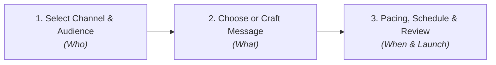
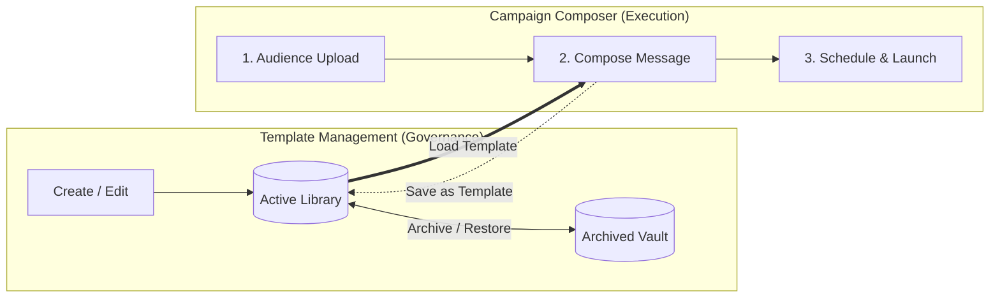

# Launching a Campaign — User Flow

> **Verified & Updated:** 2026-08-31 against git commits `c338cb9` through `93ad711` on branch `refactor/reflow`.
>
> **Status:** Roadmap Phase 1 (`CAM-01` through `CAM-13`) implemented with specific architectural compromises/gaps. Phase 2 (Target UX Flow: Audience-First, Template Library, and Simulator Test Channel) specified below. Stable `CAM-*` IDs retained. `P0` can cause a customer-facing send to a different audience than the operator reviewed; `P1` risks irreversible action or major failure; `P2` is frequent workflow friction; `P3` is refinement.
>
> **Purpose:** Trace what a user sees and does when creating, configuring, reachability-checking, scheduling, launching, and monitoring an outbound bulk messaging campaign, as well as managing recipient deliveries, pacing, template reuse, and safe simulator testing.

---

## How the User Gets Here

The user navigates to the Campaigns section via:

1. **Nav Rail:** Click the Megaphone icon labeled **Campaigns** in the persistent left navigation bar (`/campaigns`).
2. **Direct URL Navigation:** Navigating directly to `/campaigns` or `/campaigns/new`.

---

## User Flow Diagram

```mermaid
flowchart TD
    Start[User clicks Campaigns in nav rail] --> CampaignsList

    subgraph CampaignsList["Screen: /campaigns - Campaigns List"]
        direction TB
        ListHeader["Header: Megaphone icon + Campaigns
        Subtitle: Bulk outbound messaging to a pasted or uploaded recipient list
        Button: + New campaign"]

        ListLoading["State: Plain Loading text (no spinner)"]
        ListEmpty["State: Empty List
        • Muted Megaphone icon
        • Text: No campaigns yet
        • Hint: Create a campaign to send a templated message to a list of recipients"]
        ListPopulated["State: Populated Campaign Cards
        Each card displays:
        • Channel icon: WhatsApp, Telegram, Instagram, or Messenger
        • Campaign Name
        • Status Badge: Draft, Scheduled, Running, Paused, Completed, Failed, or Cancelled
        • Account Name and Creation Date
        • Progress: X of Y sent with colored progress bar"]
    end

    CampaignsList -->|"Clicks + New campaign"| WizardPhase1
    CampaignsList -->|"Clicks existing campaign card"| CampaignDetail

    subgraph WizardPhase1["Screen: /campaigns/new - Step 1: Campaign Details"]
        direction TB
        W1_Header["Title: New campaign
        Section: Campaign details"]
        W1_Name["Input: Name
        Placeholder: E.g. Summer promo"]
        W1_Account["Dropdown: Sending account"]
        W1_NoAccounts["🔴 State: No accounts connected
        Callout: No channels connected yet
        Button: Connect a channel"]
        W1_Message["Textarea: Message
        🔴 Placeholder: Hi name with single braces
        Hint: Use double brackets for per-recipient variables
        Dynamic badge: Variables used: name"]
        W1_Error["Error banner: Name is required / Message is required / Choose a sending account"]
        W1_Actions["🔴 Primary Button: Save
        Ghost Button: Cancel"]
    end

    W1_NoAccounts -->|"Clicks Connect a channel"| ChannelsPage[Screen: /accounts]

    WizardPhase1 -->|"Clicks Save with invalid fields"| W1_Error
    WizardPhase1 -->|"Clicks Cancel"| CampaignsList
    WizardPhase1 -->|"Clicks Save with valid fields"| WizardPhase2

    subgraph WizardPhase2["Screen: /campaigns/new - Step 2: Recipients, Pace and Schedule"]
        direction TB
        W2_LockedDetails["Locked Campaign Details section above"]
        
        W2_Recipients["Section: Recipients
        • Textarea: Paste recipients with CSV placeholder
        • File input: or upload a file .csv or .txt
        • 🔴 Button: Check reachability"]

        W2_PreviewEmpty["State: Paste or upload a recipient list to preview it"]
        W2_PreviewError["State: Error banner if parsing fails"]
        W2_PreviewTable["State: Reachability Preview Table
        • Counters: X valid green, Y invalid red, Z duplicate amber
        • Scrollable row list up to 200 items:
          - Status dot
          - Raw phone or handle
          - Recipient name
          - Reason or normalized phone
        • 🔴 Preview is not invalidated if pasted text or the file changes afterward"]

        W2_Pace["Section: Pace and schedule
        • Mode toggle: Use account pace OR Custom pace
        • Custom fields: Minimum interval sec + Random jitter sec"]

        W2_Windows["Quiet hours schedule:
        • Timezone hint with local UTC offset
        • Row items: Weekday selector + Start time + End time + Delete button
        • Button: + Add window"]

        W2_Schedule["Start timing toggle:
        • Option: As soon as I press Start
        • Option: At a scheduled time with Datetime picker
        • 🔴 Choosing later without a date silently leaves the campaign as a draft"]

        W2_Actions["Button: Create campaign
        Button: Cancel"]
    end

    WizardPhase2 -->|"Clicks Check reachability"| W2_PreviewTable
    WizardPhase2 -->|"Clicks Cancel"| CampaignsList
    WizardPhase2 -->|"Clicks Create campaign with 0 valid recipients"| W2_PreviewError
    WizardPhase2 -->|"🔴 Clicks Create campaign with valid setup"| CampaignDetail

    subgraph CampaignDetail["Screen: /campaigns/:id - Campaign Detail"]
        direction TB
        D_Header["Top bar:
        • Link: Back to campaigns
        • Campaign Name + Status Badge
        • Account Name subtitle"]

        D_Controls["Control Buttons:
        • Draft or Scheduled: Start button
        • Running: Pause button
        • Paused: Resume button
        • Any active state: 🔴 Stop button
        • Copy button: Duplicate
        • If unsent: Delete button with inline confirmation"]

        D_Tabs["Tab Navigation:
        • Overview
        • Recipients
        • History"]

        subgraph TabOverview["Tab: Overview"]
            O_Msg["Card: Message Template
            • Full text with linebreaks
            • Variables list badge
            • Lock hint if messages already sent"]
            O_Pace["Card: Pace and Schedule
            • Pacing mode summary
            • Scheduled date and Started date
            • Lock hint if campaign is active"]
            O_Budget["Card: Account Sending Budget
            • Status dot: Can send now / Waiting for headroom / Account paused
            • Next send estimate time
            • Rolling window progress bars: 1h, 24h usage"]
        end

        subgraph TabRecipients["Tab: Recipients"]
            R_Filters["Status filter pills: All | Pending | Sending | Sent | Failed | Skipped"]
            R_Actions["Button: Retry failed
            Button: Replace recipients"]
            R_List["Recipient Rows (first 50 only; no pagination controls):
            • Phone / Identity
            • Recipient name
            • Status label
            • Failure reason tooltip"]
            R_ReplaceBox["Inline Replace Panel:
            • Textarea paste + File upload
            • Check reachability button
            • Save replacement button"]
        end

        subgraph TabHistory["Tab: History"]
            H_List["Timeline of events (first 50 only; no pagination controls):
            • Started / Paused / Resumed / Stopped
            • Auto-started / Auto-paused
            • Completed
            • Recipients updated / Retried
            • Timestamps for every event"]
        end
    end

    CampaignDetail -->|"Clicks Back to campaigns"| CampaignsList
```

---

## Friction Points and Suggested Changes

### CAM-01 — [P2] Wizard Step 1 Action Button Is Misleadingly Labeled "Save"

**What happens today:** On the initial screen of the campaign creation wizard, the primary action button to proceed to the recipients, pacing, and scheduling section is labeled **"Save"** (`campaigns.actions.save`). When clicked, it validates the inputs, creates a draft campaign in the background, disables the Phase 1 inputs, and reveals Phase 2 below on the same page. Users assume "Save" creates the complete campaign or submits the form, leading to hesitation and confusion.

**Suggested change:** Rename the button to **"Continue to Recipients →"** or **"Next: Add Recipients"**. Provide an explicit 2-step progress indicator at the top of the wizard (e.g. *Step 1: Campaign Details → Step 2: Recipients & Schedule*) so the user understands where they are in the setup flow.

---

### CAM-02 — [P1] Inconsistent Placeholder Syntax for Message Variables

**What happens today:** The message textarea displays a placeholder: `Hi {name}, ...` with single curly braces. However, the system's variable parser and hint explicitly require double curly braces (`{{name}}`). Users who type `{name}` as prompted by the placeholder will find that their variable is not detected, and the message will send raw `{name}` to customers.

**Suggested change:**
- Update the placeholder text to `Hi {{name}}, here is your offer: {{code}}`.
- Add quick-insert chip buttons below the textarea (e.g. `[+ {{name}}]`, `[+ {{phone}}]`, `[+ Custom Variable]`) that insert the correct double-bracket syntax at the cursor position with a single click.

---

### CAM-03 — [P2] No Live Rendered Message Preview with Real Data

**What happens today:** Below the message textarea, the user only sees a plain text line: `Variables used: name, promo_code`. The user cannot see how the formatted message will actually look when rendered with a recipient's specific data, nor can they preview line breaks, spacing, or emojis in a chat bubble format.

**Suggested change:** Add a side-by-side or collapsible **"Message Preview"** chat bubble showing how the text will render for the first valid recipient in the list (e.g. replacing `{{name}}` with "Aigul"). Include a preview toggle to flip between raw template and rendered message.

---

### CAM-04 — [P2] Reachability Check Is a Manual Prerequisite That Blocks Submission

**What happens today:** After pasting text or choosing a CSV file in Phase 2, the reachability check is not run automatically. The user must notice and click the secondary **"Check"** button. If they skip this and click **"Create campaign"**, the form rejects submission with a red error: *"Check the recipient list before creating the campaign."*

**Suggested change:**
- Automatically trigger the reachability preview when a file is uploaded or when typing/pasting stops (debounced by 400ms).
- If the user clicks **"Create campaign"** with an unchecked list, automatically run the check in the background and proceed to creation if all recipients are valid.

---

### CAM-05 — [P2] Account Sending Budget and Rate Limits Are Invisible During Creation

**What happens today:** When selecting a sending account and configuring pace/schedule in the wizard, the user cannot see the account's current sending budget, health, or rate limit headroom. The live `AccountSendingBudget` widget is only visible on the Campaign Detail page *after* creation. A user might configure a campaign for 500 recipients on an account that is already throttled or paused, only discovering it after creation.

**Suggested change:** Display a compact version of the `AccountSendingBudget` card directly inside the wizard right below the account selector and pace configuration. This gives the operator immediate visibility into whether the selected account has sufficient quota to handle the campaign volume.

---

### CAM-06 — [P2] Lack of Clear CSV/Text Format Guidelines and Template Download

**What happens today:** The wizard provides a brief 2-line placeholder (`phone,name\n77011234567,Aigul\n77022222222,Bota`) but does not clarify whether header rows are required, what column separators are supported (comma, semicolon, tab), whether country codes with `+` are required, or how multiple custom variable columns should be structured.

**Suggested change:**
- Add a helper modal or expandable tooltip with explicit formatting rules.
- Provide a **"Download sample CSV"** link.
- In the preview table, display column header mapping chips to show how CSV headers map to detected `{{variables}}`.

---

### CAM-07 — [P2] Creation Drops User into "Draft" State Without an Explicit "Launch Now" Prompt

**What happens today:** Clicking **"Create campaign"** redirects the user to the Campaign Detail page where the campaign sits in `Draft` (or `Scheduled`) status. The campaign does not start sending automatically; the user must locate and click the small **"Start"** button at the top right of the detail screen. Operators often assume clicking "Create campaign" immediately starts the send.

**Suggested change:**
- In Step 2 of the wizard, offer two clear submission buttons: **"Save as Draft"** and **"Launch Campaign Now"**.
- Alternatively, when redirected to the detail page for a newly created non-scheduled campaign, display a prominent launch confirmation banner: *"Campaign created! Click Start to begin sending messages according to your pacing rules."*

---

### CAM-08 — [P1] Irreversible "Stop" Action Lacks a Warning Confirmation Dialog

**What happens today:** On the Campaign Detail page, the **"Stop"** button permanently halts the campaign. Unlike **"Pause"** (which can be resumed), a stopped campaign can never be restarted. However, clicking "Stop" executes immediately with no confirmation modal, risking accidental cancellation of an in-flight campaign.

**Suggested change:** Add a confirmation modal when clicking "Stop":
*"Stop this campaign? This action is permanent and cannot be resumed. Any remaining unsent recipients will be marked as skipped. [Keep Running] [Permanently Stop Campaign]"*

---

### CAM-09 — [P0] Reachability Preview Can Become Stale Before Saving Recipients

**What happens today:** After a successful reachability check, changing the pasted recipient text or selecting a different file does not clear `previewResult`. The Create button still trusts the old preview's valid count, while the final save reparses the new input. The same flaw exists in **Replace recipients** on Campaign Detail through `replacePreview`. A campaign can therefore save recipients the operator never reviewed while displaying a green preview for different data.

**Suggested change:** Invalidate creation and replacement previews whenever either recipient source changes. Bind each preview to a fingerprint of the exact submitted text/file and require that fingerprint to match before enabling Create or Save.

**Acceptance criteria:**

- Editing pasted text immediately invalidates the corresponding preview.
- Choosing, replacing, or clearing a file immediately invalidates the preview.
- Create/Save remains disabled until the exact current input has a successful preview.
- The store/API submission uses the same normalized input represented by the preview fingerprint.
- Tests cover both campaign creation and recipient replacement.

---

### CAM-10 — [P2] “Schedule Later” Accepts a Blank Date Without Warning

**What happens today:** Selecting “At a scheduled time” reveals a `datetime-local` input, but the Finish action validates neither its presence nor its future value. If the field is blank, no `schedule_at` patch is sent; the user is redirected to a normal Draft campaign with no explanation that scheduling was ignored.

**Suggested change:** Require a valid future date when “later” is selected, show an inline field error, and keep focus on the missing input until it is corrected.

---

### CAM-11 — [P1] Campaign, Recipient, and History Lists Stop at 50 Items

**What happens today:** The stores request the first 50 campaigns, recipients, and history events and retain the API totals, but the views render no pagination or load-more controls. Campaigns after the first page are unreachable, and a large campaign's Recipients and History tabs silently show only the first 50 records.

**Suggested change:** Add server-backed pagination to all three views, preserve page/filter state in the URL, and show “X–Y of Z” so truncation is explicit.

---

### CAM-12 — [P1] Leaving Phase 2 Can Strand an Orphan Campaign Draft

**What happens today:** Continuing from phase 1 immediately creates a server-side draft. The wizard’s own Cancel button deletes it, but browser Back, nav-rail navigation, refresh, and tab close bypass `cancelPending()` and leave the empty campaign in the list.

**Suggested change:** Prefer delaying server creation until the complete wizard is submitted. If early creation is required, add a router-leave and `beforeunload` strategy that warns about unsaved work and performs recoverable cleanup where possible.

**Acceptance criteria:**

- Normal navigation never silently leaves an empty draft.
- The user is warned before abandoning phase 2.
---

## Current Status & What Was Missed in Recent Implementation

Commits `c338cb9` through `93ad711` implemented the initial `CAM-01` through `CAM-13` batch. While all items were addressed, several critical UX gaps and architectural divergences remain:

| Finding | Summary of What Was Built | Current Status / Notes |
|---|---|---|
| **CAM-03** | Collapsible chat bubble added in Step 1 using mock sample data (`Aigul`, `SUMMER2026`). | **Accepted as built:** Hardcoded representative sample data provides immediate visual layout/emoji auditing without needing recipient-level dynamic binding. |
| **CAM-07** | Added an explicit reminder banner on Campaign Detail (`?created=1`). | **Dual actions pending:** The wizard currently has a single "Create campaign" button; explicit "Save as Draft" vs "Launch Now" buttons to be added in Phase 2. |
| **CAM-12** | Added `onBeforeRouteLeave` and `beforeunload` orphan draft cleanup guards. | **E2E test pending:** Tested via Vitest DOM; full Playwright E2E coverage to follow. |
| **Templates** | Reusable templates do not exist. | **No template library:** Templates can only be reused by duplicating entire campaigns. |
| **Order of Operations** | Enforces Message in Step 1 $\rightarrow$ Audience in Step 2. | **Chicken-and-egg friction:** Users write messages before knowing what variables their CSV has, and the message textarea is locked (`disabled`) in Step 2. |

---

## Target UX Flow (Expected Natural Journey)

The natural mental model for campaign broadcasting follows: **Who am I sending to? $\rightarrow$ What am I saying? $\rightarrow$ When should it send?**

### 1. Step 1: Audience & Channel Selection (WHO)
* **Select Account:** Operator picks the sending account (WhatsApp, Telegram, or safe **Simulator**).
  * The Simulator account is automatically provisioned/included for every organization so it is immediately available for zero-cost sandbox tests.
  * The **live sending budget & quota widget** immediately shows available sending headroom.
* **Upload or Paste Contacts:**
  * Drop `.csv`/`.txt` or paste raw numbers.
  * System instantly normalizes phone numbers and extracts all CSV column headers.
  * Preview table highlights: **X valid**, **Y invalid**, **Z duplicates**.
* **Transition:** Clicking **"Continue to Message →"**:
  * Calls `POST /campaigns` with name, account, and temporary placeholder `"Draft message"` to obtain the server-side `campaign_id` required for reachability binding.
  * Replaces recipients via `PUT /campaigns/:id/recipients`.
  * Passes detected CSV columns and reachability counts into Step 2.

### 2. Step 2: Message Selection & Personalization (WHAT)
* **Template Integration:**
  * **Saved Templates Dropdown:** Operator can pick a pre-existing template from the Organization-wide Library.
  * **Auto-Validation:** The system checks template variables against the uploaded CSV columns:
    * Matching columns show green checkmarks (e.g. `{{name}}`, `{{promo_code}}`).
    * Any missing column triggers an inline amber alert (e.g. `⚠️ Message uses {{discount}}, but your file does not contain a 'discount' column`).
* **Dynamic Column Chips & Inline Autocomplete:**
  * One-click chips are generated for every column present in the uploaded file (`[+ {{name}}]`, `[+ {{promo_code}}]`, `[+ {{city}}]`).
  * **Inline Floating Autocomplete Menu:** Typing `{` or `{{` directly in the message textarea opens a floating suggestion menu positioned right under the cursor. Operators can filter by typing (e.g. `{{pr`), navigate via `↑`/`↓`, and press `Enter` or `Tab` to insert the full `{{promo_code}}` token automatically (or `Esc` to dismiss).
* **Chat Bubble Preview:**
  * Fast, toggleable chat bubble preview rendering the message with clean sample substitutions (`Aigul`, `SUMMER2026`, etc.) and fallback brackets for custom variables, allowing operators to audit layout, line breaks, and emojis instantly.
* **Save as Template (Optional):**
  * Checkbox or button: *"Save this message to template library"* with a template name prompt (saves organization-wide).
* **Transition:** Clicking **"Continue to Schedule →"** updates the draft's message text via `PATCH /campaigns/:id`.

### 3. Step 3: Pacing, Schedule & Launch (WHEN & LAUNCH)
* **Anti-Ban Safeguards:**
  * Minimum interval between sends (e.g., 20 sec) + random jitter (± 5 sec).
* **Quiet Hours:**
  * Weekday/weekend blackout hours (e.g., no messages 21:00–09:00).
* **Send Timing:**
  * Choice between **"Send immediately"** and **"Schedule for later"** (with datetime picker).
* **Pre-Flight Summary Card:**
  * Shows total reachable audience, estimated broadcast duration, and sending account health.
* **Explicit Submission Actions:**
  * **Save as Draft:** Leaves campaign in `'draft'` status and redirects to `CampaignDetail.vue` with an informative banner (`?draft=1`).
  * **Launch Campaign 🚀:** Transitions campaign to `'running'` (or `'scheduled'`) and begins broadcast dispatch.

---

## Dedicated Template Library

To support high-velocity broadcasting without retyping or duplicating old campaigns, a dedicated template catalog is introduced:

### Capabilities
1. **Organization-Wide Scope:** Any user in the organization can create, view, edit, and use shared templates.
2. **Browse & Filter:** Dedicated **Templates** tab on `/campaigns` with search and status filter (`Active` vs `Archived`).
3. **Author & Edit:** Create and modify named templates with explicit variable placeholders.
4. **Archive & Restore:** Soft-archive deprecated or seasonal campaigns (`is_archived = 1`) so they don't clutter the composer while preserving audit history.
5. **Instant In-Wizard Application:** Select any active template directly inside the campaign composer, or save newly drafted text as a new template on the fly.

---

## Simulating Campaign Broadcasts Using the Simulator

The backend provides a native synthetic channel (`ChannelSimulator`) that routes through the identical response/ingestion pipelines as WhatsApp without external network requests or meta fees.

### How Simulator Campaign Testing Works

1. **Select "Simulator" Channel:**
   * In Step 1, the sending account picker automatically includes **"Simulator"** for every organization.
   * Quota and rate limits reflect sandbox parameters.
2. **Broadcast Execution:**
   * When launched, the campaign runner processes the recipient list, verifies pacing intervals, and evaluates variables.
   * `ChannelSender` records approved sends as delivered and generates synthetic delivery events.
3. **End-to-End Chat Verification:**
   * Dispatched messages land in the operational **Inbox / CRM** under synthetic customer contacts.
   * Operators can inspect conversation threads, test AI auto-reply triggers, and verify formatting in a completely safe, ban-free staging environment.

---

## Implementation Roadmap (Phase 2)

1. **CAM-14 — Dedicated Template Library:** Add `campaign_templates` schema, CRUD endpoints, and `/campaigns?tab=templates` UI with search, active/archived tabs, and in-wizard template selection/saving.
2. **CAM-15 — Audience-First Wizard Refactor & Autocomplete:** Invert wizard flow to Audience Upload (Step 1) $\rightarrow$ Message & Template (Step 2) $\rightarrow$ Schedule & Launch (Step 3), with dynamic column chips, unblocked text editing, and inline floating `{` triggered variable autocomplete.
3. **CAM-16 — Simulator Channel Integration:** Automatically include the Simulator account in the campaign account picker for zero-cost, end-to-end sandbox broadcast testing.
4. **CAM-17 — Dual Wizard Submission Actions:** Add explicit "Save as Draft" (redirects with draft banner) and "Launch Campaign 🚀" buttons in Step 3.
5. **CAM-18 — Playwright E2E Coverage:** Add complete browser-level test suite covering creation, navigation guards, and simulated execution.

---

## Source Components

| UI Element / Screen | Source File |
|---|---|
| Persistent Navigation Rail (Campaigns nav item) | [`NavRail.vue`](../../../frontend/src/components/NavRail.vue) |
| Campaigns List Page & Tabs | [`Campaigns.vue`](../../../frontend/src/views/Campaigns.vue) |
| Campaign Status Badge | [`CampaignStatusBadge.vue`](../../../frontend/src/components/CampaignStatusBadge.vue) |
| Campaign Creation Wizard | [`CampaignWizard.vue`](../../../frontend/src/views/CampaignWizard.vue) |
| Recipient Reachability Preview Table | [`CampaignRecipientPreviewTable.vue`](../../../frontend/src/components/CampaignRecipientPreviewTable.vue) |
| Campaign Detail View (Overview, Recipients, History) | [`CampaignDetail.vue`](../../../frontend/src/views/CampaignDetail.vue) |
| Live Account Sending Budget Widget | [`AccountSendingBudget.vue`](../../../frontend/src/components/AccountSendingBudget.vue) |
| Channels / Accounts Page | [`Accounts.vue`](../../../frontend/src/views/Accounts.vue) |
| Simulator Ingestion & Channel Sender | [`simulator/channel.go`](../../../backend/internal/simulator/channel.go) |
| Campaigns Pinia Store | [`stores/campaigns.ts`](../../../frontend/src/stores/campaigns.ts) |
| Campaign Runner Engine | [`runner.go`](../../../backend/internal/campaign/runner.go) |
| Router Configuration | [`router.ts`](../../../frontend/src/router.ts) |
| Localization Dictionaries | [`i18n/locales/en.ts`](../../../frontend/src/i18n/locales/en.ts) |

