# Daily Inbox Triage — User Flow

> **Purpose:** Trace the operator journey for daily message triage on `/chatboard`: scanning conversation lists, selecting active threads, inspecting customer context, reviewing and editing AI draft suggestions, replying via manual input or AI approval, and composing new outbound conversations. Friction points are marked with 🔴.

---

## How the User Gets Here

The operator reaches the Inbox board (`/chatboard`) via several paths:

1. **Default Login Landing:** Signing in at `/login` redirects authenticated operators directly to `/chatboard`.
2. **From the Nav Rail:** Clicking the **Inbox** icon (top item in the persistent left navigation bar).
3. **From CRM Customer Details:** Clicking any linked conversation under the customer profile conversations list.
4. **Post-Password Change:** Completing a required password change, when an account is explicitly flagged, lands back on `/chatboard`.

---

## User Flow Diagram

```mermaid
flowchart TD
    Start[Operator lands on /chatboard] --> LayoutState

    subgraph LayoutState[Screen: 3-Column Inbox Board]
        direction TB
        LSees[Operator sees:
        • Left 68px nav rail with Inbox active
        • Column 1: Chat List width 340px
        • Column 2: Thread Pane flex
        • Column 3: Assistant and Customer Panel width 340px]
    end

    LayoutState --> ListCheck{Are there existing chats in the list?}

    %% Empty Inbox State
    ListCheck -->|No chats exist| EmptyListState
    subgraph EmptyListState[State: Empty Chat List]
        direction TB
        ELSees[Operator sees:
        • Search bar: Search chats or contacts
        • Tabs: Mine · Unassigned · All
        • Message icon with text: No chats yet
        • Subtitle: New messages will show up here
        • Plus icon floating button in corner
        • Center Pane: Pick a chat to open the conversation
        • Right Pane: Pick a conversation]
    end

    %% Populated List State
    ListCheck -->|Chats found| PopulatedListState
    subgraph PopulatedListState[State: Chat List Displayed]
        direction TB
        PLSees[Operator sees:
        • Header: xchats title and New Message icon button
        • Search input with instant filter debounce
        • Filter tabs: Mine · Unassigned · All
        • Channel filter dropdown if multiple numbers connected
        • Chat cards displaying:
          - Contact avatar with colored background
          - Channel badge icon: WhatsApp, Telegram, Instagram, Messenger
          - Contact display name and relative timestamp
          - Account name label
          - Last message preview snippet
          - Unread message badge with count
        • Floating action button: Plus icon in bottom corner]
    end

    %% User Actions on List
    PopulatedListState --> FilterAction{Operator action on list}
    FilterAction -->|Clicks New Message button or FAB| ComposeModal
    FilterAction -->|Types in search box| SearchFilterState[List filters chats by contact name or message query]
    FilterAction -->|Switches tab: Mine / Unassigned / All| TabFilterState[List filters by assigned operator]
    FilterAction -->|Selects specific account dropdown| AccountFilterState[List filters by connected phone channel]
    FilterAction -->|Clicks a chat card| ThreadSelectedState

    SearchFilterState --> PopulatedListState
    TabFilterState --> PopulatedListState
    AccountFilterState --> PopulatedListState

    %% New Message Outbound Dialog Flow
    subgraph ComposeModal[Modal: New Outbound Message Dialog]
        direction TB
        NMSees[Operator sees:
        • Title: New message
        • Send-from selector for eligible QR WhatsApp/simulator accounts
        • Phone number input with country code hint
        • Message text area
        • Attached files preview list
        • Attach file paperclip button
        • Send button with icon]
    end

    ComposeModal --> ComposeAction{Operator fills form and clicks Send}
    ComposeAction -->|Phone number invalid or both text and files empty| ComposeError[Operator sees red error alert banner]
    ComposeError --> ComposeModal
    ComposeAction -->|Valid phone and text and/or attachment| ComposeSending[Button shows spinner: Sending...]
    ComposeSending -->|Send succeeds| OpenNewThread[Modal closes and new chat opens in main view]
    OpenNewThread --> ThreadSelectedState

    %% Active Thread View
    subgraph ThreadSelectedState[Screen: Active Conversation Thread]
        direction TB
        TSees[Operator sees:
        • Thread Header:
          - Contact avatar and unconditional green dot — not real presence 🔴
          - Contact display name and phone number
          - Assignee dropdown button: Assign to me / Assign / Operator name
          - Resolve button outline with green checkmark
        • Message Stream:
          - Inbound messages: white cards with text, media images, audio, file downloads, timestamp
          - Outbound messages: green bubbles with text, timestamp, delivery ticks: clock, single check, double check, blue read check
        • Composer Bar:
          - Attach file paperclip button
          - Auto-sizing message input: Type a message...
          - Static emoji smile icon
          - Send button]
    end

    ThreadSelectedState --> RightPanelCheck{Right panel tab selection}

    %% Right Column - Customer Tab
    RightPanelCheck -->|Default: Customer tab selected| CustomerTabState
    subgraph CustomerTabState[Panel: Customer Profile]
        direction TB
        CSees[Operator sees:
        • Tab switch bar: Customer active · AI assistant
        • Contact avatar and editable name input
        • Connected channel identities
        • Editable phone and email fields with inline auto-save
        • Status dropdown: Lead, Qualified, etc.
        • Tags list with remove buttons and Add Tag dropdown
        • Assignee dropdown selector
        • Next step follow-up card with Complete and Reschedule buttons
        • Notes list, add note text box, and Add Note button
        • Other conversations on other channels
        • Custom CRM fields
        • Customer activity timeline]
    end

    CustomerTabState -->|Operator switches tab to AI assistant| AssistantTabState

    %% Right Column - AI Assistant Tab
    subgraph AssistantTabState[Panel: AI Assistant Drafts]
        direction TB
        ASees[Operator sees:
        • Tab switch bar: Customer · AI assistant active
        • Header: Regenerate icon button]
    end

    AssistantTabState --> DraftStatusCheck{Are AI draft replies available?}

    DraftStatusCheck -->|No draft generated yet| EmptyDraftState
    subgraph EmptyDraftState[State: No Reply Suggested]
        direction TB
        EDSees[Operator sees:
        • Sparkles icon
        • Title: No reply suggested yet
        • Subtitle: Generate a draft from the knowledge base
        • Button: Suggest a reply]
    end
    EmptyDraftState -->|Clicks Suggest a reply| ShimmerState

    DraftStatusCheck -->|AI is generating reply| ShimmerState
    subgraph ShimmerState[State: Generating Draft]
        direction TB
        SSees[Operator sees:
        • Shimmer skeleton card placeholders
        • Sparkles icon: AI is drafting a reply...]
    end

    DraftStatusCheck -->|Drafts ready| DraftsReadyState
    ShimmerState --> DraftsReadyState

    subgraph DraftsReadyState[State: Draft Cards Displayed]
        direction TB
        DRSees[Operator sees 1 or more draft cards:
        • Card Header: Recommended reply or Option N badge
        • Confidence badge percentage: e.g. 85 percent green/amber/red
        • Pen icon button: Move to composer
        • Editable draft textarea
        • Send button with send icon
        • Regenerate icon button
        • Dismiss text button at bottom]
    end

    %% Triage Decisions
    DraftsReadyState --> TriageDecision{Operator decides how to reply}

    %% Branch 1: One-click Approve & Send AI Draft
    TriageDecision -->|Clicks Send on Draft Card| ApproveSending[Button shows spinner: Sending...]
    ApproveSending --> ReplySentState[Message sent to customer and added to thread bubbles with status tick]

    %% Branch 2: Edit AI Draft inside card then Send
    TriageDecision -->|Edits draft text in card then clicks Send| ApproveSending

    %% Branch 3: Move to Composer
    TriageDecision -->|Clicks Move to composer icon| MoveToComposerState[Draft text copied into bottom composer input]
    MoveToComposerState --> ComposerEditState[Operator edits text in composer, optionally attaches files]
    ComposerEditState -->|Clicks Send or presses Enter| ComposerSending[Composer Send button shows spinner]
    ComposerSending --> ReplySentState

    %% Branch 4: Regenerate Draft
    TriageDecision -->|Clicks Regenerate icon| ShimmerState

    %% Branch 5: Dismiss Draft & Type Manual Reply
    TriageDecision -->|Clicks Dismiss| DismissState[Draft cards cleared]
    DismissState --> ComposerEditState

    %% After Reply Sent
    ReplySentState --> PostReplyAction{Next triage action}
    PostReplyAction -->|Clicks Assignee dropdown in header| ChangeAssignee[Selects team member or unassigns]
    PostReplyAction -->|Clicks Customer tab to update CRM data| CustomerTabState
    PostReplyAction -->|Selects next unread chat in list| PopulatedListState
```

---

## Friction Points and Suggested Changes

### 🔴 1. AI Draft Availability Is Hidden Behind an Unbadged Tab

**What happens today:** The right panel defaults to **Customer** when `AssistantPanel` first mounts. The selected tab then persists while the operator switches conversations, so it does not reset for every chat. However, when Customer remains selected there is no badge or status indicator showing that an AI draft exists or is being generated behind the **AI assistant** tab.

**Suggested change:** Automatically default to the **AI assistant** tab when unread inbound messages are pending triage, or add an unread badge indicator / glowing dot to the **AI assistant** tab header when drafts are ready so the operator does not miss them.

---

### 🔴 2. Rigid 3-Column Layout Compresses Message Thread on Laptops

**What happens today:** The interface enforces a fixed 3-column desktop layout (`68px` navigation rail + `340px` chat list + `340px` assistant/customer panel = `748px` of fixed sidebars). On standard 13-inch and 14-inch laptops (1280px–1366px screen width), the central message thread is squeezed into less than 550px, and on screens below 1100px, elements collide or become horizontally cramped. Neither the chat list nor the assistant panel can be collapsed or resized.

**Suggested change:** Add collapse/expand toggle buttons on both side panels, and allow the right panel to collapse into a slide-over drawer on viewports under 1280px.

---

### 🔴 3. No Keyboard Shortcut to Approve and Send AI Drafts

**What happens today:** Operators must move their hand from the keyboard to the mouse to click the **Send** button inside the draft card. While the bottom composer supports `Enter` to send, the AI draft card text area does not support keyboard send shortcuts (`Cmd+Enter` / `Ctrl+Enter`).

**Suggested change:** Add `Cmd+Enter` / `Ctrl+Enter` inside the draft card text area to approve and send immediately, `Cmd+Shift+R` to regenerate, and `Escape` to dismiss drafts.

---

### 🔴 4. "Resolve" Button in Thread Header is Non-Functional

**What happens today:** The thread header prominently displays an outline button with a green checkmark labeled **Resolve**. However, in the code, this button has no click handler or action attached—clicking it produces no response.

**Suggested change:** Connect the Resolve button to an action: marking the conversation as resolved/closed, unassigning it from the queue, or prompting for a quick tag/follow-up resolution.

---

### 🔴 5. Stale AI Drafts Disappear Silently Without Feedback

**What happens today:** If an incoming message arrives while a draft is being approved or if a draft becomes stale (`CONFLICT` or `DRAFT_STALE`), the drafts list is immediately cleared to an empty state with no explanatory toast or notification. The operator is left wondering why their draft vanished without sending.

**Suggested change:** Show a brief informative notification: *"Conversation was updated. A new draft is being prepared."*

---

### 🔴 6. Redundant "New Message" Triggers with No Keyboard Shortcut

**What happens today:** The chat list contains two duplicate UI triggers to open the New Message dialog: a ghost icon button in the header and a large floating circular Plus button at the bottom right that partially obscures the lowest chat card. There is no global keyboard shortcut (e.g. `C` or `Cmd+N`) to trigger the composer.

**Suggested change:** Remove the floating action button to avoid obscuring chat cards, keep the header compose button, and bind `Cmd+K` or `C` (when not focusing an input) to open the New Message dialog.

---

### 🔴 7. Smile (Emoji) Button in Composer is an Unwired Placeholder

**What happens today:** In the message composer, there is an emoji Smile icon button next to the textarea. Clicking it does nothing because no emoji picker popover or dropdown is implemented.

**Suggested change:** Implement a lightweight emoji picker popover or hide the icon button until the picker is ready.

---

### 🔴 8. Rapid Chat Switching Can Render the Previous Chat’s Data

**What happens today:** `selectChat()` sets the active ID, clears state, and launches message/draft requests without cancellation or a response-ID guard. If an operator clicks Chat A and quickly clicks Chat B, the slower response for A can arrive last and overwrite B's messages or drafts. The customer profile watcher has the same stale-response risk, so the right panel can also show the wrong customer after rapid selection.

**Suggested change:** Cancel superseded requests with `AbortController`, or capture the requested chat/customer ID and apply each response only if it still matches the active selection.

---

### 🔴 9. Manual Send Failures Are Invisible and Attachments Are Lost

**What happens today:** `ChatThread` calls `inbox.send()` without awaiting or catching it, and the store has no `sendError` state. A failed upload or message request produces no inline error or retry action. `Composer` also clears its selected files immediately after emitting the send event, before the async upload succeeds, so the operator must find and attach them again after a failure.

**Suggested change:** Keep text and attachments until the send succeeds, surface an inline retryable error, and distinguish upload failure from message-delivery failure.

---

### 🔴 10. Green “Online” Dot Is Always Shown

**What happens today:** Every active thread renders a green presence dot on the customer avatar unconditionally. It is not backed by presence or last-seen data, so it communicates a false “online now” state for WhatsApp, Telegram, Instagram, Messenger, and simulator contacts.

**Suggested change:** Remove the dot until presence data exists, or replace it with a channel badge. If presence is later implemented, label it accessibly and show unknown/offline states honestly.

---

### 🔴 11. Inbox and Message History Are Silently Truncated

**What happens today:** The chat list requests only the backend's first page (50 by default), and a selected thread requests the latest 80 messages. Neither pane offers pagination, infinite scroll, or a count indicating that older chats/messages exist. Operators cannot reach older records without search, and cannot load messages older than the 80-item window.

**Suggested change:** Add cursor/page-based loading with visible loading states and preserve scroll position when prepending older messages.

---

### 🔴 12. “New Message” Supports Only QR WhatsApp/Simulator Accounts

**What happens today:** The send-from selector is built from `composableAccounts`, which includes only `whatsapp` and `simulator`. Telegram, WhatsApp Cloud API, Instagram, and Messenger accounts are excluded because those transports cannot use the same phone-number compose endpoint. The dialog does not explain this limitation, and if there is zero or one eligible account the selector is hidden entirely.

**Suggested change:** Hide or disable the entry point when no eligible account exists and explain which channels can initiate conversations. For supported non-phone channels, provide channel-specific compose flows instead of a universal phone-number form.

---

## Source Components

| UI Element / View | Source File |
|---|---|
| Main 3-Column Board Layout | [`Chatboard.vue`](../../../frontend/src/views/Chatboard.vue) |
| Left Chat List & Filters | [`ChatList.vue`](../../../frontend/src/components/ChatList.vue) |
| Message Thread & Assignee Bar | [`ChatThread.vue`](../../../frontend/src/components/ChatThread.vue) |
| Message Composer Bar | [`Composer.vue`](../../../frontend/src/components/Composer.vue) |
| Right Assistant Draft Panel | [`AssistantPanel.vue`](../../../frontend/src/components/AssistantPanel.vue) |
| Customer Profile & CRM Details | [`CustomerPanel.vue`](../../../frontend/src/components/CustomerPanel.vue) |
| Outbound Compose Modal | [`NewMessageDialog.vue`](../../../frontend/src/components/NewMessageDialog.vue) |
| Persistent Navigation Rail | [`NavRail.vue`](../../../frontend/src/components/NavRail.vue) |
| Inbox State & Realtime Store | [`stores/inbox.ts`](../../../frontend/src/stores/inbox.ts) |
