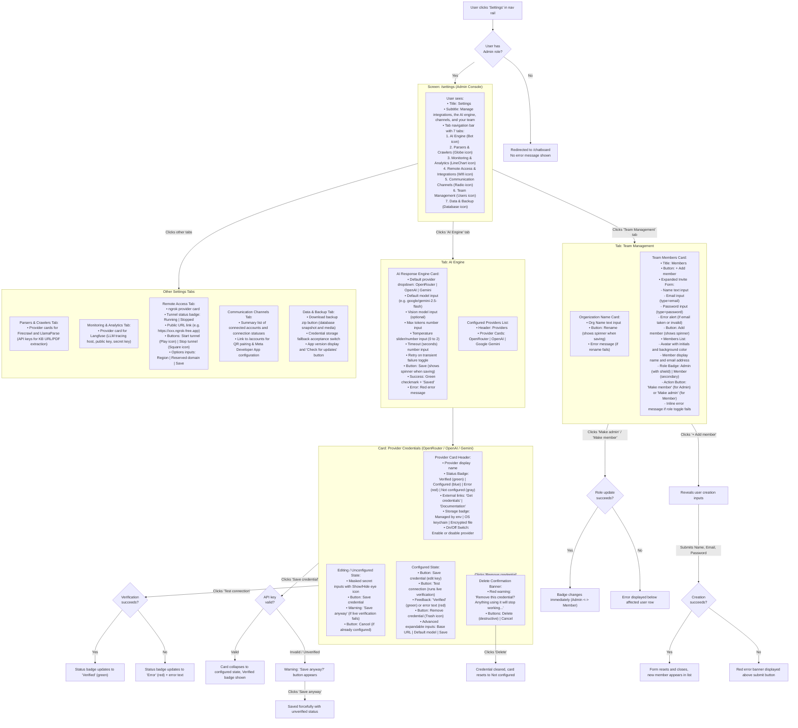

```mermaid
flowchart TD
    NavStart["User in App Nav Rail"]
    NavStart -->|"Clicks 'Customers' icon"| CustomersPage
    NavStart -->|"Clicks 'Follow-ups' icon"| FollowupsPage
    NavStart -->|"Selects chat in Inbox"| CustomerSidebar

    subgraph CustomersPage["Screen: /customers (Customer Directory)"]
        direction TB
        CustHeader["User sees Header:
        • Title: Customers
        • Button: + New customer
        • Button: Merge (appears when 2 rows selected)"]
        
        CustFilters["Search and Filters Bar:
        • Search input: Name, phone, email, @username...
        • Status dropdown: Any status or specific status
        • Tag dropdown: Any tag or specific tag
        • Channel dropdown: Any channel, WhatsApp, Telegram
        • Quick filter pills: All | Assigned to me | Unassigned | Follow-up today | Overdue follow-ups"]
        
        CustList["Customer List or Empty State:
        • Checkbox per row for merge selection
        • Avatar with initials and color
        • Display name or dash
        • Channel icons: Telegram or WhatsApp fallback
          (Instagram/Messenger/other identities are mislabelled as WhatsApp) 🔴
        • Contact handle: Phone, email, or username
        • Status badge with custom color
        • Tag badges (up to 3 shown)
        • Assignee name or Unassigned
        • Footer: Total customer count"]
    end

    CustomersPage -->|"Clicks '+ New customer'"| CreateCustAction["Creates a blank customer row"]
    CreateCustAction --> NoConversationResult["If the new customer has no conversation:
    list remains visible and no profile editor opens 🔴"]
    CustomersPage -->|"Types query in search"| FilterResults["List filters after 250ms debounce"]
    CustomersPage -->|"Clicks quick filter pill"| FilterResults
    CustomersPage -->|"Selects 2 checkboxes and clicks 'Merge'"| MergeModal
    CustomersPage -->|"Clicks customer row"| CustomerSidebar

    subgraph MergeModal["Modal: Merge Customers"]
        direction TB
        MergeContent["User sees:
        • Title: Merge customers
        • Subtitle: Select two customers to merge their profiles
        • Summary box: Source customer display name -> merged into -> Target customer display name (Keep this profile)
        • Warning: Channels, conversations, notes, tags, follow-ups, and timeline all move. Cannot be undone
        • Error message (if merge fails)
        • Buttons: Cancel | Merge"]
    end

    MergeModal -->|"Clicks 'Cancel'"| CustomersPage
    MergeModal -->|"Clicks 'Merge' (Success)"| CustomersPage

    subgraph CustomerSidebar["Sidebar: Customer Profile (in /chatboard)"]
        direction TB
        SidebarHeader["Identity Section:
        • Customer avatar
        • Inline editable Name input (saves on blur/Enter)
        • Linked channel badges and handles"]
        
        SidebarContact["Contact Fields:
        • Phone input (saves on blur/Enter)
        • Email input (saves on blur/Enter)"]
        
        SidebarStatus["Status Dropdown:
        • Selected status badge
        • Options: No status | Custom statuses"]
        
        SidebarTags["Tags Section:
        • Tag badges with 'x' remove button
        • Button: + Add tag
        • Dropdown search input + matching tags
        • Item: Create tag 'query' (if tag does not exist)"]
        
        SidebarAssignee["Assignee Dropdown:
        • Options: Unassigned | Team member names"]
        
        SidebarFollowup["Next Step Card:
        • If scheduled: Action type, due date/time, note, Complete button, Reschedule button
        • If none: Button: + Schedule"]
        
        SidebarNotes["Notes Section:
        • Latest note card with author and timestamp
        • Textarea for new note
        • Button: Add note
        • Toggle: All notes (count) with delete buttons"]
        
        SidebarExtras["Other Conversations & Timeline:
        • Other channel chats for this customer
        • Custom field inputs (if defined)
        • Chronological timeline: status changes, tags, notes, messages"]
    end

    CustomerSidebar -->|"Clicks '+ Schedule' or 'Reschedule'"| FollowupDialogModal
    CustomerSidebar -->|"Clicks 'Complete' on Next Step"| FollowupCompleted["Follow-up marked complete, card clears"]

    subgraph FollowupDialogModal["Modal: Next step / Reschedule"]
        direction TB
        DialogFields["User sees:
        • Title: Next step or Reschedule
        • Date input (defaults to tomorrow)
        • Time input (optional, defaults to all-day 09:00 local)
        • Timezone hint: Times are in browser timezone
        • Action selector: Call | Message | Meeting | Other
        • Assignee selector: Unassigned | Team member (defaults to creator)
        • Note textarea: What to follow up on...
        • Error banner: Pick a date / Could not save
        • Buttons: Cancel | Save (with spinner)"]
    end

    FollowupDialogModal -->|"Clicks 'Cancel'"| CustomerSidebar
    FollowupDialogModal -->|"Fills form and clicks 'Save'"| FollowupSaved["Follow-up saved, sidebar updates"]
    FollowupSaved --> CustomerSidebar

    subgraph FollowupsPage["Screen: /followups (Task Reminders)"]
        direction TB
        FollowupHeader["User sees:
        • Title: Follow-ups
        • Scope tabs: Mine | All | Unassigned
        • 4 Bucket filter cards with counters:
          1. Overdue (highlighted in red if count > 0)
          2. Today
          3. Tomorrow
          4. This week"]
        
        FollowupList["Follow-up List or Empty State:
        • If empty: CalendarClock icon + 'Nothing here'
        • If rows present:
          - CalendarClock icon (red if overdue, primary if upcoming)
          - Customer display name
          - Action badge + formatted due date/time
          - Note text preview
          - Assignee name
          - Action button: Open conversation (MessageSquare icon)
          - Action button: Complete (Check icon)
          - Action button: Cancel (X icon)"]
    end

    FollowupsPage -->|"Clicks bucket card (Overdue/Today/Tomorrow/Week)"| SwitchBucket["Filters list to selected timeframe"]
    FollowupsPage -->|"Clicks Scope tab (Mine/All/Unassigned)"| SwitchScope["Filters list to selected assignee scope"]
    FollowupsPage -->|"Clicks 'Complete'"| CompleteTask["Task marked done, removed from bucket count"]
    FollowupsPage -->|"Clicks 'Cancel'"| CancelTask["Task cancelled, removed from bucket count"]
    FollowupsPage -->|"Clicks 'Open conversation'"| CustomerSidebar
```

# CRM, Follow-ups, and Settings Management — User Flows

> **Purpose:** Trace the end-to-end user journeys for **CRM and Follow-ups** (customer directory, profile sidebar, task scheduling, reminders) and **Settings and Team Management** (AI model engine, provider credentials, team members, organization branding). Friction points are marked with 🔴.

---

# Part 1: CRM and Follow-ups Flow

## Title and Purpose

**Title:** Customer Relationship Management (CRM) and Follow-up Reminders
**Purpose:** Map every interaction for managing customer records, updating contact details, tagging, assigning managers, scheduling follow-up actions, merging duplicate profiles, and processing reminders across channels.

---

## How the User Gets Here

1. **From the Nav Rail (Customers):** User clicks the `UsersRound` icon labeled "Customers" to navigate to `/customers`.
2. **From the Nav Rail (Follow-ups):** User clicks the `CalendarClock` icon labeled "Follow-ups" to navigate to `/followups` (displays a red badge with the overdue count if overdue items exist).
3. **From the Inbox (Chatboard):** When working inside `/chatboard`, selecting any conversation automatically opens the right sidebar tab "Customer" (`CustomerPanel`), allowing in-context profile management.
4. **From Customer Directory to Chat:** Clicking any customer row in `/customers` jumps directly to their latest conversation in `/chatboard`.
5. **From Follow-ups to Chat:** Clicking the conversation icon on a follow-up item in `/followups` jumps directly to that conversation in `/chatboard`.

---

## User Flow Diagram

---

## Friction Points and Suggested Changes

### 🔴 1. Clicking a Customer Row Forces Unwanted Navigation to Chatboard

**What happens today:** When an operator clicks a customer row in `/customers` to view details or notes, the app immediately navigates to `/chatboard` and selects their latest conversation. If the customer has no active conversations or the manager just wants to update contact records, tags, or status, they are abruptly navigated away from the directory.

**Suggested change:** Support a slide-over customer details drawer or expandable row directly on `/customers`, with an explicit "Open Chat" action button for when the manager actually intends to message them.

---

### 🔴 2. No In-App Configuration for Statuses and Custom Fields

**What happens today:** Tags can be created dynamically inside the Customer Sidebar (`+ Add tag` -> type new tag name), but Statuses and Custom Fields cannot be created, edited, or reordered anywhere in the user interface. If no statuses are seeded, the Status dropdown only contains "No status".

**Suggested change:** Add a "CRM Settings" section or modal where managers can define custom pipeline statuses (with color pickers) and custom field schemas (text, number, date, select options).

---

### 🔴 3. Follow-up Due Dates Lack Relative Time Cues

**What happens today:** Follow-ups display rigid date-time strings (e.g., `2026-08-30 · 14:00` or `2026-08-30 · all day`). In the overdue and today lists, there are no relative cues like "Due in 30 minutes", "2 hours overdue", or "Due yesterday".

**Suggested change:** Add relative badge indicators alongside the timestamp (e.g., "Overdue by 3h" in red or "In 45m" in amber) so operators can prioritize urgent tasks at a glance.

---

### 🔴 4. Customer Directory Lacks Pagination and Column Sorting

**What happens today:** The customer directory fetches a hardcoded `page_size=100` and displays a total count in the footer, but provides no pagination controls (Previous/Next page) or column header sorting (e.g. sort by Name, Created Date, or Last Active). Customers beyond the first 100 cannot be viewed without typing a matching search query.

**Suggested change:** Add standard pagination controls (Page X of Y, Next/Previous) and clickable table column headers to sort by Name, Last Message Date, and Creation Date.

---

### 🔴 5. Merge Dialog Provides No Field-Level Conflict Preview

**What happens today:** The merge dialog warns that all channels, conversations, notes, tags, and timeline entries will move to the target customer. However, it does not show what happens if both profiles have conflicting phone numbers, email addresses, or different statuses.

**Suggested change:** Show a side-by-side comparison in the merge dialog showing which profile's contact info, status, and assignee will take precedence, allowing the operator to select preferred primary values before confirming.

---

### 🔴 6. Nav Rail Overdue Badge Does Not Recalculate Periodically

**What happens today:** The overdue count badge on the nav rail is loaded on initial app mount and updated only when the user executes a follow-up action. If the app is kept open across day boundaries or as a task becomes overdue in real time, the badge does not update until a manual page reload occurs.

**Suggested change:** Set up a periodic background timer (e.g. every 60 seconds) or server-sent event trigger to refresh the bucket counts dynamically as due dates pass.

---

### 🔴 7. “New Customer” Creates a Record but Opens No Editor

**What happens today:** Clicking **New customer** immediately creates a blank record, then calls the same `openCustomer()` path used by existing rows. That path navigates only when the profile has a conversation. A brand-new blank customer has none, so the user remains in the directory with a new dash-named row and no form, drawer, success message, or obvious way to enter its details.

**Suggested change:** Open a create/edit drawer before persisting the record, or navigate to a dedicated customer profile route that works without a conversation. Do not create an empty record until the user saves meaningful data.

---

### 🔴 8. Meta Channel Identities Are Mislabelled as WhatsApp in CRM

**What happens today:** The directory's channel filter offers only WhatsApp and Telegram. Its icon helper returns Telegram only for the literal `telegram` channel and returns the WhatsApp icon for every other identity. Instagram, Messenger, simulator, and future channel identities therefore appear as WhatsApp and cannot be filtered by their real channel.

**Suggested change:** Reuse the complete channel-brand mapping from the Inbox, expose every supported channel in the filter, and use a neutral fallback icon for unknown values.

---

## Source Components

| Element | File |
|---|---|
| Customer Directory Page | [`Customers.vue`](../../../frontend/src/views/Customers.vue) |
| Customer Sidebar Panel | [`CustomerPanel.vue`](../../../frontend/src/components/CustomerPanel.vue) |
| Follow-up Schedule & Reschedule Dialog | [`FollowupDialog.vue`](../../../frontend/src/components/crm/FollowupDialog.vue) |
| Follow-up Task List & Buckets Page | [`Followups.vue`](../../../frontend/src/views/Followups.vue) |
| Navigation Rail & Overdue Badge | [`NavRail.vue` L68–144](../../../frontend/src/components/NavRail.vue#L68-L144) |
| Assistant & Customer Tabs Container | [`AssistantPanel.vue` L61–85](../../../frontend/src/components/AssistantPanel.vue#L61-L85) |
| CRM Pinia Store | [`stores/crm.ts`](../../../frontend/src/stores/crm.ts) |

---

# Part 2: Settings and Team Management Flow

## Title and Purpose

**Title:** Administrator Settings and Team Management Console
**Purpose:** Map the configuration workflows for AI response models, provider API keys (OpenRouter, OpenAI, Gemini), parser credentials, monitoring, ngrok remote tunnels, organization name branding, and team member accounts/roles.

---

## How the User Gets Here

1. **From the Nav Rail (Settings Icon):** An administrator clicks the `Settings` gear icon at the bottom of the nav rail to navigate to `/settings`.
2. **From Unhealthy Provider Alert:** When a configured provider fails health verification, a red dot appears on the Settings icon with the tooltip "Needs attention", prompting the admin to open `/settings`.
3. **From Setup Wizard:** During first-time onboarding (`SetupWizard`), links direct the user to AI provider and team settings.
4. **Access Control Gate:** Non-admin users do not see the Settings gear in the nav rail. If a non-admin navigates to `/settings` directly via URL, the router guard redirects them immediately to `/chatboard`.

---

## User Flow Diagram

---

## Friction Points and Suggested Changes

### 🔴 1. No Guidance on LLM Provider Selection and Model Compatibility

**What happens today:** In the AI Engine settings tab, admins see OpenRouter, OpenAI, and Gemini listed with freeform text inputs for "Default model" and "Vision model". There is no explanation of model pricing, latency, capabilities, or which model identifiers are valid.

**Suggested change:** Provide a curated dropdown of recommended models (e.g., `gemini-2.5-flash`, `gpt-4o-mini`, `anthropic/claude-3.5-sonnet`) with tags indicating vision support and speed ratings, alongside the option to enter a custom model string.

---

### 🔴 2. Default Provider Setting is Disconnected from Provider Key Status

**What happens today:** An administrator can select "OpenAI" as the Default Provider in the top card and click "Save", even if no OpenAI API key has been added in the cards below. The top form saves successfully with a green checkmark, while auto-replies across the app will fail at runtime.

**Suggested change:** Add inline validation on the Default Provider selector that warns: "Warning: OpenAI does not have a configured API key. Add credentials below before saving."

---

### 🔴 3. Manual Password Creation Required Instead of Email Invitations

**What happens today:** When adding a team member, the admin must type a temporary password manually into a plaintext/password field. The admin is then responsible for insecurely transmitting this password out-of-band to the teammate.

**Suggested change:** Provide an "Invite via Email" or "Generate One-Time Login Link" option where new teammates receive a secure link to set their own initial password.

---

### 🔴 4. Last-Administrator Safeguard Is Reactive Only

**What happens today:** The backend correctly refuses to demote an organization's last administrator in the same transaction as the role update, returning a conflict instead of allowing lockout. The UI does not know that in advance: it leaves "Make member" enabled, provides no confirmation for self-demotion, and explains the safeguard only after the rejected request appears as a row error.

**Suggested change:** Disable the "Make member" button with a tooltip if there is only one administrator remaining in the organization, and require an explicit confirmation modal before self-demotion.

---

### 🔴 5. Silent Route Redirection for Non-Admin Users

**What happens today:** If a non-admin user navigates to `/settings` (e.g., via a shared link or bookmark), the router guard silently redirects them to `/chatboard` with no notification. The user is left confused as to why the page did not open.

**Suggested change:** Show an informative toast notification or an "Access Restricted — Administrator privileges required" empty state rather than a silent redirect.

---

### 🔴 6. Deleting a Provider Credential Does Not Warn if It is Currently in Active Use

**What happens today:** If an admin deletes the API key for OpenRouter while OpenRouter is selected as the default response engine, the deletion occurs immediately upon confirmation. The AI Engine card continues to point to OpenRouter, leading to broken assistant replies.

**Suggested change:** Check whether the provider being deleted is currently set as the `default_provider` in AI Engine or Extraction settings. If so, display a warning in the confirmation banner: "OpenRouter is currently set as your default AI provider. AI draft generation will stop working until you select another provider."

---

### 🔴 7. Team Management Has No Removal/Deactivation or Pagination

**What happens today:** Administrators can create users and toggle roles, but cannot deactivate or remove a teammate from the organization. The users endpoint is paginated, while the store requests only its default first page and the tab has no pagination controls despite retaining `usersTotal`. In a larger team, members after the first page are invisible and former staff cannot be offboarded through the UI.

**Suggested change:** Add explicit deactivate/remove actions with confirmation and session revocation, plus server-backed pagination or virtualized incremental loading for the member list.

---

## Source Components

| Element | File |
|---|---|
| Settings Main View & Tabs | [`Settings.vue`](../../../frontend/src/views/Settings.vue) |
| AI Engine Tab | [`AiEngineTab.vue`](../../../frontend/src/components/settings/tabs/AiEngineTab.vue) |
| Team Management Tab | [`TeamManagementTab.vue`](../../../frontend/src/components/settings/tabs/TeamManagementTab.vue) |
| Provider Credential Card Component | [`ProviderCredentialCard.vue`](../../../frontend/src/components/settings/ProviderCredentialCard.vue) |
| Masked Secret Password Input | [`MaskedSecretInput.vue`](../../../frontend/src/components/settings/MaskedSecretInput.vue) |
| Integration Status Badge | [`IntegrationStatus.vue`](../../../frontend/src/components/settings/IntegrationStatus.vue) |
| Parsers & Crawlers Tab | [`ExtractionTab.vue`](../../../frontend/src/components/settings/tabs/ExtractionTab.vue) |
| Monitoring & Analytics Tab | [`MonitoringTab.vue`](../../../frontend/src/components/settings/tabs/MonitoringTab.vue) |
| Remote Access & ngrok Tab | [`RemoteAccessTab.vue`](../../../frontend/src/components/settings/tabs/RemoteAccessTab.vue) |
| Communication Channels Tab | [`CommunicationChannelsTab.vue`](../../../frontend/src/components/settings/tabs/CommunicationChannelsTab.vue) |
| Data & Backup Tab | [`DataBackupTab.vue`](../../../frontend/src/components/settings/tabs/DataBackupTab.vue) |
| Settings Pinia Store | [`stores/settings.ts`](../../../frontend/src/stores/settings.ts) |
| Integration Settings Composable | [`composables/useIntegrationSettings.ts`](../../../frontend/src/composables/useIntegrationSettings.ts) |
| Route Definitions & Admin Guard | [`router.ts` L46–71](../../../frontend/src/router.ts#L46-L71) |
| User listing and role update handlers | [`auth.go` L380–471](../../../backend/internal/httpapi/auth.go#L380-L471) |
| Transactional last-admin guard | [`store.go` L650–692](../../../backend/internal/store/store.go#L650-L692) |
